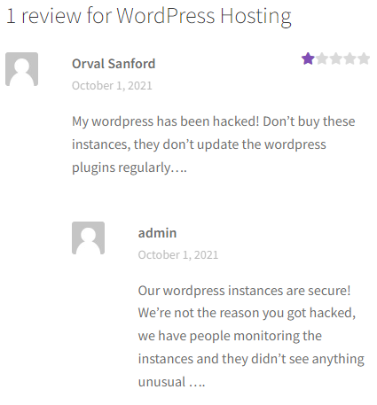
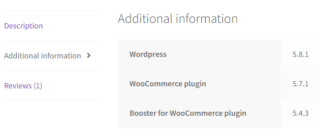

# WordPress CVE

## Introduction

Upon accessing http://ctf-fsi.fe.up.pt:5001, which redirects to a website hosted by WordPress, we started investigating the several pages in search of potential clues.
Since the platform appeared to be a virtual store, we decided to check out the services for sale. That is when we 
stumbled across the following user-review:

This led us to believe we could exploit the server using its plugins. By clicking on a tab beside the review, we 
discovered all the plugins and respective versions:

## Research

With the newly acquired information, we opened [CVEdetails.com](https://www.cvedetails.com/) to discover the CVEs associated with each plugin. We 
started by searching WooCommerce's vulnerabilities, yet to no avail.

