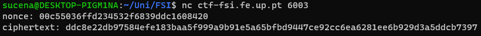
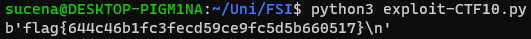

# Weak Encryption

This CTF consisted in deciphering the flag, which had been encrypted using a vulnerable algorithm.

## Analysis

The guide provided a Python script which detailed the cipher used to encrypt the key. The script, named "cipherspec.py", contained three distinct functions:

* **gen() -** This function is used to generate the cipher key.

```python
def gen(): 
	offset = 3 # Hotfix to make Crypto blazing fast!!
	key = bytearray(b'\x00'*(KEYLEN-offset)) 
	key.extend(os.urandom(offset))
	return bytes(key)
```

* **enc() -** A function which, given a <u>key</u>, a <u>message</u> and a <u>nonce</u>, encrypts the message using the AES cipher.
* **dec() -** A function which, given a <u>key</u>, a <u>ciphertext</u> and a <u>nonce</u>, decrypts the ciphertext according to the AES cipher.

We opted to not include the source code for the last two functions, seeing as they do not possess any vulnerabilities. In fact, the problem lies in the key generation function.

The issue is very simple: only very few bytes of the **key** are being randomized. This is because the variable "offset", defined in the first line of the key generation function, is being used to establish how many bytes of the key should be random as seen below:

```python
key = bytearray(b'\x00'*(KEYLEN-offset)) # create a byte array with 0's
key.extend(os.urandom(offset)) # append to that array a few random bytes
```

Seeing as the value of "offset" is **3**, the key was being generated by creating an array of bytes with the value 0 and appending to that array a mere three random bytes. Since three is a very low number, this cipher was vulnerable to **brute-force** attacks, that is, we could try out every possible key to discover which one was used to encrypt the message.

To that end, we would need to create a byte array filled with 0s, which would be our key. Then, we would attempt to decrypt the message using said key. If the decrypted message was the **flag**, we could stop, otherwise we would increment the last three bytes and try again.

## Preparing the Script

Before writing our code, we needed a few variables: the **ciphertext** and the **nonce**. By connecting to the server, we obtained them as follows:



Next, we started writing our script. Its behaviour can be summarized like so:

1. Initialize all the necessary variables.

```python
ciphertext = "5ec0245e54dc7f4cbbc4941577d4f7ddab198caab78702646c1d853c6912a7d7f4052ba72c3ae6"
nonce = "aab55d811f9e312a7cf589de98157163"

offset = 3
```

2. Iterate through all the possible keys. Since only the last three bytes could be different from 0, the keys were all the numbers belonging to **[0, 2^24[**.

```python
for i in range(2**24):
	key = bytearray(b'\x00' * (KEYLEN - offset)) 
	key.extend(i.to_bytes(3, "little"))
    ...
```

3. Decrypt the ciphertext using said keys. Then, convert it into a string.

```python
msg = str(dec(key, unhexlify(ciphertext), unhexlify(nonce)))
```

**Note:** As recommended by the guide, we used the `unhexlify()` function to convert the <u>ciphertext</u> and the <u>nonce</u> to bytes.

4. Verify if the decrypted message is the flag using a **regular expression**.

```python
if (re.search("flag{[A-Za-z0-9]+}", msg)):
    print(msg) # flag found!
    break
```

The finalized script can be found [here](etc/exploit-CTF10.py).

## Attack!

Armed with our attack script, we were finally ready to discover the flag. Running "exploit-CTF10.py", we got the following output after waiting a bit:



We successfully decrypted the ciphertext, thus obtaining the flag: `flag{644c46b1fc3fecd59ce9fc5d5b660517}`!
