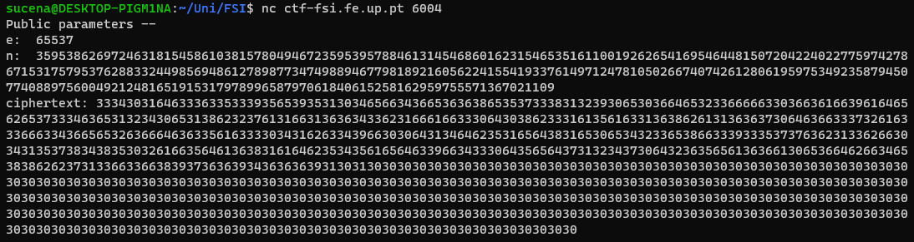

# RSA

This CTF consisted in deciphering the flag, which had been poorly encrypted using plain **RSA**.

This system requires the following values:
* Two **prime numbers**, `p` and `q`.
* Their product, `n` ($n = p \times q$).
* An exponent, `e`, such that $1 < e < (p-1)(q-1)$.
* `d`, such that $d \equiv (e - 1) \mod\ (p-1)(q-1)$.

The keys would then be the tuples below:
* **Public key -** $(n, e)$
* **Private key -** $(n, d)$

The strength of the RSA cipher comes from the fact that, given the product `n`, it is computationally unfeasible to deduce the two prime numbers, `p` and `q`, which are required to decrypt the message.

However, in this challenge, it is disclosed that $p \approx 2^{512}$ and $q \approx 2^{513}$, meaning that the possible values for the prime numbers were greatly diminished.

## Analysis

The guide provided the Python script that served as the backend of this CTF. Its behaviour can be summarized as follows:

1. Read the file which containts the flag.

```python
FLAG_FILE = '/flags/flag.txt'

...

with open(FLAG_FILE, 'r') as fd:
	un_flag = fd.read()
```

2. Get the parameters which will be used in the cipher.

```python
(p, q, n, phi, e, d) = getParams()
```

3. Output the **public key** (i.e. the exponent `e` and the product `n`).

```python
print("Public parameters -- \ne: ", e, "\nn: ", n)
```

4. Encrypt the flag and output it.

```python
print("ciphertext:", hexlify(enc(un_flag.encode(), e, n)).decode())
```

While it was useful to understand the output we would receive when connecting to the server, we were more interested in the auxiliary functions which supported the script. They are presented below:

* **enc() -** Given a plaintext message, the exponent `e` and the product `n`, encrypts the message.

```python
def enc(x, e, n):
    int_x = int.from_bytes(x, "little")
    y = pow(int_x,e,n)
    return hexlify(y.to_bytes(256, 'little'))
```

* **dec() -** Given an encrypted message, `d` and the product `n`, decrypts the message.

```python
def dec(y, d, n):
    int_y = int.from_bytes(unhexlify(y), "little")
    x = pow(int_y,d,n)
    return x.to_bytes(256, 'little')
```

We swiftly realized that, if we could discover the **primes** `p` and `q` used to encrypt the flag, we would be able to use the "dec()" function to decrypt the ciphertext.

## Computing Primes

As seen in the section above, the key to solving this challenge was the computation of **prime numbers**. Since we would be working with very big integers, we would need an algorithm that could quickly yet reliably determine whether a number is prime.

For that purpose, the guide recommended the [Miller-Rabin algorithm](https://en.wikipedia.org/wiki/Miller%E2%80%93Rabin_primality_test). Upon searching online, we found a [Python implementation](https://www.geeksforgeeks.org/primality-test-set-3-miller-rabin/) of said algorithm, which we opted to use. We placed it in a new Python script named "primes.py", which can be found [here](etc/primes.py).

## Preparing the Script

Before writing our code, we needed a few variables: the **public key**, constituted by the exponent `e` and the product `n`, and the **ciphertext**. By connecting to the server, we obtained them as follows:



Next, we started writing our script. Its behaviour can be summarized like so:

1. Import the auxiliary functions defined in other scripts.

```python
import re # regex
from binascii import hexlify, unhexlify

from primes import isPrime


def dec(y, d, n):
    int_y = int.from_bytes(unhexlify(y), "little")
    x = pow(int_y,d,n)
    return x.to_bytes(256, 'little')
```

**Note:** We were having difficulties importing the decryption function from the "challenge.py" script, so we decided to just copy it directly into our script.

2. Initialize the variables whose values we obtained from the server - the **public key** and the **ciphertext**.

```python
# public key
e = 65537
n = 359538626972463181545861038157804946723595395788461314546860162315465351611001926265416954644815072042240227759742786715317579537628833244985694861278987734749889467798189216056224155419337614971247810502667407426128061959753492358794507740889756004921248165191531797899658797061840615258162959755571367021109

ciphertext = "3334303164633363353339356539353130346566343665363638653537333831323930653036646532336666633036636166396164656265373334636531323430653138623237613166313636343362316661663330643038623331613561633136386261313636373064636633373261633366633436656532636664636335616333303431626334396630306431346462353165643831653065343233653866333933353737636231336266303431353738343835303261663564613638316164623534356165646339663433306435656437313234373064323635656136366130653664626634653838626237313366336638393736363934363636393130313030303030303030303030303030303030303030303030303030303030303030303030303030303030303030303030303030303030303030303030303030303030303030303030303030303030303030303030303030303030303030303030303030303030303030303030303030303030303030303030303030303030303030303030303030303030303030303030303030303030303030303030303030303030303030303030303030303030303030303030303030303030303030303030303030303030303030303030303030303030303030303030303030303030303030303030303030303030303030303030303030303030303030303030303030"
```

3. Compute the remaining variables required for the RSA algorithm.

```python
p = 2**512 + 1
k = 3

while True:
	# determine if the current number is prime
	if not isPrime(p, k):
		p += 2
		continue
		
	# compute the second prime
	q = n // p
	
	# compute d
	d = (e - 1) % ((p - 1) * (q - 1))

    ...
```

4. Decrypt the ciphertext. Then, convert it into a string.

```python
msg = str(dec(ciphertext, d, n))
```

5. Verify if the decrypted message is the flag using a **regular expression**.

```python
if (re.search("flag{[A-Za-z0-9]+}", msg)):
    print(msg) # flag found!
    break
```

The finalized script can be found [here](etc/exploit-CTF11.py).
