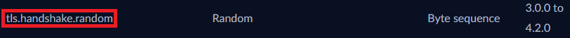
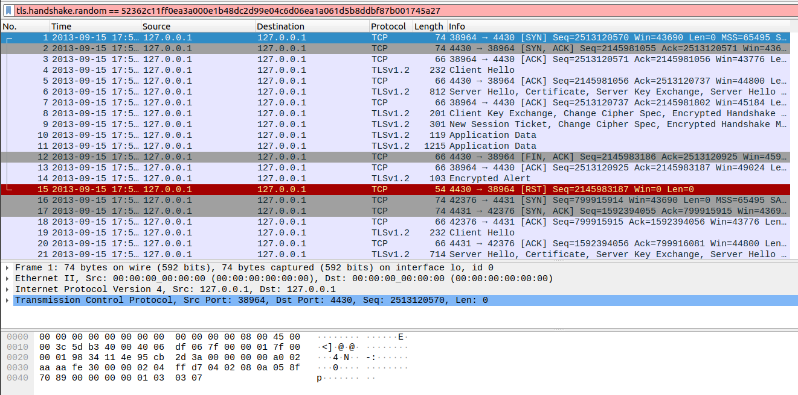
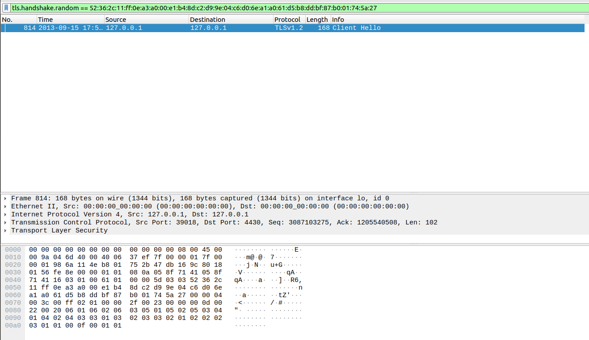
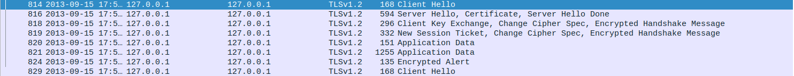

# Find-my-TLS

This CTF consisted in utilizing **Wireshark** to inspect a PCAP file. This file, named "dump.pcapng", contained multiple **TLS** connections.

> Transport Layer Security (or **TLS** for short) is a cryptographic protocol designed to provide secure communication over a computer network.

More specifically, we were interested in a particular procedure that was depicted in the file: a **TLS handshake**.

> The **TLS handshake** is a series of steps that allows two parties - typically a client and a server - to authenticate each other, agree on encryption standards and establish a secure channel for <ins>transferring data</ins>.

The figure below accurately represents this procedure:


## Analysis

The guide specified that the **TLS handshake** we had to examine was the one wherein the random number used in the first message - the **Client Hello** - was the following:

```
52362c11ff0ea3a000e1b48dc2d99e04c6d06ea1a061d5b8ddbf87b001745a27
```

With that in mind, we opened "dump.pcapng" on Wireshark and started looking for said message. However, due to the sheer number of packets contained in the file, it would be fruitless to just look at each one individually. We needed a **filter**.

To that end, we searched how to filter **TLS** packets on Wireshark and came across the official [Wireshark documentation](https://www.wireshark.org/docs/dfref/t/tls.html). Particularly, we found the following entry:



That was exactly what we were looking for: a way to filter **TLS** packets based on the random number. Excited to seemingly be making progress, we immediately typed in that filter and obtained the following:



Much to our dismay, Wireshark did not seem to recognize the number, as seen by the red search bar. Upon a bit more research, we realized the problem: since the number is a sequence of **bytes**, Wireshark required every two digits to be separated with a **colon**.

With that out of the way, we retyped the filter like so:



We found the packet we were looking for: packet **814**! Since we now knew the first message, discovering the rest of the exchange was quite easy, as we only had to sequentially analyze the packets below our initial packet. As such, we got the following:




