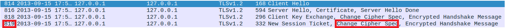

# Find-my-TLS

This CTF consisted in utilizing **Wireshark** to inspect a PCAP file. This file, named "dump.pcapng", contained multiple **TLS** connections.

> Transport Layer Security (or **TLS** for short) is a cryptographic protocol designed to provide secure communication over a computer network.

More specifically, we were interested in a particular procedure that was depicted in the file: a **TLS handshake**.

> The **TLS handshake** is a series of steps that allows two parties - typically a client and a server - to authenticate each other, agree on encryption standards and establish a secure channel for <ins>transferring data</ins>.

The figure below accurately represents this procedure:


## Analysis

The guide specified that the **TLS handshake** we had to examine was the one wherein the random number used in the first message - the **Client Hello** - was the following:

```
52362c11ff0ea3a000e1b48dc2d99e04c6d06ea1a061d5b8ddbf87b001745a27
```

With that in mind, we opened "dump.pcapng" on Wireshark and started looking for said message. However, due to the sheer number of packets contained in the file, it would be fruitless to just look at each one individually. We needed a **filter**.

To that end, we searched how to filter **TLS** packets on Wireshark and came across the official [Wireshark documentation](https://www.wireshark.org/docs/dfref/t/tls.html). Particularly, we found the following entry:


That was exactly what we were looking for: a way to filter **TLS** packets based on the random number. Excited to seemingly be making progress, we immediately typed in that filter and obtained the following:


Much to our dismay, Wireshark did not seem to recognize the number, as seen by the red search bar. Upon a bit more research, we realized the problem: since the number is a sequence of **bytes**, Wireshark required every two digits to be separated with a **colon**.

With that out of the way, we retyped the filter like so:


We found the packet we were looking for: packet **814**! Now that we had identified the beginning of handshake, we figured we should also pinpoint the end - the **Change Cipher Spec Finished** packet. However, that turned out to be way easier than we expected, since we only needed to sequentially analyze the packets below packet 814 like so:



While in Wireshark the description of the packet was slightly different (instead of 'Change Cipher Spec Finished' they simply had 'Change Cipher Spec'), we quickly deduced that packet **819** marked the end of the handshake. In fact, it was the fourth packet transmitted and, as we learned in the [previous section](#find-my-tls), a **TLS handshake** requires four packets.

As such, we had sucessfully located the procedure we would have to investigate, which can be summed up like so:


## Obtaining the Values

According to the guide, the flag had the following format:

```
flag{<frame_start>-<frame_end>-<selected_cipher_suite>-<total_encrypted_appdata_exchanged>-<size_of_encrypted_message>}
```

So, we got to work discovering the required values.

* ***frame_start* and *frame_end*** 

The ***frame_start*** and ***frame_end*** were the first and last packet numbers corresponding to the TLS handshake, respectively. Luckily, we already obtained them in the [previous section](#analysis) - packets **814** and **819**.

* ***selected_cipher_suite***

This value was the name of the ciphersuite used to encrypt the messages in the TLS channel. We figured it would be present in the **Client Hello** packet, so we decided to scrutinize it:


To our surprise, two ciphersuites were present. That meant we would have to keep exploring to figure out which one was effectively used. And so we did:


The next packet revealed the answer: the ciphersuite was **TLS_RSA_WITH_AES_128_CBC_SHA256**.

**Note:** After researching the topic a bit on the Internet, we realized why the <ins>Client Hello</ins> message contained numerous <ins>ciphersuites</ins> - it had to do with the fact that, in that message, the client specifies which ciphersuits it supports. It is up to the server to choose which one to use, hence why that information is transmitted in the next message - the <ins>Server Hello</ins>.

* ***total_encrypted_appdata_exchanged***

This value was obtained by adding the amount of data bytes sent in each **data packet**.


The first data packet contained <ins>80</ins> bytes of data, while the second had a whopping <ins>1184</ins>. Summing the two, we got the desired value: **1264** bytes.

* ***size_of_encrypted_message***

The ***size_of_encrypted_message*** was the size of the ciphered message used in the packet which concluded the TLS handshake. We already knew that was packet **819**, so we inspected it one more time:


Just like that, we got the final value: **80**.

## Writing the Flag

We had discovered all the values we needed to form the flag. For convenience, we compiled them in the following table:

| Name | Description | Value |
|:-----:|:-----------:|:-----:|
| *frame_start* | The number of the first packet corresponding to the TLS handshake - the **Client Hello** packet. | 814 |
| *frame_end* | The number of the last packet corresponding to the TLS handshake. | 819 |
| *selected_cipher_suite* | The <ins>name</ins> of the ciphersuite chosen for the TLS connection. | TLS_RSA_WITH_AES_128_CBC_SHA256 |
| *total_encrypted_appdata_exchanged* | The sum of the total data exchanged in the channel. | 1184 + 80 = 1264 |
| *size_of_encrypted_message* | The size of the ciphered message used in the **Change Cipher Spec Finished** packet. | 80 |

After writing them in the correct order, we obtained the flag: `flag{814-819-TLS_RSA_WITH_AES_128_CBC_SHA256-1264-80}`!
