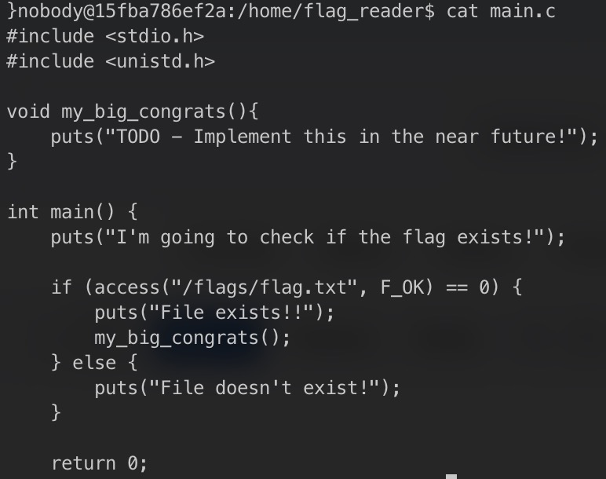
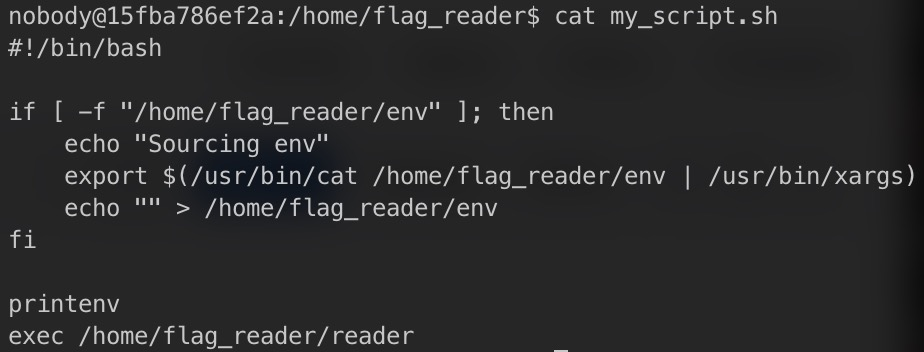

# Linux Environment 

### Exploration

Upon accessing the Linux server in the port `4006` of `ctf-fsi.fe.up.pt`, we were quick to search for potencial clues. Inside the directory `/home/flag_reader`, where we started, the following files were found:

While checking their content, we immediatily found our first clue in the file `admin_note.txt`:

We could tell `/tmp` would have some clues.
Checking `main.c`, we found the location of our goal, the flag. It would be found in the file `/flags/flag.txt`:

We also find `reader`, which is the executable file for `main.c`, and `my_script.sh`, which adds whatever is in the `env` file to the environment variables and executes `reader`:

