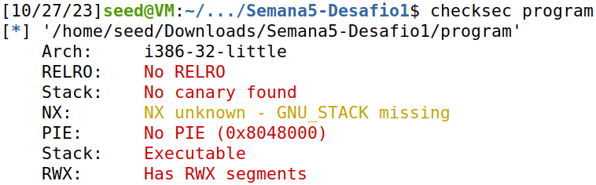
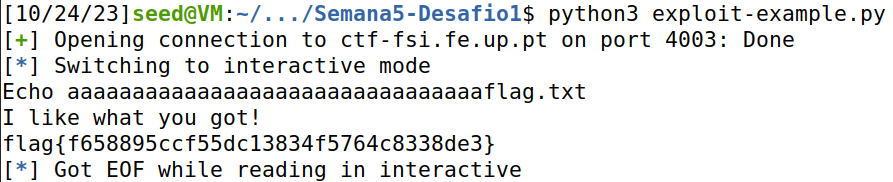
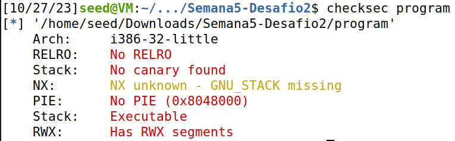
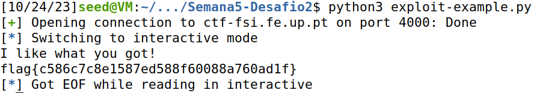

# Buffer Overflow

This CTF consists in two very similar challenges. In each of them, we had to exploit a program with a buffer overflow vulnerability in order to access a file named "flag.txt", which, as the name implies, contained the flag.

Each challenge came with a folder which contained a few files. The most relevant were the following:

* **main.c** - the source code of the vulnerable program
* **program** - the executable corresponding to the vulnerable program

## 1st flag

### Analysis

#### Source Code

Before attempting to exploit the program, we had to properly understand its source code. As such, we opened "main.c" and started thoroughly scrutinizing it.

The script itself was pretty simple. It can be summarized as follows:

1. Create two character arrays, "meme_file" and "buffer", with sizes 8 and 32, respectively.

```c
char meme_file[8] = "mem.txt\0";
char buffer[32];
```

2. Read 40 characters of user input and store them in the "buffer" array.

```c
scanf("%40s", &buffer);
```

3. Open the file whose name is given by the "meme_file" variable.

```c
FILE *fd = fopen(meme_file,"r");
```

4. Attempt to read from the file, if it exists, and store its content on "buffer". Then, print "buffer".

```c
while(1){
    if(fd != NULL && fgets(buffer, 32, fd) != NULL) {
        printf("%s", buffer);
    } else {
        break;
    }
}
```

**Note:** This step is equivalent to printing the content of the file, given it exists.

#### Executable

When attacking a program, in addition to understanding its source code, it is also vital to ascertain how the executable was set up. In other words, we should be aware of any security measures that could prevent us from exploiting it.

To that end, we ran `checksec`, which is a bash script for checking the properties of executables, as such:

```bash
$ checksec program
```

The output of the command above was the following:



As such, we have acquired the following information:

* There is no **canary** protecting the stack, which means buffer overflows will not be detected.

> A **stack canary** is a secret value placed on the **stack** which changes every time the program is started. Prior to a function return, it is checked and, if it appears to have been modified, the program returns immediately.

* The executable is not a `PIE`, which means the positions of the executable are NOT **randomized**.

> A **Position-independent executable** (or `PIE` for short) is a binary that executes properly regardless of its **absolute address** (i.e. independently of where it is placed in memory).

* The stack has **reading**, **writing** and **execution** permissions (`RWX`).

So, considering our analysis of the source code and the executable, it became glaringly obvious that we could overwrite the contents of "meme_file" by purposefully overflowing the "buffer". This is because the two variables are side by side in **memory** and, since "buffer" is initialized after "meme_file", the end of "buffer" corresponds to the start of "meme_file".

### Preparing the Payload

As recommended by the guide, we used the "exploit_example.py" script to interact with the program.

Before executing it, though, we had to create the payload we would use to cause the buffer overflow. Since our input was limited to the command line, it would have to be a string with the following restrictions:

* Since "buffer" is 32 bytes, the length of the string had to be greater than that to trigger the buffer overflow.
* The string had to contain the name of the file we wanted to access, "flag.txt", immediately after the 32nd character in order to overwrite the "meme_file" variable. In Python, this can be expressed as follows:

```python
string[32:] = "flag.txt"
```

As such, we opted to use the following string: 

```python
"aaaaaaaaaaaaaaaaaaaaaaaaaaaaaaaaflag.txt" # 32 * 'a' + "flag.txt"
```

### Attack!

With our payload ready, we modified the Python script so that it would send it to the program.

```python
r.sendline(b"aaaaaaaaaaaaaaaaaaaaaaaaaaaaaaaaflag.txt")
```

**Note:** The 'b' before the string means the characters will be encoded as <u>octets</u> (integers ranging from 0 to 255), which is the format C uses for character encoding.

Finally, we were ready to attack. Running our script, we got the following output:



We found the first flag: `flag{f658895ccf55dc13834f5764c8338de3}`!

## 2nd flag

### Analysis

#### Source Code

Once again, our first task was investigating the source code. Opening "main.c", we realized this program was quite similar to the one from the [previous challenge](#1st-flag). 
Its behaviour is described below:

1. Initialize three character arrays by this order: "meme_file" (9 bytes), "val" (4 bytes), and "buffer" (32 bytes).

```c
char meme_file[9] = "mem.txt\0\0";
char val[4] = "\xef\xbe\xad\xde";
char buffer[32];
```

This means that "buffer" is adjacent to "val" in **memory** and "val" is adjacent to "meme_file". So, in order to overwrite "meme_file", we had to overwrite "val" first.

2. Read 45 characters of user input and store them in the "buffer" array.

```c
scanf("%45s", &buffer);
```

3. Convert "val" into an integer pointer and dereference it. After that, compare the result with `0xfefc2324`.

```c
if(*(int*)val == 0xfefc2324) {
    ...
}
```

4. If the previous values are equal, open the file whose name is given by the "meme_file" variable.

```c
FILE *fd = fopen(meme_file,"r");
```

5. Attempt to read from the file, if it exists, and print its content.

```c
while(1){
    if(fd != NULL && fgets(buffer, 32, fd) != NULL) {
        printf("%s", buffer);
    } else {
        break;
    }
}
```

Once again, we had to overflow "buffer" to overwrite the contents of "meme_file". Unlike last time, though, we had to be concerned with properly overwriting "val" as well, since the code that accessed the file was only executed when "val" equalled `0xfefc2324`.

#### Executable

Before getting our hopes up, though, we had to make sure the executable would allow us to perform such an attack. That is, we had to run `checksec` again to verify its security measures.

The output this time was as follows:



Luckily for us, this executable has the same security measures (or lack thereof) as the one from the [last challenge](#executable). As such, our attack was feasible and no further examination was needed.

### Preparing the Payload

Since this challenge did not provide a script for interacting with the program, we copied the one we [previously](#preparing-the-payload) used.

Yet again, we had to create the string we would use as a payload. The restrictions this time were the following:

* The size of the string had to be greater than 32 bytes so that we could properly overflow the "buffer" variable.
* The bytes in the positions 32 to 36 would have to contain the characters whose hexadecimal values corresponded to `0xfcfe2324`. In Python, this restriction would be represented like this:

```python
string[32:36] = "\x24\x23\xfc\xfe"
```

**Note:** Since the address of "val" comes right after the end of "buffer", we overwrote its content from its <u>least significant</u> bytes to its <u>most significant</u>. As such, we had to write the hexadecimal characters in <u>reverse</u>.

* The string had to contain the name of the file we wanted to access, "flag.txt", immediately after its 36th character. In Python, this could be represented as follows:

```python
string[37:] = "flag.txt"
```

Taking that into account, we chose to use the following string:

```python
"aaaaaaaaaaaaaaaaaaaaaaaaaaaaaaaa\x24\x23\xfc\xfeflag.txt"
```

### Attack!

Having decided our payload, we copied it onto our Python script so that it would be sent to the program.

```python
r.sendline(b"aaaaaaaaaaaaaaaaaaaaaaaaaaaaaaaa\x24\x23\xfc\xfeflag.txt")
```

It was time to attack once again. This time, executing our exploit net us the following output:



We found the second flag: `flag{c586c7c8e1587ed588f60088a760ad1f}`!
