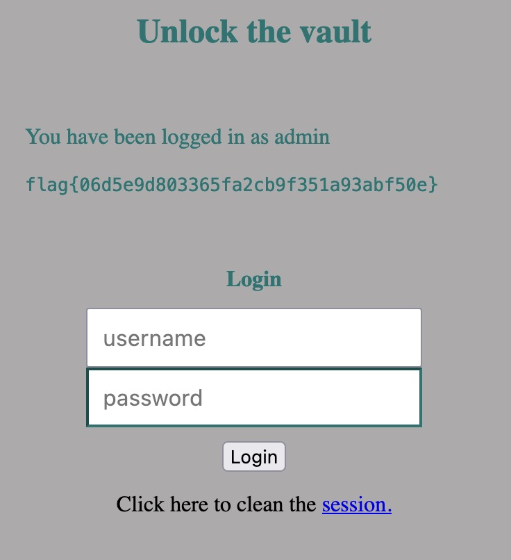

# SQL Injection

In this CTF we need to exploit the website using a SQL injection to log in without knowing the user's usernames and passwords

# Exploration

We can see that the website is just a form that tries to match our input with the data on the database

# Execution

I wonder if the form is protecting against code execution by using the single quote to close the input's string

And to our surprise, it is not protected for that exploit, so let's develop a SQL query to let us access the website without knowing the credentials of a user

We assume that the input matching query is something like:

`USERNAME='$username' AND HASH_PASSWORD='$hash_password';`

So a simple query like `' OR 1=1;--` added to the username field should be enough

Replaced it will look like this:

`USERNAME='' OR 1=1;--` ~~`' AND HASH_PASSWORD='$hash_password';`~~

When we submit the form, we get flag

