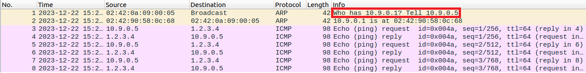
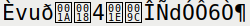
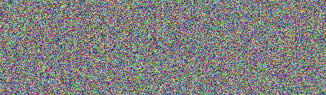

# Secret-Key Encryption

The purpose of this lab was to become familiar with essential secret-key encryption concepts, such as **ciphers**.

> A **cipher** is an algorithm for encrypting or decrypting a fixed-length block of data.

Ciphers cannot process data out of the blue though - they need a **key** that specifies which modifications to make.

> A **key** is a piece of information, usually a string of numbers or letters, which, when used in a <u>cipher</u>, can encode or decode data.

Depending on how a cipher utilizes them, it can be classified as:

* **Symmetric** - The cipher uses the same key for encryption and decryption.
* **Asymmetric** - The cipher uses separate keys for encryption and decryption. These are known as <u>public</u> and <u>private keys</u>, respectively.

Coupled with keys, most ciphers also utilize **initialization vectors**.

> An **initialization vector** (or IV for short) is a variable used in several ciphers to <u>randomize</u> the encryption, thus producing distinct ciphertexts even if the same plaintext is encrypted multiple times.

## Task 1: Frequency Analysis

Our first task was to decipher a message encrypted using a **monoalphabetic cipher**.

> A **monoalphaebtic cipher** is a substitution cipher where each symbol in the original message is <u>consistently</u> replaced with another symbol to form the ciphertext.

This type of cipher is vulnerable to a technique called **frequency analysis**.

> **Frequency analysis** consists in counting the occurrence of each <u>symbol</u> in a ciphertext. It is based on the fact that, in any given piece of text, certain symbols and combinations of symbols occur with varying frequencies.

So, as long as we know the language of the original message, we can search the most common characters and character combinations of said language to help us appropriately determine the mapping of cipher to plaintext symbols. 

**Example:** In English, the most common letter is the vowel 'e', which means that the most common cipher symbol will most likely correspond to the 'e' symbol in the original message.

### 1st Paragraph

The message we had to decrypt was in a file named "ciphertext.txt", which we can be found [here](etc/ciphertext.txt).

Since analyzing the whole file at once would be exhausting and fruitless, we opted to decipher it one paragraph at a time, starting with the first:

```
ytn xqavhq yzhu  xu qzupvd ltmat qnncq vgxzy hmrty vbynh ytmq ixur qyhvurn vlvhpq yhme ytn gvrrnh bnniq imsn v uxuvrnuvhmvu yxx
```

Before starting the substitution, we had to figure out the **frequency** of each symbol. Thankfully, the guide provided a Python program - "freq.py" - which not only computed the frequency of each character but also the most frequent groups of 2 and 3 characters. Upon running it, we obtained the following output:

```bash
$ python3 freq.py
-------------------------------------
1-gram (top 20):
n: 488
y: 373
v: 348
x: 291
u: 280
q: 276
m: 264
h: 235
t: 183
i: 166
p: 156
a: 116
c: 104
z: 95
l: 90
g: 83
b: 83
r: 82
e: 76
d: 59
-------------------------------------
2-gram (top 20):
yt: 115
tn: 89
mu: 74
nh: 58
vh: 57
hn: 57
vu: 56
nq: 53
xu: 52
up: 46
xh: 45
yn: 44
np: 44
vy: 44
nu: 42
qy: 39
vq: 33
vi: 32
gn: 32
av: 31
-------------------------------------
3-gram (top 20):
ytn: 78
vup: 30
mur: 20
ynh: 18
xzy: 16
mxu: 14
gnq: 14
ytv: 13
nqy: 13
vii: 13
bxh: 13
lvq: 12
nuy: 12
vyn: 12
uvy: 11
lmu: 11
nvh: 11
cmu: 11
tmq: 10
vhp: 10
```

We started by analyzing the most common 3-gram: 'ytn'. Since the message was in English, we deduced that 'ytn' mapped to **'the'**, because that preposition is the most common 3-gram in the English language. In addition, 'n', the most frequent symbol, was present at the end of 'ytn', which meant it had to map to **'e'**. As such, we made our first modification:

| Substitution | Message |
| ------ | ------ |
|  `ytn` ~ `THE`  | '**THE** xqavhq Tzhu  xu qzupvd lHmaH qEEcq vgxzT hmrHT vbTEh THmq ixur qThvurE vlvhpq Thme **THE** gvrrEh bEEiq imsE v uxuvrEuvhmvu Txx' |

**Note:** As recommended by the guide, we ensured the symbols we substituted were in <u>uppercase</u> so we could more easily notice our changes.

After that, we made the modifications below:

| Substitution | Message |
| ------ | ------ |
| `v` ~ `A` | 'THE xqa**A**hq Tzhu  xu qzup**A**d lHmaH qEEcq **A**gxzT hmrHT **A**bTEh THmq ixur qTh**A**urE **A**l**A**hpq Thme THE g**A**rrEh bEEiq imsE **A** uxu**A**rEu**A**hm**A**u Txx' |
| `h` ~ `R` | 'THE xqaA**R**q Tz**R**u  xu qzupAd lHmaH qEEcq AgxzT **R**mrHT AbTE**R** THmq ixur qT**R**AurE AlA**R**pq T**R**me THE gArrE**R** bEEiq imsE A uxuArEuA**R**mAu Txx' |
| `b` > `F` | 'THE xqaARq TzRu  xu qzupAd lHmaH qEEcq AgxzT RmrHT A**F**TER THmq ixur qTRAurE AlARpq TRme THE gArrER **F**EEiq imsE A uxuArEuARmAu Txx' |
| `mr` > `IG` | 'THE xqaARq TzRu  xu qzupAd lH**I**aH qEEcq AgxzT R**IG**HT AFTER TH**I**q ixu**G** qTRAu**G**E ...' |
| `q` > `S` | 'THE x**S**aAR**S** TzRu  xu **S**zupAd lHIaH **S**EEc**S** AgxzT RIGHT AFTER THI**S** ixuG **S**TRAuGE ...' |
| `u` > `N` | 'THE xSaARS TzR**N**  x**N** Sz**N**pAd lHIaH SEEcS AgxzT RIGHT AFTER THIS ix**N**G STRA**N**GE ...' |
| `x` > `O` | 'THE **O**SaARS TzRN  **O**N SzNpAd lHIaH SEEcS Ag**O**zT RIGHT AFTER THIS i**O**NG STRANGE ...' |
| `a` > `C` | 'THE OS**C**ARS TzRN  ON SzNpAd lHI**C**H SEEcS AgOzT RIGHT AFTER THIS iONG STRANGE AlARpS TRIe THE gAGGER FEEiS iIsE A NONAGENARIAN TOO' |
| `zlcg` > `UWMB` | 'THE OSCARS T**U**RN  ON S**U**NpAd **W**HICH SEE**M**S A**B**O**U**T RIGHT AFTER THIS iONG STRANGE A**W**ARpS TRIe THE **B**AGGER FEEiS iIsE A NONAGENARIAN TOO' |
| `pdise` > `DYLKP` | 'THE OSCARS TURN  ON SUN**D**A**Y** WHICH SEEMS ABOUT RIGHT AFTER THIS **L**ONG STRANGE AWAR**D**S TRI**P** THE BAGGER FEE**L**S **L**I**K**E A NONAGENARIAN TOO' |

### 2nd paragraph

After fully decrypting the first paragraph, we moved on the the second:

```
THE AWARDS RACE WAS BOOKENDED BY THE DEMISE OF HARfEY WEINSTEIN AT ITS OUTSET AND THE APPARENT IMPLOSION OF HIS FILM COMPANY AT THE END AND IT WAS SHAPED BY THE EMERGENCE OF METOO TIMES UP BLACKGOWN POLITICS ARMCANDY ACTIfISM AND A NATIONAL CONfERSATION AS BRIEF AND MAD AS A FEfER DREAM ABOUT WHETHER THERE OUGHT TO BE A PRESIDENT WINFREY THE SEASON DIDNT oUST SEEM EkTRA LONG IT WAS EkTRA LONG BECAUSE THE OSCARS WERE MOfED TO THE FIRST WEEKEND IN MARCH TO AfOID CONFLICTING WITH THE CLOSING CEREMONY OF THE WINTER OLYMPICS THANKS PYEONGCHANG
```

Luckily for us, the vast majority of it was already decrypted. In fact, we only needed to make one last modification:

| Substitution | Message |
| ------ | ------ |
| `fko` > `VXJ` | 'THE AWARDS RACE WAS BOOKENDED BY THE DEMISE OF HARVEY WEINSTEIN AT ITS OUTSET AND THE APPARENT IMPLOSION OF HIS FILM COMPANY AT THE END AND IT WAS SHAPED BY THE EMERGENCE OF METOO TIMES UP BLACKGOWN POLITICS ARMCANDY ACTIVISM AND A NATIONAL CONVERSATION AS BRIEF AND MAD AS A FEVER DREAM ABOUT WHETHER THERE OUGHT TO BE A PRESIDENT WINFREY THE SEASON DIDNT JUST SEEM EXTRA LONG IT WAS EXTRA LONG BECAUSE THE OSCARS WERE MOVED TO THE FIRST WEEKEND IN MARCH TO AVOID CONFLICTING WITH THE CLOSING CEREMONY OF THE WINTER OLYMPICS THANKS PYEONGCHANG' |

And with that, the entire message had been decrypted. To avoid bloating this file, it can be found here.

## Task 2: Encryption Ciphers

Next, we were asked to experiment different **ciphers** and cipher modes. However, considering the [next task](#task-3-encryption-modes---ecb-vs-cbc) already highlights cipher modes, we opted to focus exclusively on ciphers in this one.

There are various types of ciphers, however, the two most prominent are **stream** and **block ciphers**. Out of curiosity, we investigated more about both.

### Stream ciphers

> A **stream cipher** is a <u>symmetric key</u> cipher where plaintext symbols are combined with a pseudorandom cipher symbol stream, known as a <u>keystream</u>.

In these types of ciphers, each symbol is encrypted one at a time with the corresponding symbol from the **keystream** to create the ciphertext symbol. Generally, each symbol is a bit or a byte and the combining operation is **XOR**.

**Note:** A <u>keystream</u> is generated by supplying a <u>key</u> to a psedorandom bit generator.

### Block ciphers

> A **block cipher** is a <u>symmetric key</u> cipher that operates on fixed-length groups of bits, called <u>blocks</u>.

In these ciphers, the plaintext processes blocks of equal size, the most common being **octaves** (64-bit and 128-bit blocks). When the plaintext length is not a multiple of 8, it is necessary to add **padding**.

Conceptually speaking, block ciphers are quite similar to **stream ciphers** - the main variation is the size of the data processed at a time. However, there are additional, less obvious differences between both types as can be seen below:

|Stream cipher| Block cipher |
|-------------|--------------|
| Takes one <u>symbol</u> of plaintext at a time. | Takes one <u>block</u> of plaintext at a time.|
| Keys are one-time use. | One key can be used multiple times.|
| Faster than block cipher. | Slower than stream cipher. |
| Easy to reverse encrypted text. | Difficult to reverse encrypted text.|
| Require less code to be implemented. | Require more code to be implemented. |
| Suitable for implementation in hardware. | Suitable for implementation in software. |

### Testing the Ciphers

After understanding the differences between the two major types of ciphers, we were finally ready to try a few ciphers out.

We chose to encrypt a very simple file created by us - "message.txt" - which contained the following text:

```
A secret message
```

As recommended by the guide, we used `openssl enc` to encrypt our file. The guide also provided the command below, so we only had to replace the cipher field with the one we intended to use:

```bash
$ openssl enc -<cipher> -e -in message.txt -out encrypted.txt -K 00112233445566778889aabbccddeeff -iv 0102030405060708
```

The results of our experiment were compiled below:

| Cipher | Type | Encrypted |
|--------|----------|-----------|----------|
| Blowfish | Block |  |
| 128-bit Camellia | Block | |
| ChaCha20 | Stream |  |

## Task 3: Encryption Modes - ECB vs CBC

In the previous task, we explored different ciphers - the algorithms used to encrypt a fixed-length group of bits. This task, however, was focused on the **modes** of operation of a cipher.

> A **cipher mode** is an algorithm that describes how to repeatedly apply a <u>cipher</u>'s single-block operation to securely transform amounts of data larger than a block.

Our final task consisted in comparing two [block cipher](#block-ciphers) modes: **ECB** and **CBC**. To that end, we were prompted to encrypt a file called "pic_original.bmp", which contained the image below:


We then had to treat the encrypted image as a `.bmp` file and visualize it. To better compare our results, we used the same cipher for the encryption: **128-bit AES**.

**Note:** Given `.bmp` files have a header, we had to concatenate the header of the original file with the data from the encrypted file to view the encrypted image in a picture viewing software. As such, after encryting "pic_original.bmp" in the experiences below, we ran the following commands:

```bash
$ head -c 54 pic_original.bmp > header # extract the header from the original file
$ tail -c +55 p2.bmp > body # extract the body from the encrypted file
$ cat header body > new.bmp # concatenate both and store them in a new file
```

### ECB

> Electronic Code Book (or **ECB** for short) is a simple encryption mode wherein each block of the original message is encrypted <u>separately</u>.



Once again, we relied on `openssl enc` to encrypt "pic_original.bmp" like so:

```bash
$ openssl enc -aes-128-ecb -e -in pic_original.bmp -out pic_encrypted.bmp -K 00112233445566778889aabbccddeeff
```

We obtained the following:

| Original | Encrypted |
|----------|-----------|
|  |  |

By comparing both images, it became clear just how similar they were. It was very easy to identify the shapes from the original picture in the encrypted version, even if they had a different color.

This happened because ECB encrypts **identical** plaintext blocks into identical ciphertext blocks. As such, this mode does not hide **data patterns** well. In the case of the images, while the color of each pixel changed due to the encryption, we could still discern patterns of identically colored pixels.

### CBC

> Cipher Block Chaining (or **CBC** for short) is an encryption mode wherein each block of the original message is <u>XORed</u> with the previous ciphertext block before beign encrypted. The first block is XORed with an <u>initialization vector</u>.


This mode guarantees each ciphered block depends on all plaintext blocks processed up to that point. In addition, the **initialization vector** ensures the uniqueness of each message, meaning the same plaintext encrypted twice using the same key will <u>not</u> yield the same ciphertext.

We used the command below to encrypt "pic_original.bmp":

```bash
$ openssl enc -aes-128-cbc -e -in pic_original.bmp -out pic_encrypted.bmp -K 00112233445566778889aabbccddeeff -iv 0102030405060708
```

The result this time was as follows:

| Original | Encrypted |
|----------|-----------|
|  |  |

Unlike with EBC, we were not able to identify any patterns in the encrypted image that resembled the original. It was as if the two images had no correlation.

This is due to the fact that each plaintext block is XORed with the previous ciphered block, thus introducing an element of **pseudo-randomness** in the ciphertext.

### Further testing

To confirm our results, we decided to retry this experience with another picture. The results were as follows:

| Cipher Mode | Picture | Conclusion |
|------|---------|-------------------------|
| *None* |  | - |
| ECB    |  | Color patterns are easily recognizable. It conveys clear information about the original image, even though the colors are different. |
| CBC  |  | No color patterns can be detected. It is not possible to derive any meaningful information about the original image. |

So, our previous conclusions held true.
