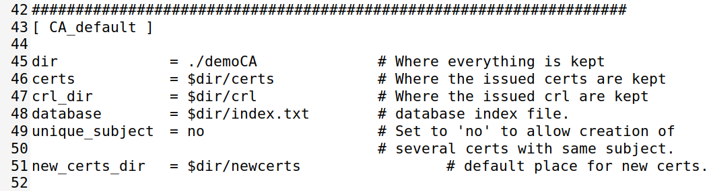
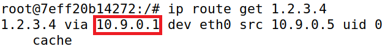
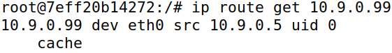

# Public-Key Infrastructure (PKI)

## Setup

Before starting the tasks themselves, we had to set up an HTTPS web server. To that end, we added the following entry to the `etc/hosts` file of our virtual machine:

```
10.9.0.80   www.l11g04.com
```

## Task 1: Becoming a CA

> A Certificate Authority (or **CA** for short) is a trusted entity that issues **digital certificates**, which are used to certify the ownership of a <u>public key</u> by the named subject of the certificate.

There are two types of CAs:

* **Normal -** The certificates they issue are generally signed by another CA.
* **Root -** The certificates they issue are <u>unconditionally trusted</u>, thus not needing another signature.

Our first task was to become a **root CA**.

### Configuring the Server

We were going to rely on `OpenSSL` to create certificates, meaning we needed a **configuration file**. The default configuration file is located in `/usr/lib/ssl/openssl.cnf`, so we copied it to our working directory like so:

```bash
cp /usr/lib/ssl/openssl.cnf .
```

Next, we uncommented a line so we could allow the creation of certificates with the same subject.

```shell
unique_subject	= no	# Set to 'no' to allow creation of
					    # several certs with same subject.
```

The guide recommended we create an empty file for our "index.php", so we typed the command below:

```bash
touch index.php
```

Finally, we had to create a "serial" file with a single number in string format, so we did it like so:

```bash
echo 2023 > serial
```

While it was not necessary, we noticed the example directory provided by the guide had a folder named "certs" which contained the configuration file, so we decided to do the same ourselves:

```bash
mkdir certs
mv openssl.cnf certs
```

### Generating the Certificate

As previously mentioned, our goal was to become a root CA. As such, we needed to generate a **self-signed certificate**. Thankfully, the guide provided the command below, which we ran inside "certs":

```bash
openssl req -x509 -newkey rsa:4096 -sha256 -days 3650 \
    -keyout ca.key -out ca.crt
```

We were prompted to input a password, which we decided would be 'fsi2023', as well as the subject information seen below:



Upon submitting our input, the command yielded two new files: "ca.key" and "ca.crt". The former contained the CA's **private key**, while the latter contained the **public-key certificate**.

### Analyzing the Files

To view the content of the output files - "ca.key" and "ca.crt" - the guide provided the commands below:

```bash
openssl x509 -in ca.crt -text -noout # print the certificate in plain text
openssl rsa -in ca.key -text -noout # print the key in plain text
```

Upon inspecting their content, we were then asked the following questions:

* **What part of the certificate indicates this is a CA’s certificate?**

The property "CA" indicates whether the certificate belongs to a CA or not.



Since in our certificate that value was set to `TRUE`, it meant it was in fact a CA certificate.

* **What part of the certificate indicates this is a self-signed certificate?**

If a certificate is self-signed, the "Subject Key Identifier" and the "Authority Key Identifier" must be the same.



In our certificate, that was the case.

* **In the RSA algorithm, we have a public exponent *e*, a private exponent *d*, a modulus *n*, and two secret numbers *p* and *q*, such that *n = pq*. Please identify the values for these elements in your certificate and key files.**

    * The public exponent, `e`

        ```
        publicExponent: 65537 (0x10001)
        ```

    * The private exponent, `d`

        ```
        privateExponent:
            2f:73:0e:f0:62:12:aa:d8:b3:ff:51:a1:c7:df:94:
            a8:c3:d8:01:33:79:b9:bf:7b:5a:c8:bd:da:67:3b:
            12:ca:19:a3:6c:63:6f:b7:8e:0c:6b:f5:cc:fb:86:
            d5:04:08:27:79:1a:d0:0a:09:a7:b1:27:d4:5b:3d:
            27:05:af:8b:c4:34:3f:a6:92:c6:8f:22:26:45:09:
            f8:bc:8b:00:b1:94:24:49:00:65:1d:bc:f2:9a:8f:
            49:93:8d:fb:79:b7:61:a7:e7:d0:9b:17:e1:67:df:
            60:68:f0:3e:aa:3a:92:d7:0a:07:da:f8:91:26:aa:
            28:2a:af:7d:3a:4c:a8:5d:e0:5c:e5:3e:0b:6a:4f:
            79:d4:17:4d:00:1e:87:b3:f9:30:18:33:e0:80:cf:
            f1:dc:b2:15:9e:89:4d:cf:f2:90:46:ff:d4:02:9b:
            25:ca:f2:5e:45:44:cd:f0:d5:9f:50:d3:e9:02:2d:
            9c:62:1f:58:48:b5:32:f1:c4:38:84:19:8b:02:c0:
            67:26:69:ff:11:ef:ac:ff:9d:0a:aa:ff:cd:f0:65:
            22:8e:42:75:74:e9:3c:2c:e9:9e:48:e9:4d:0c:af:
            20:4c:a2:eb:b3:29:d5:de:b6:2f:f7:5f:7a:9f:c7:
            e4:81:67:2a:da:0e:c1:34:0d:2a:94:1a:d0:b6:b0:
            1f:bd:82:3b:44:4c:ab:96:98:52:f2:c1:b2:4d:78:
            df:6b:5e:ea:03:4b:44:9e:40:60:82:2d:50:bf:64:
            ec:20:a8:6e:35:72:b2:6a:fc:3b:1d:b8:b6:6e:20:
            5f:a1:05:32:1d:eb:4b:ec:16:df:b2:3b:b5:37:99:
            c3:23:86:8e:39:cf:c9:83:03:19:ce:e2:ab:8a:8a:
            a9:40:7d:ea:b5:42:4f:c7:21:1c:40:fb:a8:f2:55:
            e6:e5:ec:69:88:e1:48:21:a0:ca:11:d7:66:d9:69:
            db:51:d5:45:53:5d:84:8f:0e:05:24:ec:70:d0:c5:
            b9:40:6f:c7:31:83:94:5c:ad:d5:db:54:05:52:3e:
            60:20:f9:21:cc:0d:ef:81:e2:28:0f:51:8f:3a:2d:
            6d:79:35:c3:76:0a:7f:7c:5b:dd:92:05:8f:84:31:
            a5:33:ee:a7:8b:23:54:1d:bc:31:bf:6a:65:02:d3:
            1a:64:cd:1c:b6:0a:56:41:ea:aa:4a:83:0c:dc:25:
            11:29:b0:e1:a8:41:4e:9f:1f:c4:85:0c:35:b8:28:
            b6:3b:77:60:b3:d2:50:f9:46:83:ee:72:5d:1f:ba:
            5d:b5:db:9e:b8:7c:ab:59:33:b8:6a:28:c6:0d:73:
            4d:57:a3:c5:13:e1:2f:f6:34:c0:5d:af:4b:f3:f8:
            31:b1
        ```

    * The modulus, `n`

        ```
        modulus:
            00:bb:ce:60:77:7f:2a:78:36:a6:ca:9f:a2:64:84:
            2a:cd:04:9e:85:33:c6:f0:08:3e:00:7f:09:2b:a5:
            ab:7d:d6:92:58:38:42:7b:ab:bc:28:5a:53:51:40:
            68:27:01:68:d8:f7:29:2c:a2:0e:30:57:cf:5a:4e:
            bf:ef:38:f7:65:33:db:13:cd:73:23:7f:21:33:59:
            26:96:31:b7:c9:47:1a:08:ac:fc:6a:37:c0:ad:86:
            42:8b:9f:c3:df:96:e9:23:a4:3f:55:da:38:a7:f6:
            5d:53:66:83:e7:cb:b3:25:39:3f:d6:06:21:06:b2:
            b7:58:d9:ce:76:55:6f:44:28:d3:ea:ef:b0:1b:d5:
            be:72:c6:39:97:c9:03:9d:75:ea:f9:6f:68:fd:61:
            df:b2:85:35:9f:78:ea:f2:a1:5a:d1:fb:5d:07:1e:
            62:07:15:1f:37:fe:50:e0:f2:f9:a9:d4:14:50:1e:
            87:79:eb:76:be:c9:82:14:f2:e8:41:ae:b5:3f:ac:
            11:d7:1a:74:a8:c4:e3:b0:b4:bc:c7:e0:be:dc:d8:
            60:06:bb:46:e6:1b:de:fe:15:cb:ea:64:dc:21:5d:
            3b:3a:e6:e9:17:a0:1a:db:1e:75:6b:7a:09:fc:d5:
            a5:37:f5:0c:77:21:04:a8:61:70:90:7c:43:bb:21:
            40:f2:de:da:2b:2b:18:3e:43:a4:3e:50:50:ed:9b:
            e9:18:69:fc:9a:42:d8:54:6f:04:da:9f:58:67:6e:
            78:93:12:e6:f4:1c:cd:6a:21:90:d7:50:e4:f4:da:
            95:32:0c:5c:8e:f0:5a:78:ca:a6:be:3b:5d:73:4f:
            d4:b6:7e:53:9b:48:b9:82:45:af:32:2b:91:10:35:
            28:ff:e7:5b:93:5f:81:d4:26:10:bd:34:35:66:58:
            fa:2f:eb:0e:fb:b4:ba:b9:39:9f:2c:e0:a9:11:bb:
            9e:5f:44:e0:7d:e8:9b:bc:09:78:c4:52:be:70:93:
            2d:55:7d:2d:60:c8:db:92:b9:aa:ee:e3:1d:2a:1c:
            c0:c2:59:e8:41:5b:21:25:d8:d0:fb:61:fc:cb:55:
            a7:e1:b6:50:7a:f1:6d:14:00:f6:1e:a9:e6:fb:1d:
            25:33:7f:63:78:37:6b:42:e4:f7:1f:3a:c1:c9:79:
            eb:7d:b8:0a:0a:0c:99:21:37:06:52:e0:9c:7c:6a:
            7c:fb:78:17:41:a9:77:da:23:4d:60:0e:5a:39:26:
            5c:9d:0a:c0:e7:c8:2b:0b:67:92:32:19:8c:15:fb:
            23:ba:f4:4d:6a:97:9f:57:3c:d9:56:6f:4a:c5:8b:
            29:3e:2b:03:86:ca:e3:7a:3c:37:a5:d8:dd:86:f3:
            00:e8:17
        ```

    * The two secret numbers, which are the **prime numbers**:

        * `p`

        ```
        prime1:
            00:ed:9f:1f:a3:41:91:39:bf:0c:41:f3:fb:61:08:
            cc:b7:cc:66:e4:b4:5d:15:10:db:e7:77:75:36:f1:
            4e:44:5c:37:04:33:93:10:9c:19:11:5c:31:e0:59:
            8a:53:11:c8:42:43:d0:92:f4:4a:69:39:4e:2e:33:
            60:fd:08:ff:36:7c:21:ac:88:ee:1e:58:46:ba:f0:
            1a:f3:0b:80:d8:ae:b3:1a:45:b0:24:c7:40:ee:3b:
            fe:fb:9f:7e:23:6e:11:64:52:7d:6b:be:3a:17:fb:
            eb:ec:6a:a8:6f:b3:65:40:dc:2a:46:02:90:59:c1:
            a7:76:51:15:64:07:d1:11:cc:dd:57:fd:61:59:a7:
            9a:66:52:b1:ae:05:26:8f:fb:a3:70:b7:ab:98:a5:
            6c:3b:83:29:8c:58:4f:ab:cb:0a:86:a9:8e:6c:88:
            3b:ac:7e:c7:30:db:12:fa:8a:29:3d:51:3f:cf:ec:
            e6:b9:72:8f:c4:c6:68:76:cc:c8:ec:1b:7f:27:89:
            78:fc:0f:1b:94:a3:7d:2f:d5:84:92:b8:5e:d0:bf:
            cd:67:dd:55:8b:0e:bf:c3:23:5a:60:0d:93:b8:31:
            44:43:7d:67:fe:08:83:93:5f:cd:6d:3c:f4:7a:e1:
            ed:f6:1c:03:66:ed:b7:15:2a:44:63:37:6c:8b:10:
            0c:cb
        ```

        * `q`

        ```
        prime2:
            00:ca:54:ea:18:9d:51:6d:e5:aa:9a:4d:e6:e5:05:
            04:4b:56:7d:bb:22:04:fe:c7:e3:97:69:ea:22:a9:
            52:23:f8:3f:e5:79:38:49:e7:52:55:1e:c2:90:01:
            3f:7f:15:ba:5b:22:88:90:36:9d:5c:c5:a0:4d:86:
            14:a4:7c:26:60:bf:e0:82:32:38:45:4e:65:06:7a:
            c2:b4:d0:09:d1:cb:3a:61:27:6c:63:e0:e5:b7:f0:
            ea:18:b9:fd:31:26:ca:ba:c9:16:72:63:d3:f2:69:
            73:61:9a:9c:d8:51:91:00:0b:93:8a:a7:31:7f:9a:
            b6:10:5e:53:5a:06:09:73:a3:47:3c:7e:0d:de:28:
            cb:f0:59:50:64:6a:b3:10:c7:16:ec:24:96:04:7d:
            80:5a:af:af:46:9f:bc:67:4c:61:e0:56:c9:95:0b:
            46:57:1d:c7:e9:2c:99:a6:b3:d7:5a:4b:84:9a:df:
            3f:55:4d:b4:cc:1e:d8:98:a1:7e:7e:f3:39:33:36:
            96:e1:8b:fa:47:5f:18:44:7a:0e:ec:84:08:57:0f:
            27:34:1a:54:af:a8:ca:7d:33:8c:1b:3b:99:e2:5b:
            1c:6d:52:2e:62:20:0f:38:11:95:29:7d:d7:a5:7c:
            3d:24:f6:68:07:bf:67:92:76:81:5d:2a:05:34:84:
            14:65
        ```

## Task 2: Generating a CSR

> When a company wants to get a <ins>public-key certificate</ins> from a CA, it must first generate a Certificate Signing Request (or **CSR** for short). This document, which contains the company's public key and identity information, is sent to the CA, who will verify it and only then generate the certificate.

In this task, we had to generate a CSR for our server. The guide provided the command to do it, which was quite similar to the one used to generate the self-signed certificate. As a matter of fact, the only difference was the `-x509` flag, which prevented the command from self-signing the certificate.

Additionally, we were required to add additional **URLs** for our website. Since we wanted www.l11g04.com, www.l11g04.net and www.l11g04.pt to be valid hostnames, we accomplished that by using the `-addtext` flag coupled with the "subjectAltName" field. The final command was the following:

After running it, two new files were generated.
