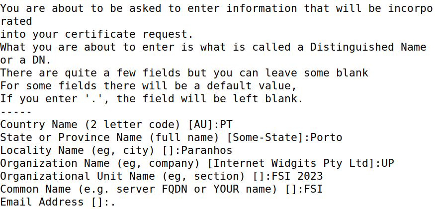

# Public-Key Infrastructure (PKI)

## Setup

Before starting the tasks themselves, we had to set up an HTTPS web server. To that end, we added the following entry to the `etc/hosts` file of our virtual machine:

```
10.9.0.80   www.l11g04.com
```

## Task 1: Becoming a CA

> A Certificate Authority (or **CA** for short) is a trusted entity that issues **digital certificates**, which are used to certify the ownership of a <u>public key</u> by the named subject of the certificate.

There are two types of CAs:

* **Normal -** The certificates they issue are generally signed by another CA.
* **Root -** The certificates they issue are <u>unconditionally trusted</u>, thus not needing another signature.

Our first task was to become a **root CA**.

### Configuring OpenSSL

We were going to rely on `OpenSSL` to create certificates, meaning we needed a **configuration file**. The default configuration file is located in `/usr/lib/ssl/openssl.cnf`, so we copied it to our working directory like so:

```bash
cp /usr/lib/ssl/openssl.cnf .
```

In it, there was a section which detailed its default configuration.


To comply with it, we did the following:

* Create the directory where our files would be kept - "demoCA". Inside of it, create another directory to store certificates - "newcerts".

```bash
mkdir -p demoCA/newcerts
```

* Create an empty "index.php".
```bash
touch demoCA/index.php
```

* Create a "serial" file with a single number in string format.

```bash
echo 2023 > demoCA/serial
```

Next, we uncommented a line so we could allow the creation of certificates with the same subject.

```shell
unique_subject	= no	# Set to 'no' to allow creation of
					    # several certs with same subject.
```

### Generating the Certificate

As previously mentioned, our goal was to become a root CA. As such, we needed to generate a **self-signed certificate**. Thankfully, the guide provided the command below, which we ran inside "certs":

```bash
openssl req -x509 -newkey rsa:4096 -sha256 -days 3650 \
    -keyout ca.key -out ca.crt
```

We were prompted to input a password, which we decided would be 'fsi2023', as well as the subject information seen below:


Upon submitting our input, the command yielded two new files: "ca.key" and "ca.crt". The former contained the CA's **private key**, while the latter contained the **public-key certificate**.

### Analyzing the Files

To view the content of the output files - "ca.key" and "ca.crt" - the guide provided the commands below:

```bash
openssl x509 -in ca.crt -text -noout # print the certificate in plain text
openssl rsa -in ca.key -text -noout # print the key in plain text
```

Upon inspecting their content, we were then asked the following questions:

1. **What part of the certificate indicates this is a CA’s certificate?**

The property "CA" indicates whether the certificate belongs to a CA or not.



Since in our certificate that value was set to `TRUE`, it meant it was in fact a CA certificate.

2. **What part of the certificate indicates this is a self-signed certificate?**

If a certificate is self-signed, the "Subject Key Identifier" and the "Authority Key Identifier" must be the same.


In our certificate, that was the case.

3. **In the RSA algorithm, we have a public exponent *e*, a private exponent *d*, a modulus *n*, and two secret numbers *p* and *q*, such that *n = pq*. Please identify the values for these elements in your certificate and key files.**

The requested values were the following:

* The public exponent, `e`

    ```
    publicExponent: 65537 (0x10001)
    ```

* The private exponent, `d`

    ```
    privateExponent:
        71:9c:6b:19:1c:c5:5f:32:e0:a6:a2:55:bd:db:06:
        14:2f:36:69:8a:d0:37:2e:a1:e6:18:2f:5a:de:0e:
        ea:0a:56:bb:e9:b3:3d:71:34:a2:fd:9d:6b:8a:85:
        3d:02:40:38:c2:2b:17:2e:89:b0:47:68:f8:61:af:
        86:7d:3a:99:58:3e:da:9e:a0:2c:ef:7c:06:e4:dc:
        f6:cf:fd:d5:6f:2d:67:84:20:b9:04:4c:f9:9b:a3:
        f5:7e:1f:6e:ad:1f:e1:22:2f:04:0a:f1:36:35:cb:
        58:5b:7d:be:bb:07:d7:34:17:42:e7:02:ed:fc:b5:
        55:06:7d:e9:4e:8b:14:dc:98:d0:20:52:ad:ba:1d:
        89:d8:76:04:6e:b1:ee:52:a5:56:e7:c8:c1:ca:fa:
        8f:a7:cf:6e:55:5e:bc:bf:11:f0:8b:6e:e8:5f:38:
        48:53:49:ee:fb:da:cf:ff:df:c9:91:ec:49:f2:17:
        df:89:9b:42:c0:3f:4b:31:66:02:b2:4d:75:8d:e9:
        6f:ab:68:22:c5:bc:82:b3:3e:ce:b1:cb:84:42:82:
        37:c5:22:5b:e0:ea:f2:b4:cb:a9:ac:f3:67:84:83:
        42:0e:11:a4:a4:a2:99:4e:ba:c7:c8:9e:6a:eb:c5:
        5b:1e:00:47:0e:67:61:95:b8:ed:83:78:3c:9c:fd:
        42:25:39:fa:7d:d6:3f:f7:5c:32:28:c2:84:93:5e:
        93:7d:df:f3:5d:6c:14:74:ba:ee:ba:74:61:c2:48:
        32:f1:36:fc:d8:22:fa:53:85:13:ad:ef:7c:05:ca:
        5b:46:8f:ad:21:69:5b:d9:7b:36:12:d2:18:91:8f:
        f5:3a:27:43:5c:bc:c4:2f:33:2f:f4:c9:53:16:31:
        f5:06:f8:d9:46:1b:17:1b:85:38:a5:79:a6:fb:f2:
        72:bf:b0:ef:ff:0e:b8:d0:a1:56:f5:ea:6c:2d:fa:
        a0:9d:fa:4d:69:45:5b:62:0f:f8:00:b6:01:10:3b:
        f6:b3:8d:f5:2f:55:3c:bc:8c:6f:5e:0b:a3:87:8b:
        5d:fb:42:59:21:48:30:cf:e3:2c:aa:1d:51:d8:2f:
        4e:4e:88:99:b1:e1:63:37:29:a7:51:69:bb:f4:81:
        84:f4:38:7f:30:b4:0f:38:a6:05:b8:2a:b9:5e:d0:
        6b:2f:a2:39:2b:6c:51:0d:2b:8b:48:ca:06:1a:8e:
        a1:c1:ef:7d:a2:6e:c8:4a:a7:6c:d5:6a:9b:39:6c:
        52:1c:96:4b:68:a5:dd:c8:76:3d:96:e7:3b:99:f2:
        63:29:c8:b9:e8:d4:95:99:1e:20:94:d5:0e:d2:b7:
        84:3e:20:74:96:83:9c:66:9d:72:30:bd:4c:00:52:
        e9:f1
    ```

* The modulus, `n`

    ```
    modulus:
        00:c8:86:9c:ff:9e:b1:b9:f7:a1:08:1b:9b:b3:33:
        50:bc:73:19:dd:d3:52:68:f7:c4:bd:64:89:f0:54:
        e5:c0:d7:55:aa:7f:4e:e3:50:a5:46:c9:a3:be:e3:
        4a:2c:bd:e9:2c:1e:e2:e8:57:a6:24:81:d1:84:0a:
        8f:ce:8e:ca:f3:61:c9:43:79:14:77:7e:47:91:4e:
        d2:ed:a9:09:80:e9:e1:9d:21:28:47:59:f7:65:20:
        41:a4:be:ae:4f:fe:72:17:94:64:3b:e2:aa:66:19:
        cf:5a:77:f7:14:7d:2a:b6:8d:65:52:57:ce:ab:76:
        c4:5a:90:a7:3b:58:1b:8b:dd:de:b4:5a:b9:36:e4:
        85:33:9e:82:bd:65:a5:f3:71:32:d8:0a:4f:d5:e2:
        f2:f0:74:97:f8:41:8f:74:70:a5:af:a9:2e:39:f1:
        3c:89:9c:87:1e:d6:72:05:37:8c:2e:a5:70:8d:4c:
        77:3b:28:7f:38:4d:d6:dd:0e:77:51:28:4c:aa:7b:
        aa:af:39:0c:fb:cc:e4:98:eb:24:05:fd:14:03:df:
        f8:ae:11:6e:22:0a:43:c5:3a:bc:a3:12:b9:dd:8a:
        69:a0:b6:97:92:e3:b1:5c:5f:f8:df:e6:e4:3f:16:
        07:a5:2e:5c:84:8e:fb:38:d6:cb:88:cf:7b:4b:89:
        ac:f3:1f:9c:51:5c:09:88:35:ed:2a:6d:cf:b8:b6:
        be:4e:90:49:d0:01:fc:5c:24:e9:ab:09:b2:ec:65:
        a5:c4:20:65:39:f0:26:db:89:81:b5:3e:d6:eb:66:
        d0:24:7d:8b:e9:3e:0c:2a:bc:e5:e3:df:a2:32:29:
        0e:90:02:18:2c:d4:a9:e0:b6:ea:25:6d:70:ff:60:
        bb:72:85:e4:0b:c4:50:3d:2c:39:83:3a:42:7d:51:
        04:0a:b1:69:16:6f:5b:98:db:17:9e:c4:84:90:50:
        41:e2:79:c2:2a:e7:3d:1a:a6:87:2b:e0:63:08:53:
        8d:88:ef:a9:83:b3:3c:67:24:8d:b7:a0:1c:ca:8e:
        92:db:00:f4:db:a1:0d:e4:68:a1:ca:47:0a:5f:4c:
        80:5e:9a:4e:d0:3d:9f:e9:60:12:3c:89:7e:53:45:
        47:34:67:92:be:4c:8b:df:30:aa:fe:14:ad:17:30:
        54:80:41:ff:fe:d5:f7:d5:fb:3e:20:a8:21:76:46:
        45:82:71:9b:23:1f:65:e9:b3:75:fc:b6:00:d3:47:
        32:9d:18:76:eb:9a:7b:93:d7:ba:e9:5f:b7:00:89:
        de:a2:db:3e:e6:86:5e:ba:68:a1:71:7c:bc:86:2c:
        f9:20:de:9c:bb:93:84:ba:25:0e:20:9d:a5:19:c2:
        09:7a:fb
    ```

* The two secret numbers, which are the **prime numbers**:

    * `p`

    ```
    prime1:
        00:e9:d1:c7:dc:e3:bd:14:32:fc:4b:6e:48:f0:2b:
        a4:3d:65:67:28:7a:cf:58:f7:2e:ae:27:c6:36:f4:
        b6:a4:13:27:30:16:8a:e2:2c:40:9c:c7:84:91:13:
        42:1e:4c:d9:82:11:0e:12:cb:d8:f7:b6:30:63:59:
        f4:95:51:18:ae:70:5c:7e:00:fd:9f:0f:65:6a:11:
        46:b1:46:c9:59:de:2e:84:80:73:9b:49:72:1c:cb:
        60:85:f2:71:a9:29:91:f7:f6:28:9a:d3:73:35:f4:
        db:3a:e6:a2:8c:f7:1f:66:e4:bc:a5:c9:e8:90:6d:
        51:70:c2:3e:21:0a:60:d4:f3:1b:86:6b:0f:cd:14:
        cd:5d:1d:55:c0:30:3f:37:cd:8b:bb:c7:e5:d9:62:
        56:a9:c0:50:0d:7b:d9:1e:dc:cc:f2:a7:04:52:a6:
        d1:0a:8e:3e:c2:a2:2c:53:98:0c:dd:6a:8a:de:e8:
        b0:3a:28:94:8a:7d:48:ac:89:13:a1:82:c8:7e:fb:
        da:8e:cf:1a:3b:2e:e6:bf:52:cf:01:8e:83:16:f6:
        78:34:ab:7e:0e:db:2c:9d:5c:7b:0a:93:6d:5b:f4:
        6f:ee:48:c4:62:81:9b:b0:20:ec:31:4e:db:8a:41:
        a5:c1:14:f9:d3:2d:39:b0:6d:0a:a2:ee:d2:18:4e:
        e4:e9
    ```

    * `q`

    ```
    prime2:
        00:db:8c:4f:28:17:ab:01:8a:e6:a6:ff:ab:90:cd:
        35:22:7d:5e:96:89:60:47:b6:f9:e2:1c:1c:92:e2:
        05:d7:fa:07:ab:7f:a6:ba:68:7b:aa:55:1b:00:14:
        cf:3a:00:a5:c9:28:ea:d3:3d:a7:e3:04:cc:01:1e:
        65:de:1b:30:2b:29:06:7e:89:2d:0b:d2:bb:fa:3a:
        98:89:67:28:12:7b:9e:53:5c:02:f6:fa:aa:ee:8c:
        a2:92:31:9c:70:53:85:74:45:d8:c2:6c:5a:a5:b2:
        05:97:f4:b1:e5:1d:d8:10:21:00:e0:aa:87:01:7e:
        4e:7c:3e:95:ea:ec:c1:4a:9f:fb:2d:e1:9f:27:e5:
        b1:de:a9:df:2a:31:8e:c4:ee:1b:d4:00:f4:c8:35:
        52:fc:cd:4b:5a:24:43:45:31:d5:69:ec:47:69:10:
        62:e1:ed:42:c8:6e:39:b7:1c:74:42:2b:c0:4c:87:
        09:fe:0e:2a:76:05:79:1a:6a:48:a0:68:18:82:23:
        3b:04:89:7a:65:73:17:99:86:5c:0d:04:6a:d0:97:
        2e:b1:c7:71:62:d4:72:68:9c:34:97:0e:ff:8b:c6:
        d9:9b:28:ac:16:a6:84:f9:a8:33:5e:12:d8:f9:a3:
        ed:a9:c6:09:72:92:04:1c:8f:51:ee:c6:37:05:b3:
        c2:43
    ```

We found them by analyzing the private key, which also contained other important values. For convenience, the complete file can be found [here](ect/ca-key.txt).

## Task 2: Generating a CSR

> When a company wants to get a <ins>public-key certificate</ins> from a CA, it must first generate a Certificate Signing Request (or **CSR** for short). This document, which contains the company's public key and identity information, is sent to the CA, who will verify it and only then generate the certificate.

In this task, we had to generate a CSR for our server. To do that, we used the command provided by the guide, which was the following:

```bash
openssl req -newkey rsa:2048 -sha256 \
    -keyout server.key -out server.csr \
    -subj "/CN=www.l11g04.com/O=L11G04 Inc./C=PT" \
    -passout pass:dees \
    -addext "subjectAltName = DNS:www.l11g04.com, \
                              DNS:www.l11g04-A.com, \
                              DNS:www.l11g04-B.com"
```

It was quite similar to the one used to generate the self-signed certificate. As a matter of fact, the only differences were:
* `-x509` flag, which prevented the command from self-signing the certificate.
* The `-addtext` flag coupled with the "subjectAltName" field. We used them to add additional **domains** for our website, thus establishing that www.l11g04.com, www.l11g04-A.com and www.l11g04-B.com were valid hostnames.

After running it, two new files were created: the CSR ("server.csr") and the corresponding private key ("server.key").


## Task 3: Generating a Certificate

> To form a **certificate**, it is necessary for the <ins>CSR</ins> to be signed by a trusted <ins>CA</ins>.

In the next task, we had to use our own CA to sign the server's CSR, thus generating a **certificate**. Using our CA files - "ca.crt" and "ca.key" - we signed the CSR ("server.csr") using the command below:

```bash
openssl ca -config openssl.cnf -policy policy_anything \
    -md sha256 -days 3650 \
    -in certs/server.csr -out certs/server.crt -batch \
    -cert certs/ca.crt -keyfile certs/ca.key
```

**Note**: The policy used - 'policy_anything' - is not the default policy, because that would force some subject information in the CSR to match that in the CA's certificate, which was undesirable. As its name implies, the policy we ended up using did not enfore any such rules.

Before running the command, though, we had to uncomment another line in `openssl.cnf`, because the default settings did not allow copying the extension field from the CSR to the final certificate. In our case, that meant our additional domains would not be valid, so we changed the file like so:

```shell
# Extension copying option: use with caution.
copy_extensions = copy
```

With that taken care of, we ran the aforementioned command and 
