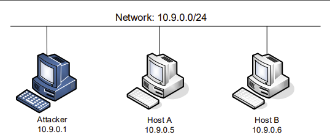
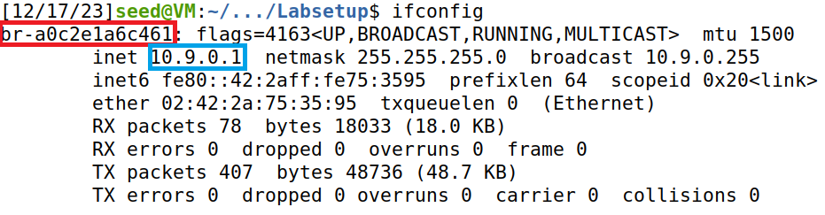
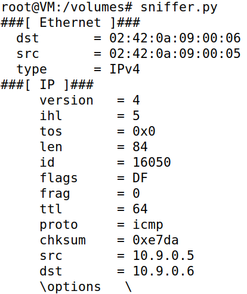
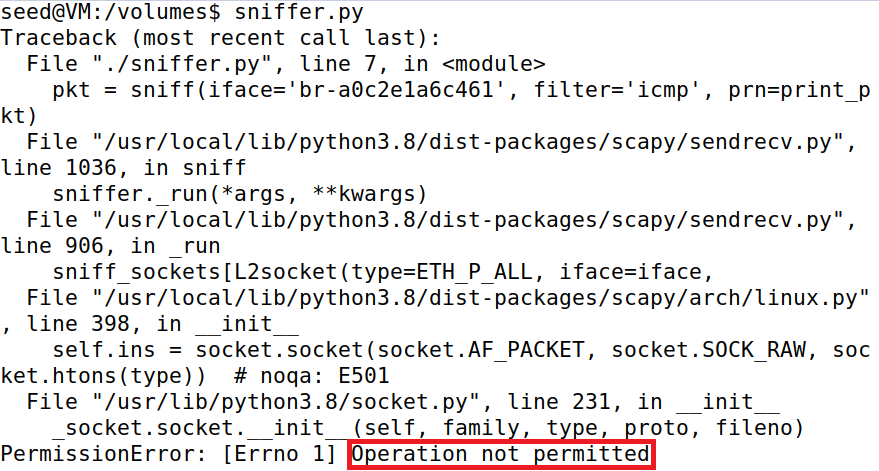
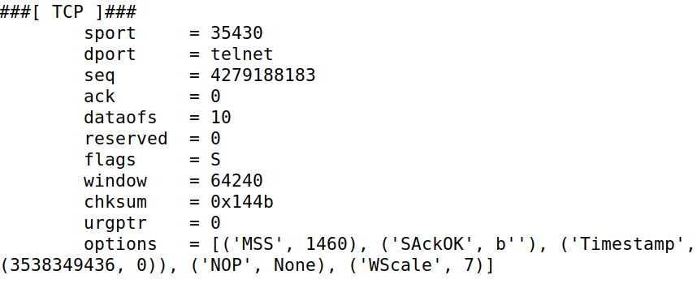
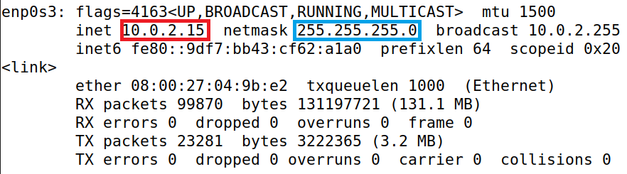
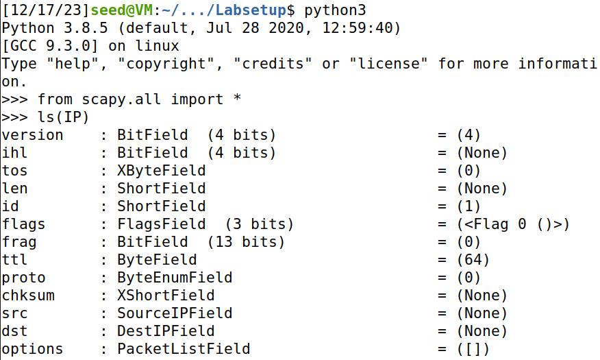
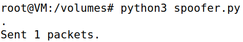
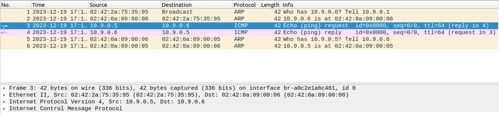

# Packet Sniffing and Spoofing

The objective of this lab was to understand the following **network communication** threats:

* **Sniffing**

> **Packet sniffing** is the practice of detecting and assessing data sent over a network.

The most popular tool for sniffing is [Wireshark](https://www.wireshark.org/).

* **Spoofing**

> **Packet spoofing** is the creation of Internet Protocol (IP) packets with a modified <ins>source address</ins> in order to either conceal the identity of the sender or to impersonate another computing system.

**Note:** While not directly related, <ins>spoofing</ins> is frequently used in <ins>Man-in-the-Middle</ins> attacks.

# Setup

Before moving on to the tasks themselves, we had to properly set up our environment. We had to use three machines that were connected to the same LAN as illustrated below:



All the attacks were performed on the attacker machine, while the other two were merely represented the user machines. 

Thankfully, the guide provided a `docker-compose.yml` file that created the necessary containers, as well as the network which connected them. The IP prefix for said network was **10.9.0.0/24**. 

Additionally, the guide prompted us to search for the name of the corresponding **network interface** on our virtual machine, since we would require it for the programs we would write. We did so by executing the `ifconfig` command.

> `ifconfig` is a Linux command that displays the current configuration of the **network interface** of the system. It can also be used to change them.

After setting up the containers, we ran `ifconfig`. The guide specified that the IP address assigned to our virtual machine was **10.9.0.1**, so we looked for it. Luckily for us, we didn't have to search much, because it was the first entry output by the command:



We found the name of our network interface: **br-a0c2e1a6c461**. With that, we could move on the tasks.

**Note:** Throughout this entire lab, we relied on <ins>Scapy</ins>.

> **Scapy** is a network analysis tool that can be also used as a building block to construct other tools.

## Task 1.1: Sniffing Packets

Our first task was to sniff the packets on our network interface. To that end, we used the following Python program provided by the guide:

```Python
#!/usr/bin/env python3
from scapy.all import *

def print_pkt(pkt):
    pkt.show()

pkt = sniff(iface='br-a0c2e1a6c461', prn=print_pkt)
```

The "iface" parameter established the network interface we wanted to sniff, so we filled it with the name we [previously](#setup) discovered.

**Note:** In the above program, for each packet, the callback function <ins>"print_pkt()"</ins> was invoked, meaning we did not have to explicitly call it.

### 1.1A: Changing the Priviliges

We were tasked with running this script twice: one with the **root** privilege and one without it. As such, we placed the script in a new file - "sniffer.py" - and made it executable so we could reuse it.

```bash
$ chmod a+x sniffer.py
```

To test if we could sniff packets, we had to first send some through the network. To that end, we used the `ping` command.

> `ping` is a Linux command used to check the **network connectivity** between two systems, which can be two hosts or a host and a server.

We opted to send the `ping` command in host A to communicate with host B like so:

```bash
$ ping 10.9.0.6
```

The results of our experiment can be found below:

| Root privilege? | Results          | Conclusion |
|-----------------|------------------|------------|
| Yes |  | The packets were sniffed. |
| No  |  | The packets were <ins>not</ins> sniffed, because this operation requires **elevated privileges**. |

### 1.1B: Filtering Packets

Next, we had to alter our Python script to only capture specific types of packets. In short, we had to filters the packets we sniffed.

Analysing our current script, we realized there was a parameter - `filter` - designed specifically to filter the packets.

```python
#                            here ----v
pkt = sniff(iface='br-a0c2e1a6c461', filter='icmp', prn=print_pkt)
```

According to the guide, Scapy's filter used the **BFP** (Berkeley Packet Filter) syntax, so we had to learn it before proceeding. Luckily, we found a [webpage](https://biot.com/capstats/bpf.html) detailing it, so we searched for the specific commands as we kept going.

Below are the results of our filtering experiences, as well as the filters we used. 

**Note:** Because screenshots would not be able to properly convey the results we obtained, we created a text file for each prompt and placed the output there.

* **Capture only the ICMP packet**

For the first prompt, we used the following command:

```python
filter = 'icmp'
pkt = sniff(iface='br-a0c2e1a6c461', filter=filter, prn=print_pkt)
```

The filter `icmp` made it so only the packets with the **ICMP** protocol were captured. The proof can be found [here](etc/13-1.1B-1.txt).

* **Capture any TCP packet that comes from a particular IP and with a destination port number 23.**

To complete the second prompt, we used the command below:

```python
filter = 'tcp and src host 10.9.0.5 and dst port 23'
pkt = sniff(iface='br-a0c2e1a6c461', filter=filter, prn=print_pkt)
```

The `tcp` in the filter forced Scapy to only capture **TCP** packets. The `src host 10.9.0.5` part ensured only packets coming from IP 10.9.0.5 - host A - were sniffed. Finally, the `dst port 23` specified that we were only interested in packets whose destination port was 23.

Upon running the script, we switched to host A and sent a message to port 23 like so:

```bash
$ echo "YOUR_MESSAGE" > /dev/tcp/10.9.0.6/23
```

Then, after switching back to the attacker container, we copied the sniffed packets and placed them [here](etc/13-1.1B-2.txt).

As an additional proof of correctness, the image below depicts part of our output. We have highlighted the destination port - `telnet` - since that service is usually located at port 23, thus proving we were successful.



* **Capture packets that come from or to go to a particular subnet.**

For our final challenge, we had to sniff all the packets that came or went to a specific **subnet**.

> A **subnet** is a logical subdivision of an IP network. Computers that belong to the same subnet are addressed with an identical group of its <ins>most-significant bits</ins> of their IP addresses.


The guide instructed us to not pick the subnet that our virtual machine was attached to, so we ran `ifconfig` again to discover another we could use. There were many to choose from, but ultimately we decided on sniffing packets circulating in "enp0s3"'s subnet.



The subnet was calculated by applying the netmask - 255.255.255.0 - to the network interface - 10.0.2.15 - giving us **10.0.2.0/24**. So, we modified "sniffer.py" as shown below:

```python
filter = 'net 10.0.2.0/24'
pkt = sniff(iface='enp0s3', filter=filter, prn=print_pkt)
```

The filter `net` specifies the subnet Scapy will sniff. The results can be found [here](etc/13-1.1B-3.txt).

## Task 1.2: Spoofing ICMP Packets

Our next task had a very specific objective: use Scapy to spoof **ICMP** packets with an arbitrary source IP address. In addition, they had to be **echo request** packets.

The guide mentioned that, if our request was accepted by the receiver, an **echo reply packet** would be sent to the spoofed IP address. Bearing that information in mind, we created a new Python script - "spoofer.py" - and followed the steps listed below:

1. Create an object from the **IP** class.

```python
from scapy.all import *

ip = IP()
```

**Note:** Beforehand, we ran the commands below to view the list of attributes of the <ins>IP class</ins>.



2. Change the source and the destination of IP object.

```python
ip.src = '10.9.0.5' # host A
ip.dst = '10.9.0.6' # host B
```

For convenience, we decided that our arbitrary IP address would be host A's, since it would be easy to recognize.

3. Stack the IP object together with an **ICMP** class object to form a **packet**.

```python
packet = ip/ICMP()
```

Since the default type of an ICMP object is **echo request**, which was what we wanted, we did not need to instantiate it and modify it, so instead we just called the constructor.

**Note:** The division operator - '/'- was overloaded by the IP class, meaning that it no longer represented division. In our case, it meant adding the <ins>ICMP</ins> object as the payload field of the <ins>IP</ins> object and modifying its fields accordingly.

4. Send the **packet**.

```python
send(packet)
```

After that, all we had to do was run the script.



To verify whether our attack had worked, we decided to sniff the packets circulating on the network interface using **Wireshark**. We obtained the logs below:



Since we immediately identified the request packet - **line 3** - as well as the corresponding reply - **line 4** - that meant our attack was successful. As such, thanks to spoofing, we successfully impersonated host A.
