# Packet Sniffing and Spoofing

The objective of this lab was to understand the following **network communication** threats:

* **Sniffing**

> **Packet sniffing** is the practice of detecting and assessing data sent over a network.

The most popular tool for sniffing is [Wireshark](https://www.wireshark.org/).

* **Spoofing**

> **Packet spoofing** is the creation of Internet Protocol (IP) packets with a modified <ins>source address</ins> in order to either conceal the identity of the sender or to impersonate another computing system.

**Note:** While not directly related, <ins>spoofing</ins> is frequently used in <ins>Man-in-the-Middle</ins> attacks.

# Setup

Before moving on to the tasks themselves, we had to properly set up our environment. We had to use three machines that were connected to the same LAN as illustrated below:


All the attacks were performed on the attacker machine, while the other two were merely represented the user machines. 

Thankfully, the guide provided a `docker-compose.yml` file that created the necessary containers, as well as the network which connected them. The IP prefix for said network was **10.9.0.0/24**. 

Additionally, the guide prompted us to search for the name of the corresponding **network interface** on our virtual machine, since we would require it for the programs we would write. We did so by executing the `ifconfig` command.

> `ifconfig` is a Linux command that displays the current configuration of the **network interface** of the system. It can also be used to change them.

After setting up the containers, we ran `ifconfig`. The guide specified that the IP address assigned to our virtual machine was **10.9.0.1**, so we looked for it. Luckily for us, we didn't have to search much, because it was the first entry output by the command:


We found the name of our network interface: **br-a0c2e1a6c461**. With that, we could move on the tasks.

**Note:** Throughout this entire lab, we relied on <ins>Scapy</ins>.

> **Scapy** is a network analysis tool that can be also used as a building block to construct other tools.

## Task 1.1: Sniffing Packets

Our first task was to sniff the packets on our network interface. To that end, we used the following Python program provided by the guide:

```Python
#!/usr/bin/env python3
from scapy.all import *

def print_pkt(pkt):
    pkt.show()

pkt = sniff(iface='br-a0c2e1a6c461', filter='icmp', prn=print_pkt)
```

The "iface" parameter established the network interface we wanted to sniff, so we filled it with the name we [previously](#setup) discovered.

**Note:** In the above program, for each packet, the callback function <ins>"print_pkt()"</ins> was invoked, meaning we did not have to explicitly call it.

### 1.1A: Changing the Priviliges

We were tasked with running this script twice: one with the **root** privilege and one without it. As such, we placed the script in a new file - "sniffer.py" - and made it executable so we could reuse it.

```bash
$ chmod a+x sniffer.py
```

To test if we could sniff packets, we had to first send some through the network. To that end, we used the `ping` command.

> `ping` is a Linux command used to check the **network connectivity** between two systems, which can be two hosts or a host and a server.

We opted to send the `ping` command in host A to communicate with host B like so:

```bash
$ ping 10.9.0.6
```

The results of our experiment can be found below:

| Root privilege? | Results          | Conclusion |
|-----------------|------------------|------------|
| Yes |  | The packets were sniffed. |
| No  |  | The packets were <ins>not</ins> sniffed, because this operation requires **elevated privileges**. |

### 1.1B: Filtering Packets

Next, we had to alter our Python script to only capture specific types of packets. In short, we had to filters the packets we sniffed.

Analysing our current script, we realized there was a parameter - `filter` - designed specifically to filter the packets.

```python
#                            here ----v
pkt = sniff(iface='br-a0c2e1a6c461', filter='icmp', prn=print_pkt)
```

According to the guide, Scapy's filter used the **BFP** (Berkeley Packet Filter) syntax, so we had to learn it before proceeding. Luckily, we found a [webpage](https://biot.com/capstats/bpf.html) detailing it, so we searched for the specific commands as we kept going.

Below are the results of our filtering experiences, as well as the filters we used. 

**Note:** Because screenshots would not be able to properly convey the results we obtained, we created a text file for each prompt and placed the output there.

* **Capture only the ICMP packet**

For the first prompt, we used the following command:

```python
filter = 'icmp'
pkt = sniff(iface='br-a0c2e1a6c461', filter=filter, prn=print_pkt)
```

The filter `icmp` made it so only the packets with the **ICMP** protocol were captured. The proof can be found [here](etc/13-1.1B-1.txt).

* **Capture any TCP packet that comes from a particular IP and with a destination port number 23.**

To complete the second prompt, we used the command below:

```python
filter = 'tcp and src host 10.9.0.5 and dst port 23'
pkt = sniff(iface='br-a0c2e1a6c461', filter=filter, prn=print_pkt)
```

The `tcp` in the filter forced Scapy to only capture **TCP** packets. The `src host 10.9.0.5` part ensured only packets coming from IP 10.9.0.5 - host A - were sniffed. Finally, the `dst port 23` specified that we were only interested in packets whose destination port was 23.

Upon running the script, we switched to host A and sent a message to port 23 like so:

```bash
$ echo "YOUR_MESSAGE" > /dev/tcp/10.9.0.6/23
```

Then, after switching back to the attacker container, we copied the sniffed packets and placed them [here](etc/13-1.1B-2.txt).

As an additional proof of correctness, the image below depicts part of our output. We have highlighted the destination port - `telnet` - since that service is usually located at port 23, thus proving we were successful.


* **Capture packets that come from or to go to a particular subnet.**

For our final challenge, we had to sniff all the packets that came or went to a specific **subnet**.

> A **subnet** is a logical subdivision of an IP network. Computers that belong to the same subnet are addressed with an identical group of its <ins>most-significant bits</ins> of their IP addresses.


The guide instructed us to not pick the subnet that our virtual machine was attached to, so we ran `ifconfig` again to discover another we could use. There were many to choose from, but ultimately we decided on sniffing packets circulating in "enp0s3"'s subnet.


The subnet was calculated by applying the netmask - 255.255.255.0 - to the network interface - 10.0.2.15 - giving us **10.0.2.0/24**. So, we modified "sniffer.py" as shown below:

```python
filter = 'net 10.0.2.0/24'
pkt = sniff(iface='enp0s3', filter=filter, prn=print_pkt)
```

The filter `net` specifies the subnet Scapy will sniff. The results can be found [here](etc/13-1.1B-3.txt).

## Task 1.2: Spoofing ICMP Packets

Our next task had a very specific objective: use Scapy to spoof **ICMP** packets with an arbitrary source IP address. In addition, they had to be **echo request** packets.

The guide mentioned that, if our request was accepted by the receiver, an **echo reply packet** would be sent to the spoofed IP address. Bearing that information in mind, we created a new Python script - "spoofer.py" - and followed the steps listed below:

1. Create an object from the **IP** class.

```python
from scapy.all import *

ip = IP()
```

**Note:** Beforehand, we ran the commands below to view the list of attributes of the <ins>IP class</ins>.


2. Change the source and the destination of IP object.

```python
ip.src = '10.9.0.5' # host A
ip.dst = '10.9.0.6' # host B
```

For convenience, we decided that our arbitrary IP address would be host A's, since it would be easy to recognize.

3. Stack the IP object together with an **ICMP** class object to form a **packet**.

```python
packet = ip/ICMP()
```

Since the default type of an ICMP object is **echo request**, which was what we wanted, we did not need to instantiate it and modify it, so instead we just called the constructor.

**Note:** The division operator - '/'- was overloaded by the IP class, meaning that it no longer represented division. In our case, it meant adding the <ins>ICMP</ins> object as the payload field of the <ins>IP</ins> object and modifying its fields accordingly.

4. Send the **packet**.

```python
send(packet)
```

After that, all we had to do was run the script.


To verify whether our attack had worked, we decided to sniff the packets circulating on the network interface using **Wireshark**. We obtained the logs below:


Since we immediately identified the request packet - **line 3** - as well as the corresponding reply - **line 4** - that meant our attack was successful. As such, thanks to spoofing, we successfully impersonated host A.

## Task 1.3: Traceroute

In this task, we had to implement our own version of the `traceroute` command using Scapy.

> `traceroute` is a Linux command that traces the path of an **IP packet** until it reaches its destination.

### Learning about Scapy and ICMP

We had a rough idea of how to go about this task, which will become clear in the [next section](#preparing-the-script). Before proceeding, though, we had to learn how to receive a **reply packet** - packets sent as a direct response to the packets we would send. 

We could attempt to use sniffing like we did in the [first task](#task-11-sniffing-packets), but that would require us to define a very specific filter, which would certainly be tedious. We were certain Scapy would have functions for this particular purpose. Sure enough, after a bit of research online, we discovered the `sr()` and `sr1()` functions.

> The `sr()` Scapy function is used to **send** packets and **receive** their respective answers. The `sr1()` function is similar, but it only returns the <ins>first</ins> reply packet that answered the packet sent.

Since `sr1()` was exactly what we were looking for, that problem was solved. 

However, just as we were ready to begin writing the script, we realized that, despite now knowing how to receive answers, we still had no idea how to parse the **ICMP** packets we were expecting. Once again, we relied on the Internet and found a [website] containing ICMP documentation. There, we learned that ICMP packets have two important attributes:

* **Type -** Identifies the message they transmit.
* **Code -** For a given <ins>type</ins>, specifies the message even further.

So, we had found the solution to our new problem: to properly parse an ICMP packet, we just had to analyze its **type** and **code**. With both problems taken care of, we could finally start writing our script.

### Preparing the Script

By following the tutorial provided by the guide, we created a new script - "traceroute.py". Its behaviour can be summarized like so:

1. Create an **IP** object, such that its destination is the desired IP address and its **TTL** value is 1.

```python
import sys
from scapy.all import *

a = IP(dst=sys.argv[1], ttl=1)
# NOTE: sys.argv[0] -> program name
#       sys.argv[1] -> first argument
```

**Note:** To avoid having to change the script everytime we wanted to test it with a new destination, we opted to use Python's command line support to pass the <ins>destination IP address</ins> to our program. That is why the variable `sys.argv`, which contains the command line arguments, is used.

2. Create an infinite loop, which will be used to increment the **TTL**. In it, create the packet to be sent.

```python
while True:
    packet = a / ICMP()
    ...
```

3. Using `sr1()`, send the packet and receive the first packet that is sent as a reply.

```python
reply = sr1(packet, timeout=1, verbose=0)
```

4. Verify if the ICMP error message was received. If it was, increment the **TTL** and try again, else leave the loop.

```python
while True:
    ...

    # verify if the TTL was exceeded
    if reply == None or (reply[ICMP].type == 11 and reply[ICMP].code == 0):
        a.ttl += 1
        continue

    break
```

**Note:** We found the <ins>type</ins> and the <ins>code</ins> of the ICMP packets in the [documentation website](https://www.iana.org/assignments/icmp-parameters/icmp-parameters.xhtml#icmp-parameters-types) we [previously](#learning-about-scapy-and-icmp) visited. For reference, we took a picture of the extract we consulted:

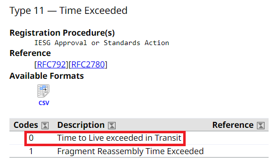

5. Print the value of the **TTL** that let the packet reach its destination - our **distance**.

```python
print("Distance: ", a.ttl)
```

### Testing

We decided to submit our new script to a few tests. For comparison, we also ran the `traceroute` commands for the same test cases. Below are the results:

| Destination | Our script | Linux's command |
|:-----------:|:----------:|:---------------:|
| 10.9.0.5 (host A) | 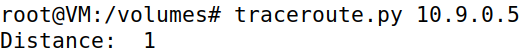 | 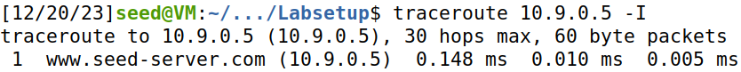 |
| 8.8.8.8 (Google's DNS) | 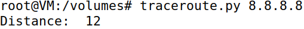 | 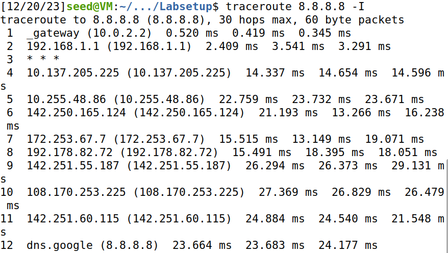|
| 1.1.1.1 (Cloudfare's DNS) | 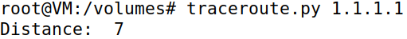 | 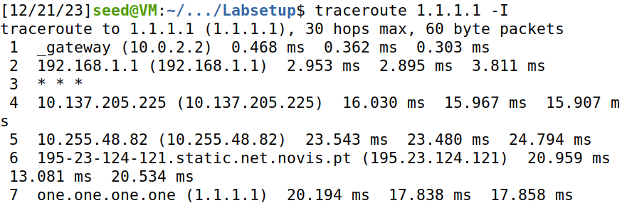 |

Considering the distances were identical, our program was working as expected.

## Task 1.4: Sniffing and then Spoofing

Our final task consisted in creating a program which combined the sniffing and spoofing techniques. The objective was simple: sniff all ICMP packets and, if the packet was an **ICMP echo request**, reply with an appropriate **ICMP echo reply** packet.

### Preparing the Script

To that end, we created our final script - "sniff_and_spoof.py". Its behaviour is succintly presented below:

1. Sniff the **ICMP** packets on the LAN and redirect them to "send_reply()".

```python
packet = sniff(iface='br-a0c2e1a6c461', filter='icmp', prn=send_reply)
```

2. Verify if the packet is an **ICMP echo request**. If it isn't, leave the function, as we are not interested in them.

```python
if packet[ICMP].type != 8:
    return
```

**Note:** We discovered the <ins>ICMP type</ins> corresponding to <ins>echo requests</ins> by browsing the [documentation site](https://www.iana.org/assignments/icmp-parameters/icmp-parameters.xhtml#icmp-parameters-types) from the [previous task](#learning-about-scapy-and-icmp). The extract we consulted was the following:

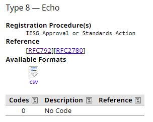

3. Prepare the **IP** layer of the reply packet by creating an IP object.

```python
# create the IP object
ip = IP(src = packet[IP].dst, dst = packet[IP].src)
```

Since we were impersonating the destination of the original packet, we had to switch the **source** and the **destination** IP addresses.

4. Prepare the **ICMP** layer of the reply packet by creating an ICMP object.

```python
# create the ICMP object
icmp = ICMP(type = 0, id = packet[ICMP].id, seq = packet[ICMP].seq)
```

It was necessary to copy both the `id` and the `seq` parameters of the original packet so that our spoofed packet would not raise suspicion. In particular, ensuring the **sequence number** - `seq` - was equal to the original packet's was vital, because a mismatch in the sequence number could trigger security measures or be detected by the system.

**Note:** One last time, we searched for the adequate <ins>type</ins> in the aforementioned [ICMP documentation](https://www.iana.org/assignments/icmp-parameters/icmp-parameters.xhtml#icmp-parameters-types), which led us to the extract below:

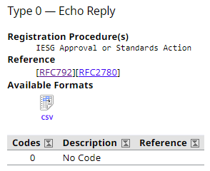

5. Prepare the **data** which will be sent in the packet. To avoid issues that could arise if we made data up, we opted to simply copy the original packet's data.

```python
# fetch the data
data = packet[Raw].load	
```

6. Create the **reply packet** by merging the **IP**, **ICMP** and **data** objects. Then, send it.

```python
# create and send the reply		
reply = ip / icmp / data
send(reply, verbose = 0)
```

### Testing

To test our program, the guide recomended we use one of the user machines - host A (our choice) or host B - to send `ping` commands to a few IP addresses. Regardless of whether the pinged host existed or not, the user should receive a **reply** - our spoofed packets.

The guide also provided some tests cases, which we decided to use. For each of them, we pinged the IP address twice: one where our program wasn't running and one where it was. The results were the following:

| IP address | Results w/o Program | Results w/ Program  | Success? |
|:----------:|:-------------------:|:-------------------:|:--------:|
| 1.2.3.4 |  | 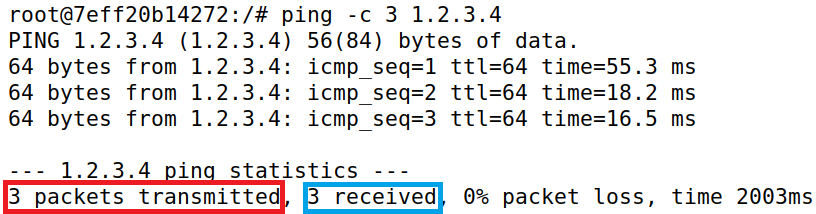 | Yes |
| 10.9.0.99 | 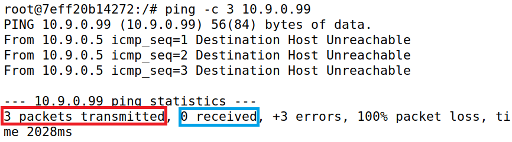 | 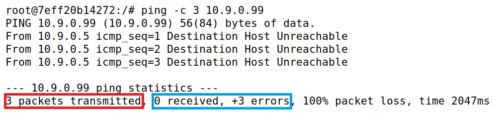 | No |
| 8.8.8.8 | 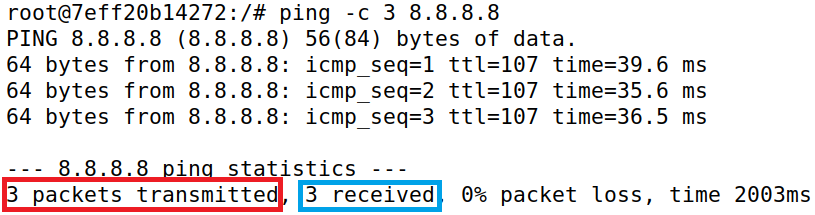 | 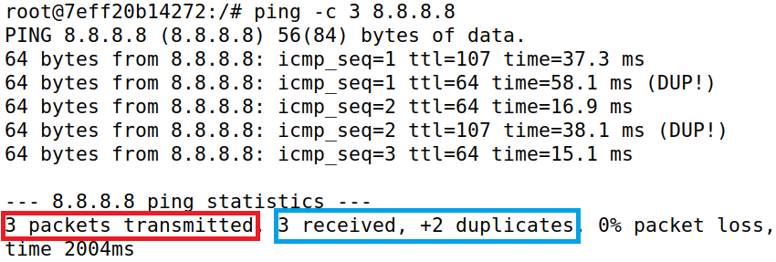 | Yes |

### Explanation

In order to fully understand the results from this task, we first had to review the **ARP** protocol.

> The Address Resolution Protocol (or **ARP** for short) is a communication protocol used for mapping an ever-changing **IP** address to a fixed physical machine address - a **MAC** address.

When a machine attempts to send packets to another, it first looks up the destination's MAC address. If it cannot find it, though, it will send a **broadcast packet** to discover the receiver's MAC address.

> In computer networking, **broadcasting** is sending a message to all devices on a network. The packet that transmits said message is called the **broadcast packet**.

Bearing this in mind, below are very succint explanations for the outcome of each test case:

* **1.2.3.4**

**1.2.3.4** was the IP address of a non-existing **Internet** host. The route from the user machine to it was the following:


That meant that, in order for packets sent by host A to reach the Internet, they had to go through **10.9.0.1** - the attacker - first. In fact, by analyzing the Wireshark logs, we noticed that a **broadcast packet** was sent out to obtain the MAC address of the attacker's machine.


So, since the attacker would redirect the **reply** packets from the host, we were able to spoof them.

* **10.9.0.99**

**10.9.0.99** was a non-existing host that belonged to the same **LAN** as host A, as can be deduced from its IP address. The route that linked them was as follows:


Unlike what happened with **1.2.3.4**, since this host would be located in the same local network, packets sent from host A did not go through the attacker's machine. In fact, the **broadcast packet** that was sent this time did not ask for the attacker's MAC address - they requested the MAC address of **10.9.0.99** instead.


As such, considering we could not intersect this connection, our program was rendered useless.

* **8.8.8.8**

The final IP address corresponded to Google's DNS server - a real host on the **Internet**. Expectedly, the route from host A to **8.8.8.8** passed through the attacker once again, as can be seen below:


Similarly to pinging **1.2.3.4**, a **broadcast packet** requesting the attacker's MAC address was sent out, which meant we would be able to spoof the packets. However, this time, because the destination truly existed, host A received double the amount of responses, which is evident by looking at the logs:

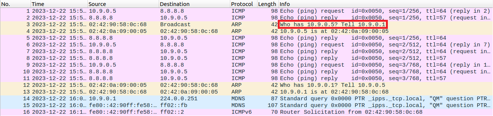

Thus, our program worked, but it could not stop the real host from replying to host A's ping.
