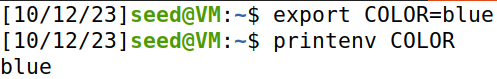
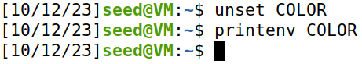
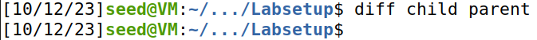
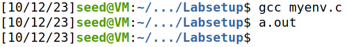
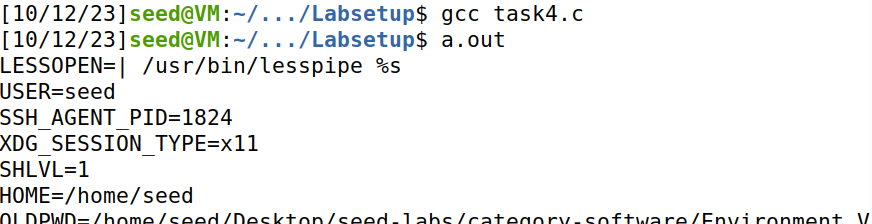
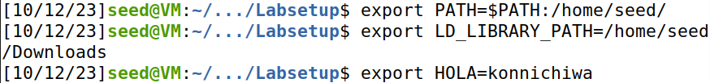
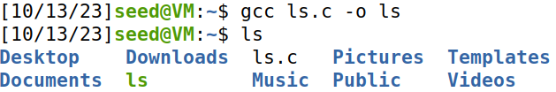
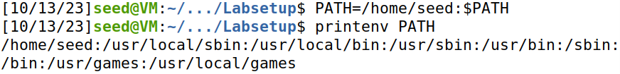
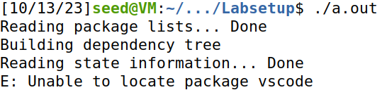

# Environment Variable and Set-UID Lab

## Task 1: Manipulating Environment Variables

As described in the task, by using the `env` command, the console printed out all the environment variables of the system.

Then, using `export`, we created a new environment variable, COLOR, whose value we set to "blue".



After ensuring that COLOR had been correctly set, we proceeded to remove it using `unset`. To confirm that it had been successfully deleted, we used `printenv` again and verified that it did not print "blue" anymore.



## Task 2: Passing Environment Variables from Parent Process to Child Process

As requested in the guide, we compiled and ran "myprintenv.c" twice.

* Firstly, we ran the script as it was provided. Since it was meant to print the environment variables of a **child** process, we saved its output in a file named "child".
* Next, we altered the script by changing the lines that were commented, making it so it would now print the environment variables of the **parent** process. Because of this, we saved the output of the modified script in a file named "parent".

By using the `diff` command with the two files, we noticed there was no difference. 



As such, we concluded that child processes inherit the environment variables of their parent.

## Task 3: Environment Variables and execve()

> `execve()` is a function that allows us to load and execute a new command, all the while the process's data is completely replaced by the process of the command ran.

To test the behaviour of this command, we compiled and ran "myenv.c" twice.

* Firstly, we ran the script without modifying it, which meant the third parameter of `execve()` was set to `NULL`. To our surprise, nothing was output.



* Next, we changed the script so that the third parameter of `execve()` was now `environ`. This time, running the program printed the environment variables.

Through this experiment, we found out that the third parameter of `execve()` (named `envp` in the Linux manual) is a pointer to the execution environment we want to pass to the new program. Since `envp` is `NULL` by default, we can conclude that `execve()` does NOT automatically inherit the environment variables of the calling process.

## Task 4: Environment Variables and system()

> `system()`, unlike `execve()`, does not directly execute a command. Instead, it requests the shell to do it.

The behaviour of `system()` can be summarized like this:

* `system()` calls `execl()` to execute `/bin/sh`.
* `execl()` calls `execve()` and passes it the `environ` variable, which, as we discovered in the previous task, is an array containing the environment variables of the calling process.

In simple terms, `system()` wraps a call to `execve()`, ensuring the environment variables are inherited by the latter. So, any command executed with `system()` should retain the execution environment of the calling process.

To verify this hypothesis, we copied the code present in this section of the guide into a script called "task4.c" and executed it. 



Predictably, the environment variables were printed, thus validating our conclusion.

## Task 5: Environment Variables and Set-UID

> `Set-UID` is a security mechanism in Unix which makes a program assume the permissions of its owner, independently of the user that runs it.

To understand the relation between `Set-UID` and environment variables, we set the following variables:



Next, we created a simple `Set-UID` program which prints the environment variables of the current process. We also made 'root' its owner, since 'root' has the highest access rights on the system.

``` bash
$ sudo chown root task6.c # change its owner to 'root'
$ sudo chmod 4755 task6.c # make it a Set-UID program
```

Upon executing it, we noticed that the `PATH` and `HOLA` variables we had created were present, as expected, but `LD_LIBRARY_PATH` was nowhere to be found.

After further research, we learned that `LD_LIBRARY_PATH` is a special environment variable which specifies the path of dynamic and shared libraries that can be made available during execution. As such, typically this variable is not inherited by `Set-UID` programs, because an attacker could potentially manipulate it to point to malicious or modified libraries.

## Task 6: PATH and Set-UID

To further explore how environment variables can affect `Set-UID` programs, we attempted to make an exploit using the `PATH` variable. To that end, we created the script below:

```c
// ls.c
#include <stdio.h>
#include <stdlib.h>

int main() {
  system("sudo apt-get install vscode"); // privileged instruction
  return 0;
}
```

Next, we compiled it, ensuring the executable file was named "ls":



After that, we preppended the location of "ls" to the `PATH`. Since the operating system searches the `PATH` from beginning to end when looking for an executable, we wanted it to run our mock executable as if it were running the real `ls` command.



Finally, we created a simple script that calls `system()` with the `ls` command. Before executing it, we made it a `Set-UID` program just like in the previous task.

The result was self-explanatory:



So, not only were we able to run our potentially malicious code but it also executed with root privileges (`sudo` cannot be executed without them).
