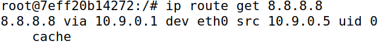

# Environment Variable and Set-UID Lab

## Task 1: Manipulating Environment Variables

As described in the task, by using the `env` command, the console printed out all the environment variables of the system.

Then, using `export`, we created a new environment variable, COLOR, whose value we set to "blue".

After ensuring that COLOR had been correctly set, we proceeded to remove it using `unset`. To confirm that it had been successfully deleted, we used `printenv` again and verified that it did not print "blue" anymore.

## Task 2: Passing Environment Variables from Parent Process to Child Process

As requested in the guide, we compiled and ran myprintenv.c twice.

* Firstly, we ran the script as it was provided. Since it was meant to print the environment variables of a **child** process, we saved its output in a file named "child".
* Next, we altered the script by changing the lines that were commented, making it so it would now print the environment variables of the **parent** process. Because of this, we saved the output of the modified script in a file named "parent".

By using the `diff` command with the two files, we noticed there was no difference. 

As such, we concluded that child processes inherit the environment variables of their parent.

## Task 3: Environment Variables and execve()

The guide lets us know that `execve` is a function that allows us to load and execute a new command, all the while the process's data is completely replaced by the process of the command ran.

To test the behaviour of this command, we compiled and ran myenv.c twice.

* Firstly, we ran the script without modifying it, which meant the third parameter of `execve` was set to `NULL`. To our surprise, nothing was output.

* Next, we changed the script so that the third parameter of `execve` was now `environ`. This time, running the program printed the environment variables.

Through this experiment, we found out that the third parameter of `execve` (named `envp` in the Linux manual) is a pointer to the execution environment we want to pass to the new program. Since `envp` is `NULL` by default, we can conclude that `execve` does NOT automatically inherit the environment variables of the calling process.

## Task 4: Environment Variables and system()

Similarly to `execve`, `system` also executes a new command, however, by requesting the shell to do it.
Through the provided program, we verified that the environment variables of the calling process are passed to the new process, as predicted by the guide. 
