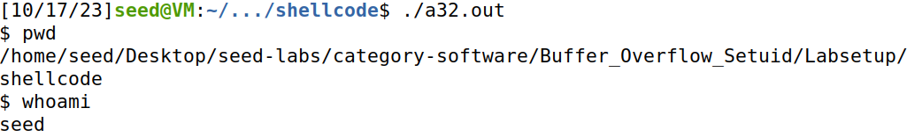

# Buffer Overflow

## Setup

Before starting the tasks themselves, we had to deactivate a couple of security mechanisms Unix uses to prevent buffer overflows.

### Address Space Layout Randomization

> Address Space Layout Randomization (or `ASLR` for short) is a security measure that consists in randomly arranging the positions of a process' key address spaces, such as the base of the executable and the positions of the **stack**, **heap** and libraries.

Since this mechanism difficults guessing exact addresses, which is vital to perform buffer overflows, we disabled it with the following command:

```bash
$ sudo sysctl -w kernel.randomize_va_space=0
```

### Configuring `/bin/sh`

> In most recent Ubuntu releases, the `/bin/sh/` symbolic link points to the `/bin/dash/` shell. This program, as well as `bash`, has a countermeasure against `Set-UID` programs: if it detects it is being executed in a `Set-UID` program, it immediately switchs the user ID to the process's real user ID, therefore dropping the acquired privilege.

Considering we will be exploiting a `Set-UID` program using `/bin/sh`, we had to link `/bin/sh` to another shell, `zhs`, which does not possess the aforementioned security measure. We did so by running the command below:

```bash
$ sudo ln -sf /bin/zsh /bin/sh
```

#### Note
**StackGuard** and **Non-Executable Stack** are additional countermeasures that will be turned off during compilation.

## Task 1: Understanding Shellcode

> **Shellcode** is a piece of code that launches a **shell**. It is widely used in most code-injection attacks.

To familiarize ourselves with shellcode, we used the `Makefile` provided in the guide to compile a simple C script which invokes shellcode. After running `make`, two binaries were created: "a32.out" (32-bit shellcode) and "a64.out" (64-bit shellcode).

In order to fully analyze these programs, we tested them in two categories: the **directory** the code would be executed from and the **privileges** with which said code would execute. To that end, we used the `pwd` and `whoami` commands, respectively.

For reference, these were the values we obtained before running either of the shellcode programs:


The results of our experiments were as follows:

| Shellcode Version | Results                     |
|-------------------|-----------------------------|
| 32-bit            |  |
| 64-bit            |  |

In conclusion:
* Both programs invoked a shell in the **same directory** as the calling program.
* The shell invoked in both programs had the **same privileges** as the calling program, which means it inherited the user ID.

## Task 2: Understanding the Program

### Analysis

The vulnerable program we are going to exploit is a script called "stack.c" which does the following:

1. Reads at most 517 characters from a file called "badfile" and stores them in a character array called "str".

```c
char str[517];
FILE *badfile;

badfile = fopen("badfile", "r"); // open the file
fread(str, sizeof(char), 517, badfile); // read at most 517 chars from the file
```

2. Calls the function "bof", passing "str" as an argument.
3. "bof" allocates memory for a new character array, "buffer", and copies the contents of "str" to it.

```c
int bof(char *str)
{
    char buffer[BUF_SIZE];

    /* The following statement has a buffer overflow problem */
    strcpy(buffer, str);

    return 1;
}
```

The buffer overflow vulnerability is present in the "bof" function for the following reasons:

* The size of "buffer" is dictated by "BUF_SIZE", which, being a user-defined constant, can be less than the size of "str".
* `strcpy`, which is used to copy the content of "str" to "buffer", does NOT perform bounds checking. As such, it does not verify if "buffer" has enough space to receive all the characters from "str".

So, if we can modify the contents of "badfile", we can send payloads to the system.

### Preparation

Since our objective is to lauch a root shell using the program, we need to first prepare the executable. 

The first step is compiling it. In order for our attack to work, we have to use `-fno-stack-protector` and `-z execstack` to deactivate the **StackGuard** and the non-executable stack protections, respectively.

The compilation command would be as follows:

```bash
$ gcc -DBUF_SIZE=100 -m32 -o stack -z execstack -fno-stack-protector stack.c
```

Next, we have to turn the executable into a root-owned `Set-UID` program. To that end, the commands below must be run:

```bash
$ gcc chown root stack # change the owner to 'root'
$ sudo chmod 4755 stack # make it a Set-UID program
```

**Note:** The order of the last two commands could not be inverted, because changing the owner of a program caused the `Set-UID` bit to be turned off.

## Task 3: Launching Attack (Level 1)

To exploit the buffer overflow vulnerability in our program, we have to discover the distance between the buffer's **base** and the position where the **return-address** is stored. 

Since we have the source code of the vulnerable program, the easiest way to obtain that information is to debug it. To do that, we have to compile it using the `-g` flag, which adds debugging information to the resulting binary.

The guide already had a Makefile which created the executable as well as its debugging counterpart, so we ran it.


After confirming the compilation was successful, we created an empty file called "badfile", which is the file our program will read, using the `touch` command:

```c
$ touch badfile
```


