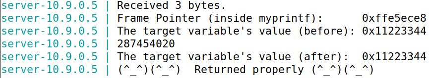

# Format Strings

> Add definition

## Setup

Before starting the tasks themselves, we had to deactivate a couple of security mechanisms Unix uses to prevent memory exploitation.

### Address Space Layout Randomization

> Address Space Layout Randomization (or `ASLR` for short) is a security measure that consists in randomly arranging the positions of a process's key address spaces, such as the base of the executable and the positions of the **stack**, **heap** and libraries.

Since this mechanism difficults guessing exact addresses, which is vital to perform format string attacks, we disabled it with the following command:

```bash
$ sudo sysctl -w kernel.randomize_va_space=0
```

### Non-executable Stack

> `Non-executable stack` is one of many executable-space protection mechanisms which marks the **stack** as non-executable, meaning all writable addresses stored on it cannot be executed.

Since one of our tasks was to exploit the format-string vulnerability to inject code into the program's stack and execute it, we deactivated it during compilation using the `-z execstack` flag.

Our compilation command was the following:

```bash
$ gcc -DBUF_SIZE=100 -z execstack -o format format.c
```

## Task 0: Understanding the Program

The vulnerable program we had to exploit in this lab was called "format.c". Its behaviour can be summarized like so:

1. Reads at most 1500 characters of user input and stores them in a character array called "buf".

```c
char buf[1500];
int length = fread(buf, sizeof(char), 1500, stdin);
```

2. Calls the function "myprintf()", passing it the "buf" variable.

```c
myprintf(buf);
```

3. "myprintf()" calls `printf()`, passing it its first argument. In this case, since "myprintf()" was called with "buf", the format string will be "buf".

```c
void myprintf(char *msg)
{
    // This line has a format-string vulnerability
    printf(msg);
}
```

The format-string vulnerability is present in "myprintf()", because the call to `printf()` this function encapsulates does not sanitize its content. So, considering `printf()` assumes the data needed to fill the placeholders are stored in the function's stack frame, if "myprintf()" were to be called with a string with placeholders, the program would print values present in the stack frame. 

As such, by construction a proper payload, executing "myprintf()" could lead to the divulgation of sensitive program data or the execution of malicious code.

```bash
$ gcc -DBUF_SIZE=100 -m32 -o stack -z execstack -fno-stack-protector stack.c
```

## Task 1: Crashing the Program

Our first task was to crash the vulnerable program. We started by opening two terminals, one for running the server and another for communicating with it.

According to the guide, the server would output a message if it returned successfully upon printing our input, so we decided to test that by sending it a harmless message.

| Payload  | Server Response             |
|----------|-----------------------------|
| 'hi'     |  |

Next, we decided to send the `"%s"` string, since that would force the program to find a string in the value immeadiately above the format string on the stack. Since there would be no string above our format string, the program should crash. The result of our experiment was as follows:

| Payload  | Server Response             |
|----------|-----------------------------|
| '%s'     |  |

Since neither our payload nor the "Returned properly" message were output, we managed to crash the program!
