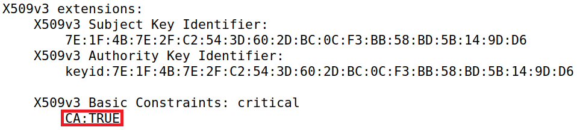
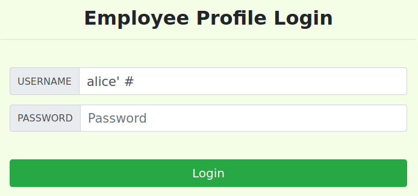
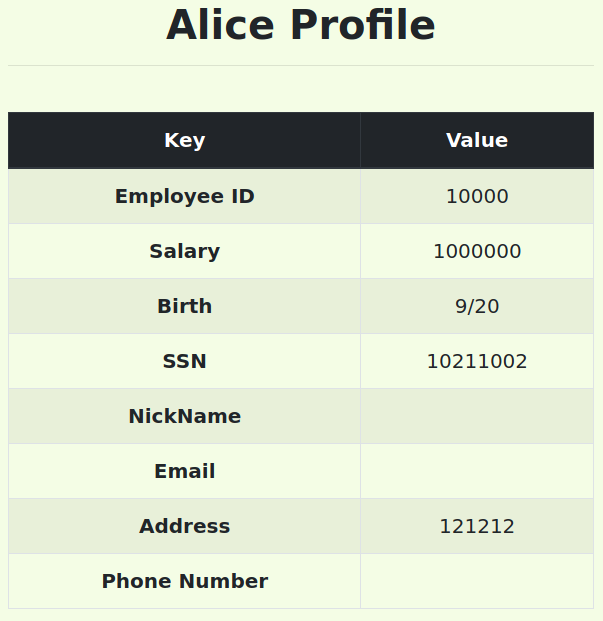
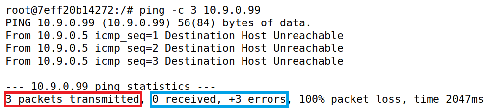
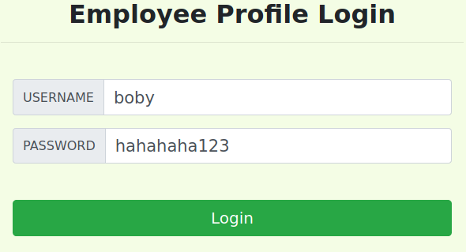
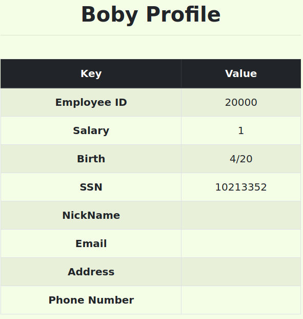

# SQL Injection
## Task 1: Get Familiar with SQL Statements

As instructed in this task, we firstly opened the shell using the command `docksh`, passing it the value we obtained using `dockps`. Afterwards, we opened the MySQL container by using the command `mysql -u root -pdees`. Then, we opened the provided database, `sqllab_users`, by using the command `use sqllab_users;` inside the MySQL container.

(img)

By using the command `show tables`, we found the table `credential`, as expected.

(img)

In order to view the contents of this table, we used the following SQL query:

```sql
select * from credential;
```
Which gave us profile information for all users. 

(img)

Because we only want the profile information of the user Alice, all we had to do was to change the query and so we got the profile information for Alice.

```sql
select * from credential where name = "Alice";
```

(img)

## Task 2: SQL Injection Attack on SELECT Statement

To get started with this task, we found it especially important to look at the provided code snippet.

```php
$input_uname = $_GET['username'];
$input_pwd = $_GET['Password'];
$hashed_pwd = sha1($input_pwd);
...
$sql = "SELECT id, name, eid, salary, birth, ssn, address, email,
        nickname, Password
    FROM credential
    WHERE name= ’$input_uname’ and Password=’$hashed_pwd’";

$result = $conn -> query($sql);
```

This SQL query makes it so, if there is no verification of the user input, one could make an SQL injection attack. We will exploit this to complete our task. We will also use it as a reference to make the attack.

### Task 2.1: SQL Injection Attack from webpage

We must log in into the Admin's account without knowing its password. To do so, we need to input a username so that the password condition in the SQL query is ignored.

We chose to make the username `admin' #`. The `admin'` portion makes it so it gets us the admin's credentials while the `#` makes it so it comments out the remainder of the SQL code, thus not verifying the password. There was no need to input anything into the password field as it is ignored.

**Note:** The <u>semicolon</u> which terminates the SQL statement is optional. That is why our payload works even though we commented the rest of the query. However, if we were to include it, it would still perform the attack as expected.

With this, we successfully logged in as the admin.

(img)
(img)


## Task 3: SQL Injection Attack on UPDATE Statement

> In SQL, `UPDATE` statements are used to modify existing records in a table.

Our final tasks consisted in exploiting an SQL injection vulnerability present in the Edit Profile page. As its name suggests, this page contains a simple input form for altering the profile information of an account, as shown below:



The guide also discloses the code fragment that processes the user input. Once again, it contains an unsanitized database query:

```php
$hashed_pwd = sha1($input_pwd);
$sql = "UPDATE credential SET
    nickname=’$input_nickname’,
    email=’$input_email’,
    address=’$input_address’,
    Password=’$hashed_pwd’,
    PhoneNumber=’$input_phonenumber’
    WHERE ID=$id;";
$conn->query($sql);
```

**Note:** To verify whether our attacks had been successful, we compared our results with the values we obtained when we hijacked the administrator's account. For reference, they have been copied below:

(img)

### 3.1: Modifying our salary

Our next objective was to update our salary. That is, upon logging in to an account, we had to use the input form to alter its database entry.

To that end, we logged in to Alice's account by repeating the attack from [before](#task-21-sql-injection-attack-from-webpage), except instead of 'admin' we wrote 'alice':



Immediately after logging in, we were redirected to a page which contained Alice's profile information, including her salary: **20000**.


Now that we were familiar with the value we had to change, we navigated to the Edit Profile page. However, as seen above, there was no text field for altering the salary. Thankfully, the guide revealed that the salaries are stored in a column appropriately named "salary", so we had all the information we needed.

Considering that each value change in the query (i.e. `value=’$input_value’`) was in a separate line, our payload had the following restrictions:
* Have a backtick, so as to close the string where `$input_value` is inserted.
* Modify the `salary` column (i.e. `salary=...`).
* Have a backtick before the salary value. This is a necessity considering we already closed the `$input_value` string, which causes its final backtick to become unpaired.

With that in mind, we chose the following payload:

```
, salary=1000000'
```

Since we input it in the "NickName" field, our payload made the server execute the following query:

```sql
UPDATE credential SET
    nickname='$input_nickname', salary='1000000'
    email='',
    address='',
    Password='',
    PhoneNumber=''
    WHERE ID=$id;
```

After submitting, we checked Alice's profile again.


And _voilá_, Alice's salary was now **1000000**. Just like that, she was 50x richer! No wonder computer scientists make so much money...

### 3.2: Modifying someone else's salary

Our next task was very similar to the previous one, except we had to change the salary of another user. In other words, whilst logged in as Alice, we had to modify someone else's databse entry.

We chose Bobby as our victim. The payload this time would have to:
* Have a backtick, so as to close the string where `$input_value` is inserted.
* Modify the `salary` column (i.e. `salary=...`).
* Have a `WHERE` clause that specifies the user whose entry we want to update.
* Have a hashtag in order to comment the rest of the query.

We assumed that Alice only knew Boby's username, so we used it in our `WHERE` clause. As such, our payload was the following:

```
', salary=1 WHERE name='Boby' #
```

Once again, we placed it in the "NickName" field, which made the server execute the following:

```sql
UPDATE credential SET
    nickname='', salary=1 WHERE name='Boby';
```

Upon submitting it, we logged in as an administrator to view Boby's information.



We did it! Our boss was now making less money than us.

### 3.3: Modifying someone else's password

Our final task was to change the password of another user. Yet again, Boby was our target, so our goal was to update his database entry while logged in as Alice.

Since we were dealing with passwords, this task was slightly different from the previous two. In fact, the guide stated that, unlike the values stored in the `salary` column, passwords were hashed before being inserted in the database. This meant that we could not simply write the password on our payload - we would have to write its **hash** instead. This rendered our previous payload useless, since we did not know which hashing algorithm used for computing the password hashes.

Given this adversity, we recalled the code used by the server:

```php
$hashed_pwd = sha1($input_pwd); # the hashing occurs here
$sql = "UPDATE credential SET
    nickname=’$input_nickname’,
    email=’$input_email’,
    address=’$input_address’,
    Password=’$hashed_pwd’,
    PhoneNumber=’$input_phonenumber’
    WHERE ID=$id;";
$conn->query($sql);
```

By reanalyzing it, we realized that the input processed in the "Password" field was hashed before being inserted in the query. We also noticed that the password was only processed in the query before the phone number, which meant we input our payload in the "Phone Number" field without risking commenting the hashed password.

This time, the payload needed to:
* Have a backtick, so as to close the string where `$input_value` is inserted.
* Have a `WHERE` clause that specifies the user whose entry we want to update.
* Have a hashtag in order to comment the rest of the query.

We opted to use the payload below:

```
' WHERE name = 'Boby' #
```

We placed it on the "Phone Number" field. After writing the new password, which we decided would be **'hahahaha123'**, on the "Password" field, we submitted the form. The query executed by the server was as follows:

```sql
UPDATE credential SET
    nickname='',
    email='',
    address='',
    Password='$hashed_pwd',
    PhoneNumber='' WHERE name='Boby';
```

Weirdly enough, our payload triggered an error message from the server.



Still, we decided to test if our attack had worked by attempting to log in as Boby. To that end, we wrote 'Boby' and 'hahaha123' on the "USERNAME" and "PASSWORD" fields, respectively.



**Note:** In order to show the password on the screenshot, we altered the `text-form` value of a `div` in the page's HTML code.

After pressing the login button, we were greeted with Boby's profile information.



We successfully changed Boby's password!
