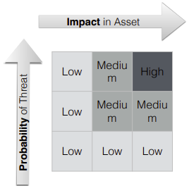
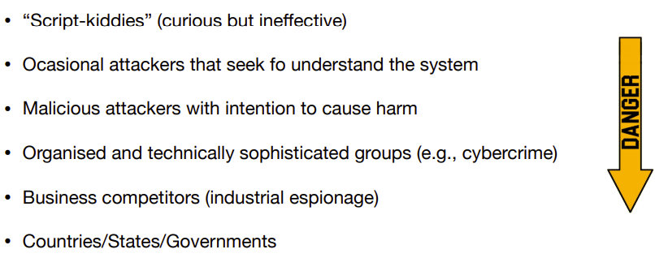

# Introduction

## Basic concepts

### Security

> **Cybersecurity** is the protection of computer systems and networks from information disclosure, theft of or damage to their <ins>hardware</ins>, <ins>software</ins> or <ins>electronic data</ins>, as well as from the disruption or misdirection of the services they provide.

Security is:

* **Context-dependent -** everything, including the definition/terminology, depends on the concrete application (software, systems, web, etc.)
* **Defensive -** it is defined in the negative: bad things can't happen

Security is defined in terms of 3 essential security axes (**CIA**):

* **Confidentiality** (secrecy, privacy)
* **Integrity** (non-tampering, reliable data, authenticity of origin)
* **Availability** (existence, liveness)

**Note:** CIA is always a compromise.

### Actors

> **Actors** are <ins>entities</ins> that intervene in the system, such as people, organisations, companies, machines, ...

Security is defined from the perspective of the **actors**.

### Asset

> An **asset** is a resource that holds value for an <ins>actor</ins> of the system. It can be information, reputation/marketing, a resource with an intrinsic monetary value, an infrastructure, etc.

By measuring the potential impact on an **asset** and the probability of a **threat**, we can build a **risk analysis matrix**.

### Vulnerability

> A **vulnerability** is a <ins>latent failure</ins> that is accessible to an adversary.

Vulnerabilities are often non-intentional, originating from design flaws such as:
* Bad quality software
* Inappropriate requirement analysis
* Misconfiguration
* Wrong usage

### Attack

> An **attack** occurs when someone tries to explore a <ins>vulnerability</ins>.

**Note:** When an <ins>attack</ins> is successful, the system has been <ins>compromised</ins>.

An attack needs **MOM**:
* **Motive** - the threat
* **Opportunity** - something that can be explored (the vulnerability)
* **Method** - the way to explore the vulnerability

### Attackers

> **Attackers** are <ins>actors</ins> with explicit intention of using the system/resources in a wrong way and/or to inhibit its usage.

**Ex:**

In order to better develop security measures, it is important to possess **adversarial thinking**.

> **Adversarial thinking** is the ability to embody the technological capabilities, the unconventional perspectives, and the strategic reasoning of <ins>hackers</ins>. Basically, it is to question the <ins>security assumptions</ins> and understand how to break them.

## Security Models

There are two **security models**:

| Binary | Risk Management |
|:------:|:---------------:|
| Typical of **cryptography** and **dependable systems**. | Typical of **software engineering** and security of **real-world systems**. |
| Formally define the capabilities of **attackers X** and the **security goals Y**. | Minimine risk with respect to the more **likely threats**. |
| No attacker limited to X can break security Y. | Optimize the cost of **security measures** vs **eventual losses**. |
|  |  |
| **Terminology:** security proof, secure by design | **Terminology:** resilience, mitigation, risk, security engineering |

### Limitations

| Binary | Risk Management |
|:------:|:---------------:|
| Does not scale for **complex systems**. | The risk analysis may be wrong. |
| Abstract model != concrete system | We are never really secure (if that exists). |
| Formal models may ignore real problems e.g. side-channels. | A **wrongly-catalogued threat** can break all guarantees. |
