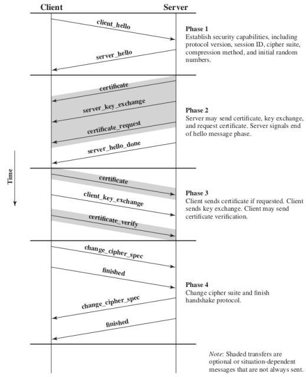

# Network Security Protocols

## SSL/TLS

> **Secure Sockets Layer** (or SSL for short) is a security protocol that creates an ecnrypted link between a web server and a web browser. It was later upgraded to the **Transport Layer Security** (or TLS for short) protocol, which fixed existing vulnerabilities in SSL.

These protocols are implemented in the **application layer**.

### Architecture

* **TLS connection -** A transient peer-to-peer connection where a service is provided. It is associated with exactly <ins>one session</ins>.
* **TLS session -** An association between a client and a server which consists in a set of negotiated <ins>cryptography parameters</ins>. It is reused across <ins>multiple connections</ins>, in order to avoid expensive negotiation stages.

### Protocols

TLS is built on top of several **protocols**, as the protocol stack above demonstrates:

**Note:** Since it is a layered structure, protocols on top rely on those below them.

* **Record protocol**

* **Handshake protocol**

This protocol is used before any application data is transmitted. It consists in a series of messages exchanged between server and client which allow them to:

1. Mutually **authenticate**.
2. Negotiate **encryption** and **MAC** algorithms.
3. Negotiate cryptographic **keys**.

It is comprised of the following phases:

* **Change Cipher Spec protocol**

Consists of a single message of one byte, whose value is either 0 or 1. It is a confirmation message whose sole purpose is to cause the pending **state** to become the current state.

* **Alert protocol**

This protocol details how to send alert messages, that is, important messages about the state of the TLS connection. Depending on the severity of the issue, the messages can be classified as **fatal** (eg: incorrect MAC) or **non-fatal**.

Each message has two bytes - the first relays the **severity**, while the second specifies the **issue**.

* **Heartbeat protocol**

A **periodic signal** is generated by hardware or software to indicate normal operation or to synchronize with other parts of a system. It is typically used to monitor the availability of a protocol entity.

This protocol has two types of messages - `HEARTBEAT_REQUEST`, used to ask whether a machine is alive, and `HEARTBEAT_RESPONSE`, used to respond to the former.

## IP Security (IPSec)

> The **Internet Protocol Security** (or IPSEC for short) is a group of networking protocols used for setting up secure encrypted connections, such as VPNs, across publicly shared networks.

IPSEC lives at the **network layer**.

### Protocols

IPSec is built on top of several **protocols**, namely:

* **Authentication Header (AH)**

This protocol adds a header that contains sender **authentication data** and protects the packet contents from modification by unauthorized parties.

When receiving packets secured with AH, the computer compares the cryptographic hash from the payload with the header to ensure both values match. As such, it provides **integrity**.

* **Encapsulating Security Payload (ESP)**

Consists in encrypting either the entire IP packet or its payload. It provides both **integrity** and **confidentiality**.

This protocol also supplies **authentication**, though not to the same extent as **AH**. In fact, ESP only authenticates the datagram portion of the IP packet, whereas AH authenticates the entire IP packet plus the IP header.

**Note:** Both <ins>AH</ins> and <ins>ESP</ins> can protect an IP packet by itself, but they can also be used simultaneously.

* **Internet Key Exchange (IKE)**

> **Internet Key Exchange** (or IKE for short) is a protocol that establishes a secure connection between two devices on the Internet by having both negotiate a <ins>security association</ins>.

This protocol is divided in two phases, each associated with a **SA**:

1. **IKE SA -** Defines parameters for authentication and key exchange. It is comparable to a <ins>TLS session</ins>.
2. **IPSec SA -** Uses the previous phase to select encryption/<ins>MAC keys</ins>. It is comparable to a <ins>TLS connection</ins>.

### Modes

* **Transport mode**

This mode was designed for **host-to-host** communication. It consists in appending a minimal extra header to the packet.

|Advantages|Disadvantages|
|:--------:|:-----------:|
| Speed | The original header remains unchanged, meaning an attacker can see who is communicating |

* **Tunnel mode**

This mode was designed for communication between **firewalls**. It involves encapsulating the original IP packet and prepending a new header, which contains information about the firewall.

|Advantages|Disadvantages|
|:--------:|:-----------:|
| An attacker can only know which firewalls are communicating, not which hosts. | - |