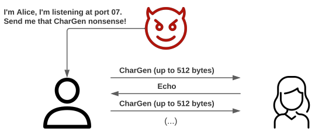
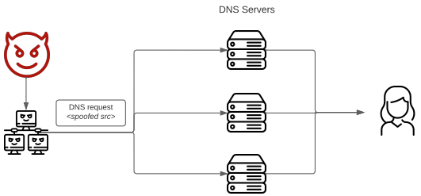
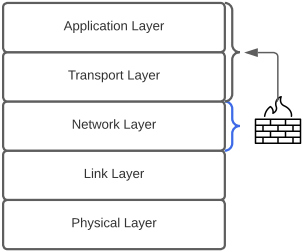
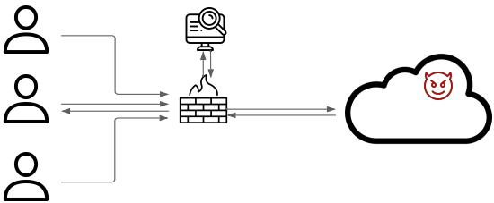

# Network Security Threats and Countermeasures

## Denial-of-Service (DoS)

> **Denial-of-Service** is a form of attack which compromises the availability of services. It is often done in a distributed fashion (<ins>DDoS</ins>).

The following **resource categories** can be attacked using DoS:

* **Network bandwidth**
* **System resources**
    * Aims to overload or crash the network handling software.
* **Application resources**
    * Done by sending several <ins>requests</ins> to a server within the target system. If each request consumes significant resources, the server responseability is jeopardized.

### Attacks

There are several DoS attacks, namely:

* **Flooding ping**

This attack overwhelms the capacity of the **network connection** to the victim organization. This can be achieved, for instance, by spamming the victim.

The more computers that spam the network connection, the better the results of the attack. Hence, **botnets** are commonly used for this purpose.

> A **botnet** is a network of computers infected with malicious software (a.k.a. malware) that allows them to be controlled by an external entity.

* **Reflection**

Occurs when an attacker sends packets to a known service on the intermediary with a **spoofed** source address on the actual victim, thus causing the intermediary to respond to the victim.

The objective is to generate enough volumes of packets to flood the link to the target system without alerting the intermediary.

**Examples:**

| Attack | Description | Figure |
|:------:|-----------|:--------:|
| Echo-Chargen | Attack that exploits the `CharGen` service to send huge amounts of data to a victim. | |
| Smurf | The attacker sends a spoofed broadcast packet to flood the victim with echo responses. | |
| DNS Amplification | The attacker sends spoofed DNS request packets with the victim's IP address as the source. This exploits the fact that DNS requests tend to produce very large responses. | |

## Firewalls

> A **firewall** is a network security device that monitors incoming and outgoing network traffic and decides whether to allow or block specific traffic.

### Types

* **Packet filter**

Operates at the **network layer** by observing IP packets and assessing their importance. It is configured via **Access Control Lists** (or ACLs for short).

|Advantages|Disadvantages|
|:--------:|:-----------:|
| Speed | Stateless |
| Simplicity | Vulnerable to attacks on **TPC/IP** bugs |
| Transparency | Cannot see **TCP** connections |
| - | Unknowing of application data and context |

* **Stateful packet filter**

A **stateful** packet filter that operates at the **transport layer**. It remembers **TCP** connections and can even remember **UDP** packets.

|Advantages|Disadvantages|
|:--------:|:-----------:|
| Can do everything a packet filter can | Lacks internal application logic |
| Keeps track of ongoing connections | Slower than packet filtering |
| Relies on protocol logic to detect misbehaviors | - |

* **Application proxy**

A packet filter which looks at incoming application data and verifies it is safe before allowing passage. It operates at the **application** and **transport layers**.

|Advantages|Disadvantages|
|:--------:|:-----------:|
| Has a complete view of connections and application data | Slower than the stateful packet filtering |
| Can filter bad data at application level | Requires each application to have their own proxy code |

## Intrusion Detection System (IDS)

> An **Intrusion Detection System** (or IDS for short) is a device or software application that monitors a network or systems for malicious activity or policy violations.

### Types

* **Host-based -** monitor activities on <ins>hosts</ins>

* **Network-based -** monitor activity at selected points of the <ins>network</ins> for known attacks.

### Methodologies

* **Signature detection**
    * Requires a set of malicious data patterns or attack rules.
    * Only identifies known attacks for which it has patterns or rules.
* **Anomaly detection**
    * Invloves the collection of user data relating to the behaviour of legitimate users.
    * Observed behaviour is analysed to determine whether it matches a legitimate user or an intruder.
