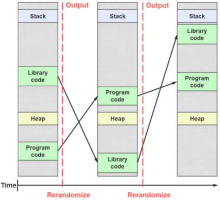

# Software Security

## Countermeasures

**Note:** In the following section, each <ins>countermeasure</ins> is preceded by where it occurs.

### OS: Data Execution Prevention

Also known as **W ^ X**, this countermeasure guarantees that **memory** can never simultaneously:
* Be **writable** by a program
* Contain **executable** code

It can be implemented in hardware (NX bit) or emulated in software.

#### Limitations

* By itself, it does not prevent exploits from reusing code (e.g. ROP).
* Creates problems for **Just-in-Time** compilation (e.g. in modern browsers where trusted code may run alongside untrusted client code).

### OS: Address Space Layout Randomization (ASLR)

The location of **code** and **data** in memory is determined at **random** in each execution.

As such, an attacker cannot easily predict the address of useful code, such as the location of the **stack**, the **heap**, **shared libraries**, etc.

#### How to bypass this?

Without crashing an ASLR program, an attacker can still:

| Technique | Countermeasure |
|:-------:|:--------------:|
| Use other vulnerabilities to extract important addresses. | - |
| Use **spraying** techniques. | - |
| Guess the addresses many times under the same process. | **Runtime ASLR -** randomize the address space on forks |
| Use OS kernel code. | **Kernel ASLR -** randomize the base address of the kernel (only changes at boot time); **Kernel Address Randomised Link -** the kernel code itself is "shuffled" |

### App: Position Independent Executable (PIE)

The compiler generates code whose execution is **independent from absolute addresses**. Each time it is executed, it can be loaded into a different address.

Still, an attacker only needs to find the **base address**... 

#### Code instrumentation

To fix that, more advanced **code instrumentation** can be used to perform "run-time monitoring".

The compiler attache code to "monitor" more complex code and verify that it is performing the expected functionality. This transforms arbitrary code execution exploits into **DoS attacks**, as the program aborts if something seems amiss.

### App: Stack Canaries

The objective is to prevent **code injection** by detecting stack modifications.

This is achieved by storing "**canaries**", which are dynamically generated in the stack frame of a function. Then, before jumping to the return address, the **integrity** of the canary is verified: if it has changed, that means the program was modified, thus it terminates.

#### Variants

* **Random canary -** at the beginning of the execution, the program chooses an <ins>array of random bytes</ins>, which are then used to generate canaries that are aplced in all stack frames
* **Termination canary -** canaries containing <ins>string termination bytes</ins>, such as `\0`, `\n`, `EOF`, etc.

#### How to bypass this?

* Read the canary using other vulnerability, then exploit a **stack overflow** to put it back.
* Circumvent the canary using existing **pointers**.
    * If the code has a pointer in the stack and writes to that address the value of another local variable, a stack overflow may change both and write an arbitrary memory position.

    

* Overwrite and ignore the canary using **function pointers**.
    * If a program receives a function pointer as an argument, changing such pointer may allow jumping to an arbitrary address before the function starts.

* **Guess** the canary.
    * If the canary is reused many times (for instance, by being preseved in forks), it is susceptible to **brute-force attacks**.

    