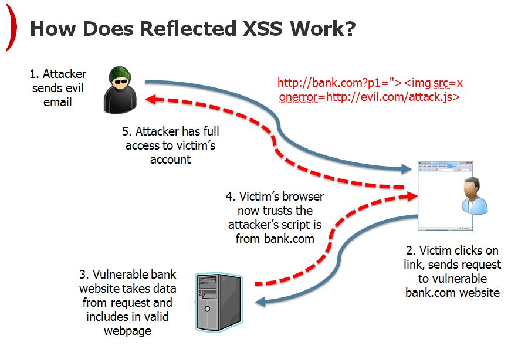
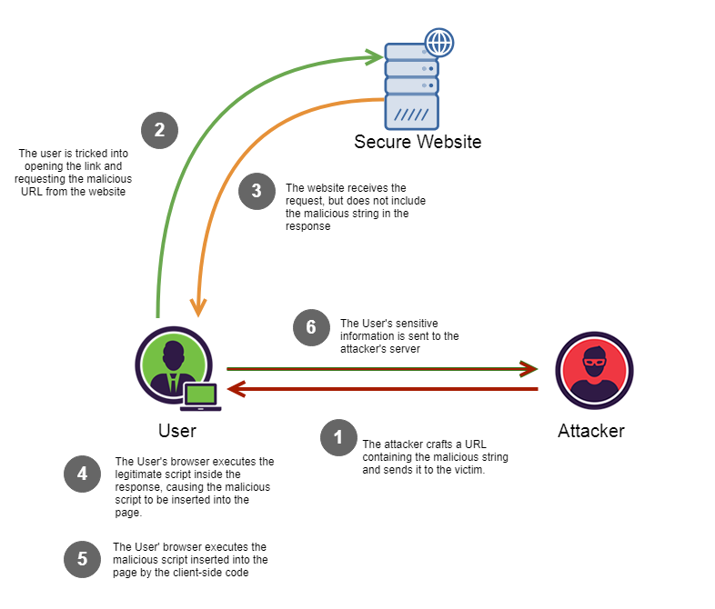
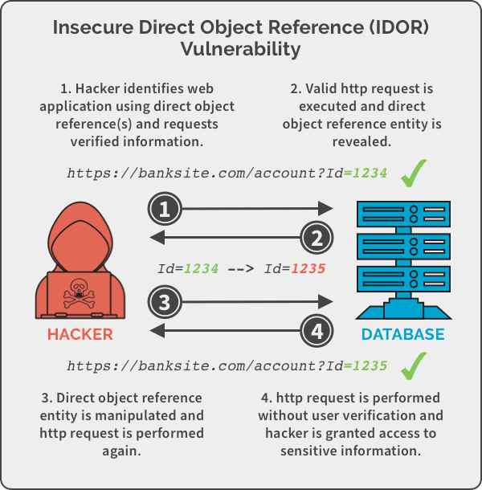
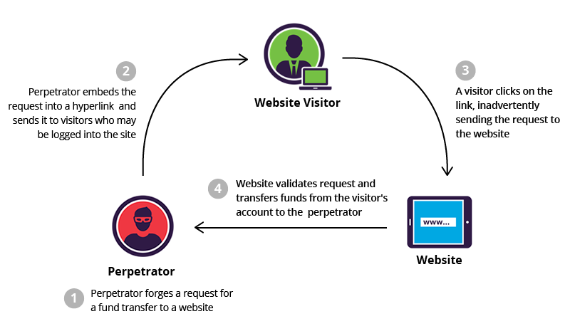
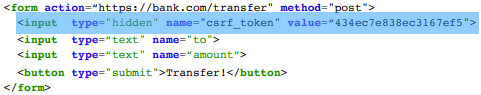
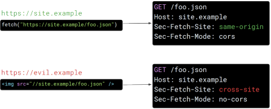

# Web Security

## Browser

A modern **browser** is analogous to an **operating system** (OS). The table below highlights the most important similarities:

| Browser | OS Equivalent |
|:-------:|:-------------:|
| Pages | Processes |
| Resources/Cookies | Files |
| HTTP | Sockets/TCP |
| Frames/iFrames | Sub-processes |

## Security Mechanisms

### Same-Origin Policy (SOP)

> The **origin** of a frame is the context that establishes its <ins>security perimeter</ins>. It is defined as a combination of <ins>URI scheme</ins>, <ins>host name</ins>, and <ins>port number</ins>

The **Same-Origin Policy** establishes that code in a frame can only access data from the **same origin**.

**Ex:**

A page/frame **can** make HTTP requests outside its origin.
* Side-effects are generally allowed (e.g. sending data do external services).
* Embedding of resources from other origins is generally allowed.

As for the server **response**:
* It may be processed by the browser (e.g. creating frame).
* Cannot be programatically analysed, but its embedding may reveal some information.

Some rules:

#### HTML from an origin

* **Can** create frames with **HTML code** from other origins.
* **Cannot** **inspect** nor **modify** the frame's content.

#### JavaScript from an origin

* **Can** obtain **scripts** from other origins.
* **Cannot** **inspect** nor **modify** JavaScript code loaded from another origin.
* **Can** **execute scripts** from other origins.
* **Can** make **GET requests** to any origin, but only see the **response** from the same origin.
* **Cannot** make **POST requests** to other origins, only its own.

#### Images, CSS and fonts

* Are rendered by the browser.
* SOP forbids seeing pixels, but reveals their **size**.

#### Cookies

For cookies, the notion of **origin** is different: **domain** and **path** (the scheme and port are optional).

* If a page creates a frame with **another origin**, the cookies associated to the frame **cannot** be accessed from the parent page.
* If `SameSite=None`, the browser **will** send the cookies to another origin if:
    * The cookie's **domain** is a **suffix** of the URL's domain.
    * The cookies's **path** is a **prefix** of the URL's path.

    

* If `SameSite=Strict`, send the cookie only when the request has the same origin as the **top-level page**.
* If `SameSite=Lax` (default), the browser distinguishes some requests (e.g. explicit links) and opens **cross domain exceptions** for sending cookies.

**Note:** <ins>HTTPS</ins> is the only way to guarantee cookies are securely sent.

#### DOM

DOM access is generally **permitted** via JavaScript. As such:

* SOP **policy collisions** can occur.
    * For instance, different **cookie origin** but same **HTTP origin** (e.g. https://fsi.pt/evil and https://fsi.pt/good) means code can run.
* Libraries loaded within our origin can read the `document.cookie` variable, thus potencially leading to **session hijacking**.

To avoid these problems, it is necessary to define **cookies** as **HTTPOnly**.

### Cross-Origin Resource Sharing (CORS)

> **Cross-Origin Resource Sharing** (or CORS for short) is a mechanism that builds upon the **SOP** to loosen the restrictions on <ins>cross-origin interactions</ins> in a controlled and secure manner.

CORS relaxes which **cross-origin requests** to **resources** are allowed (in particular requests issued dynamically from JavaScript).

Some rules:

#### Simple requests to a server

* **Cannot** cause **side-effects** in the server.
* The browser first makes the **request** and then verifies if the response admits that code from the site can access **resources** from the server.
* The server can allow more origins to see the response via the `Access-Control-Allow-Origin` attribute.

#### Pre-flighted requests to a server

> A **pre-flight request** is an HTTP request of the <ins>OPTIONS</ins> method, sent before the request itself, in order to determine if it is safe to send it.

* **Can** cause **side-effects** in the server.
* The browser makes a **dummy request** without side-effects and verifies if the response admits the code in the site to access **resources** from the server.
* The server can allow more origins to see the response via the `Access-Control-Allow-Origin` attribute.
* If the access is permitted, the browser then makes the **real request**.

## Attacks

### Cross Site Scripting (XSS)

> **Cross-Site Scripting** (or XSS for short) attacks are a type of injection, in which malicious scripts are injected into otherwise benign and trusted websites.

**Note:** XSS attacks ignore <ins>SOP</ins>, because it is the client running the code. Plus, an attacker can see the response.

There are three types of XSS attacks:

* **Reflected XSS** (users + servers + attackers)
* **Stored XSS** (users + servers)
* **DOM-based XSS** (users)

#### Reflected XSS

> **Reflected XSS** occurs when the attacker forces the user to make a <ins>request</ins> to a legitimate site and the malicious payload is "reflected" to execute in the client.

**Note:** To distribute the <ins>malicious link</ins>, a perpetrator typically embeds it into an email or third party website (e.g., in a comment section or in social media).

#### Stored XSS

> **Stored XSS** is a type of XSS attack in which malicious payload is <ins>stored</ins> in a resource of a legitimate website.

#### DOM-based XSS

> **DOM-based XSS** occurs when the malicious code runs only in the <ins>client-side</ins>; nothing is sent to the server. As such, the data flow never leaves the <ins>browser</ins>.

DOM-based XSS vulnerabilities usually arise when JavaScript takes data from an attacker-controllable source, such as the **URL**, and passes it to a sink that supports dunamic code execution, such as `eval()` or `innerHTML`.

### Insecure Direct Object Reference (IDOR)

> **Insecure Direct Object References** (or IDORs for short) is a vulnerability that consists in an application providing <ins>direct access</ins> to resources based on user-supplied input. This comes about due to inexistent <ins>access control</ins>.

### Cross-Site Request Forgery (CSRF)

> **Cross-Site Request Forgery** (or CSRF for short) is an attack that forces an end user to execute unwanted actions on a web application in which they are currently authenticated.

The basic premise of CSRF attacks is as follows:
1. Attacker tricks a legitimate user into clicking on a **link**.
2. Legitimate user makes unintended/unrealised **request** to a legitimate website.
3. Legitimate website executes operations in the name of the legitimate user.

**Note:** Due to <ins>SOP</ins>, an attacker cannot see the response on another origin, but the <ins>side-effects</ins> are executed nonetheless.

#### Countermeasures

* **CSRF tokens -** secret token (dynamic) in the HTML form that the attacker cannot infer when simulating a <ins>POST</ins> request

    

* **`SameSite=Strict` -** prevent use of <ins>cookies</ins> in <ins>cross-site requests</ins> (e.g. if we follow a link that comes from an email, we won't be authenticated)
* **`SameSite=Lax` -** allows following cross-site links, but does NOT permit cross-site requests when loading <ins>images</ins> or <ins>frames</ins>
* **`FETCH` metadata headers**
    * **`Sec-Fetch-Site` -** the <ins>site</ins> which originated the request
    * **`Sec-Fetch-Mode` -** the <ins>security mechanism</ins> (`cors` or `no-cors`)
    * **`Sec-Fetch-User` -** specifies whether the request was <ins>explicitly</ins> made by the user (e.g. by clicking on a button)

    