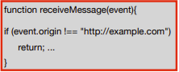
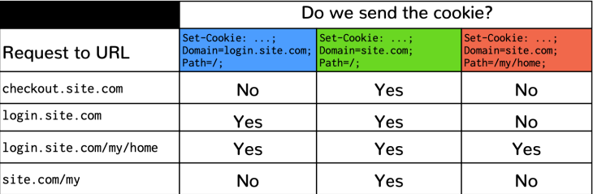

# Web Security

## Browser

A modern **browser** is analogous to an **operating system** (OS). The table below highlights the most important similarities:

| Browser | OS Equivalent |
|:-------:|:-------------:|
| Pages | Processes |
| Resources/Cookies | Files |
| HTTP | Sockets/TCP |
| Frames/iFrames | Sub-processes |

## Security Mechanisms

### Same-Origin Policy (SOP)

> The **origin** of a frame is the context that establishes its <ins>security perimeter</ins>. It is defined as a combination of <ins>URI scheme</ins>, <ins>host name</ins>, and <ins>port number</ins>

The **Same-Origin Policy** establishes that code in a frame can only access data from the **same origin**.

**Ex:**

A page/frame **can** make HTTP requests outside its origin.
* Side-effects are generally allowed (e.g. sending data do external services).
* Embedding of resources from other origins is generally allowed.

As for the server **response**:
* It may be processed by the browser (e.g. creating frame).
* Cannot be programatically analysed, but its embedding may reveal some information.

Some rules:

#### HTML from an origin

* **Can** create frames with **HTML code** from other origins.
* **Cannot** **inspect** nor **modify** the frame's content.

#### JavaScript from an origin

* **Can** obtain **scripts** from other origins.
* **Cannot** **inspect** nor **modify** JavaScript code loaded from another origin.
* **Can** **execute scripts** from other origins.
* **Can** make **GET requests** to any origin, but only see the **response** from the same origin.
* **Cannot** make **POST requests** to other origins, only its own.

#### Images, CSS and fonts

* Are rendered by the browser.
* SOP forbids seeing pixels, but reveals their **size**.

#### Cookies

For cookies, the notion of **origin** is different: **domain** and **path** (the scheme and port are optional).

* If a page creates a frame with **another origin**, the cookies associated to the frame **cannot** be accessed from the parent page.
* If `SameSite=None`, the browser **can** send the cookies to another origin if:
    * The cookie's **domain** is a **suffix** of the URL's domain.
    * The cookies's **path** is a **prefix** of the URL's path.

    
* If `SameSite=Strict`, send the cookie only when the request has the same origin as the **top-level page**.
* If `SameSite=Lax` (default), the browser distinguishes some requests (e.g. explicit links) and opens **cross domain exceptions** for sending cookies.

**Note:** <ins>HTTPS</ins> is the only way to guarantee cookies are securely sent.

### Cross-Origin Resource Sharing (CORS)

> **Cross-Origin Resource Sharing** (or CORS for short) is a mechanism that builds upon the **SOP** to loosen the restrictions on cross-origin interactions in a controlled and secure manner.

CORS relaxes which **cross-origin requests** to **resources** are allowed (in particular requests issued dynamically from JavaScript).

Some rules:

#### Simple requests to a server

* **Cannot** cause **side-effects** in the server.
* The browser first makes the **request** and then verifies if the response admits that code from the site can access **resources** from the server.
* The server can allow more origins to see the response via the `Access-Control-Allow-Origin` attribute.

#### Pre-flighted requests to a server

> A **pre-flight request** is an HTTP request of the <ins>OPTIONS</ins> method, sent before the request itself, in order to determine if it is safe to send it.

* **Can** cause **side-effects** in the server.
* The browser makes a **dummy request** without side-effects and verifies if the response admits the code in the site to access **resources** from the server.
* The server can allow more origins to see the response via the `Access-Control-Allow-Origin` attribute.
* If the access is permitted, the browser then makes the **real request**.

(stored XSS for later)

