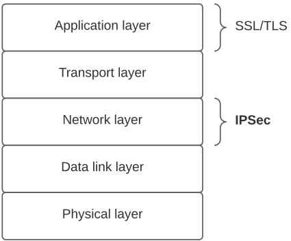
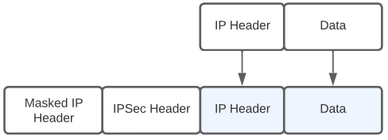

# Notes

## Introduction

### Basic concepts

#### Security

> **Cybersecurity** is the protection of computer systems and networks from information disclosure, theft of or damage to their <ins>hardware</ins>, <ins>software</ins> or <ins>electronic data</ins>, as well as from the disruption or misdirection of the services they provide.

Security is:

* **Context-dependent -** everything, including the definition/terminology, depends on the concrete application (software, systems, web, etc.)
* **Defensive -** it is defined in the negative: bad things can't happen

Security is defined in terms of 3 essential security axes (**CIA**):

* **Confidentiality** (secrecy, privacy)
* **Integrity** (non-tampering, reliable data, authenticity of origin)
* **Availability** (existence, liveness)

**Note:** CIA is always a compromise.

#### Actors

> **Actors** are <ins>entities</ins> that intervene in the system, such as people, organisations, companies, machines, ...

Security is defined from the perspective of the **actors**.

#### Attackers

> **Attackers** are <ins>actors</ins> with explicit intention of using the system/resources in a wrong way and/or to inhibit its usage.

**Ex:**

In order to better develop security measures, it is important to possess **adversarial thinking**.

> **Adversarial thinking** is the ability to embody the technological capabilities, the unconventional perspectives, and the strategic reasoning of <ins>hackers</ins>. Basically, it is to question the <ins>security assumptions</ins> and understand how to break them.

## Week 12 - Network Security Protocols

### SSL/TLS

> **Secure Sockets Layer** (or SSL for short) is a security protocol that creates an ecnrypted link between a web server and a web browser. It was later upgraded to the **Transport Layer Security** (or TLS for short) protocol, which fixed existing vulnerabilities in SSL.

These protocols are implemented in the **application layer**.

#### Architecture

* **TLS connection -** A transient peer-to-peer connection where a service is provided. It is associated with exactly <ins>one session</ins>.
* **TLS session -** An association between a client and a server which consists in a set of negotiated <ins>cryptography parameters</ins>. It is reused across <ins>multiple connections</ins>, in order to avoid expensive negotiation stages.

#### Protocols

TLS is built on top of several **protocols**, as the protocol stack above demonstrates:

**Note:** Since it is a layered structure, protocols on top rely on those below them.

* **Record protocol**

* **Handshake protocol**

This protocol is used before any application data is transmitted. It consists in a series of messages exchanged between server and client which allow them to:

1. Mutually **authenticate**.
2. Negotiate **encryption** and **MAC** algorithms.
3. Negotiate cryptographic **keys**.

It is comprised of the following phases:

* **Change Cipher Spec protocol**

Consists of a single message of one byte, whose value is either 0 or 1. It is a confirmation message whose sole purpose is to cause the pending **state** to become the current state.

* **Alert protocol**

This protocol details how to send alert messages, that is, important messages about the state of the TLS connection. Depending on the severity of the issue, the messages can be classified as **fatal** (eg: incorrect MAC) or **non-fatal**.

Each message has two bytes - the first relays the **severity**, while the second specifies the **issue**.

* **Heartbeat protocol**

A **periodic signal** is generated by hardware or software to indicate normal operation or to synchronize with other parts of a system. It is typically used to monitor the availability of a protocol entity.

This protocol has two types of messages - `HEARTBEAT_REQUEST`, used to ask whether a machine is alive, and `HEARTBEAT_RESPONSE`, used to respond to the former.

### IP Security (IPSec)

> The **Internet Protocol Security** (or IPSEC for short) is a group of networking protocols used for setting up secure encrypted connections, such as VPNs, across publicly shared networks.

IPSEC lives at the **network layer**.

#### Protocols

IPSec is built on top of several **protocols**, namely:

* **Authentication Header (AH)**

This protocol adds a header that contains sender **authentication data** and protects the packet contents from modification by unauthorized parties.

When receiving packets secured with AH, the computer compares the cryptographic hash from the payload with the header to ensure both values match. As such, it provides **integrity**.

* **Encapsulating Security Payload (ESP)**

Consists in encrypting either the entire IP packet or its payload. It provides both **integrity** and **confidentiality**.

This protocol also supplies **authentication**, though not to the same extent as **AH**. In fact, ESP only authenticates the datagram portion of the IP packet, whereas AH authenticates the entire IP packet plus the IP header.

**Note:** Both <ins>AH</ins> and <ins>ESP</ins> can protect an IP packet by itself, but they can also be used simultaneously.

* **Internet Key Exchange (IKE)**

> **Internet Key Exchange** (or IKE for short) is a protocol that establishes a secure connection between two devices on the Internet by having both negotiate a <ins>security association</ins>.

This protocol is divided in two phases, each associated with a **SA**:

1. **IKE SA -** Defines parameters for authentication and key exchange. It is comparable to a <ins>TLS session</ins>.
2. **IPSec SA -** Uses the previous phase to select encryption/<ins>MAC keys</ins>. It is comparable to a <ins>TLS connection</ins>.

#### Modes

* **Transport mode**

This mode was designed for **host-to-host** communication. It consists in appending a minimal extra header to the packet.

|Advantages|Disadvantages|
|:--------:|:-----------:|
| Speed | The original header remains unchanged, meaning an attacker can see who is communicating |

* **Tunnel mode**

This mode was designed for communication between **firewalls**. It involves encapsulating the original IP packet and prepending a new header, which contains information about the firewall.

|Advantages|Disadvantages|
|:--------:|:-----------:|
| An attacker can only know which firewalls are communicating, not which hosts. | - |

## Week 13 - Network Security Threats and Countermeasures

### Denial-of-Service (DoS)

> **Denial-of-Service** is a form of attack which compromises the availability of services. It is often done in a distributed fashion (<ins>DDoS</ins>).

The following **resource categories** can be attacked using DoS:

* **Network bandwidth**
* **System resources**
    * Aims to overload or crash the network handling software.
* **Application resources**
    * Done by sending several <ins>requests</ins> to a server within the target system. If each request consumes significant resources, the server responseability is jeopardized.

#### Attacks

There are several DoS attacks, namely:

* **Flooding ping**

This attack overwhelms the capacity of the **network connection** to the victim organization. This can be achieved, for instance, by spamming the victim.

The more computers that spam the network connection, the better the results of the attack. Hence, **botnets** are commonly used for this purpose.

> A **botnet** is a network of computers infected with malicious software (a.k.a. malware) that allows them to be controlled by an external entity.

* **Reflection**

Occurs when an attacker sends packets to a known service on the intermediary with a **spoofed** source address on the actual victim, thus causing the intermediary to respond to the victim.

The objective is to generate enough volumes of packets to flood the link to the target system without alerting the intermediary.

**Examples:**

| Attack | Description | Figure |
|:------:|-----------|:--------:|
| Echo-Chargen | Attack that exploits the `CharGen` service to send huge amounts of data to a victim. | |
| Smurf | The attacker sends a spoofed broadcast packet to flood the victim with echo responses. | |
| DNS Amplification | The attacker sends spoofed DNS request packets with the victim's IP address as the source. This exploits the fact that DNS requests tend to produce very large responses. | |

### Firewalls

> A **firewall** is a network security device that monitors incoming and outgoing network traffic and decides whether to allow or block specific traffic.

#### Types

* **Packet filter**

Operates at the **network layer** by observing IP packets and assessing their importance. It is configured via **Access Control Lists** (or ACLs for short).

|Advantages|Disadvantages|
|:--------:|:-----------:|
| Speed | Stateless |
| Simplicity | Vulnerable to attacks on **TPC/IP** bugs |
| Transparency | Cannot see **TCP** connections |
| - | Unknowing of application data and context |

* **Stateful packet filter**

A **stateful** packet filter that operates at the **transport layer**. It remembers **TCP** connections and can even remember **UDP** packets.

|Advantages|Disadvantages|
|:--------:|:-----------:|
| Can do everything a packet filter can | Lacks internal application logic |
| Keeps track of ongoing connections | Slower than packet filtering |
| Relies on protocol logic to detect misbehaviors | - |

* **Application proxy**

A packet filter which looks at incoming application data and verifies it is safe before allowing passage. It operates at the **application** and **transport layers**.

|Advantages|Disadvantages|
|:--------:|:-----------:|
| Has a complete view of connections and application data | Slower than the stateful packet filtering |
| Can filter bad data at application level | Requires each application to have their own proxy code |

### Intrusion Detection System (IDS)

> An **Intrusion Detection System** (or IDS for short) is a device or software application that monitors a network or systems for malicious activity or policy violations.

#### Types

* **Host-based -** monitor activities on <ins>hosts</ins>

* **Network-based -** monitor activity at selected points of the <ins>network</ins> for known attacks.

#### Methodologies

* **Signature detection**
    * Requires a set of malicious data patterns or attack rules.
    * Only identifies known attacks for which it has patterns or rules.
* **Anomaly detection**
    * Invloves the collection of user data relating to the behaviour of legitimate users.
    * Observed behaviour is analysed to determine whether it matches a legitimate user or an intruder.
